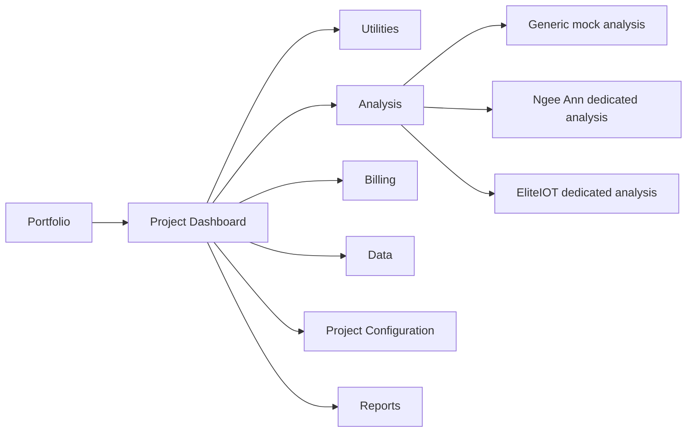
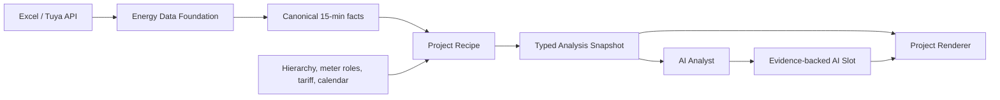

# NetZero Prototype 完整理解与 EnergyIQ 复用审计

## 1. 结论先行

NetZero Prototype 不是单一的 Ngee Ann 看板，而是一个较完整的能源 SaaS 演示系统。它包含 Portfolio、单项目 Dashboard、Electricity/Water/Gas Utilities、通用 Analysis、Ngee Ann 专属 Analysis、EliteIOT 专属 Analysis、Billing/Data/Project/Reports，以及三条单文件 HTML 导出链路。

但各部分可信度不同：

| 类型 | 代表内容 | 结论 |
| --- | --- | --- |
| 真实 Excel 派生 | Ngee Ann、EliteIOT 专属分析 | 可作为正式项目的算法与页面种子 |
| 固定静态演示 | Portfolio、通用 Analysis 初始值 | 只能借鉴产品表达，不可当作正式指标 |
| 哈希确定性合成 | 通用 Dashboard、Utilities、通用异常下钻 | 只能借鉴交互和视觉 |
| 占位页面 | Billing、Data、Project、Reports 部分功能 | 只代表信息架构，不代表功能已实现 |

EnergyIQ 最合适的路线是：

> 复刻项目专属页面的视觉和分析顺序；把计算脚本改成读取统一 Energy Data Foundation；每个项目通过一个 `Recipe` 产生稳定结果，再由该项目的 `Renderer` 原样呈现。

前三个项目允许 Ngee Ann、Preschool、EliteIOT 各有自己的 Renderer。到第三、第四个 Renderer，再把真正重复的 KPI 卡片、时间选择器、异常表格、热力图下沉为共用组件。这不是放弃通用化，而是先找到真实共性。

## 2. 审计范围与证据

审计对象：`docs/template/Net-Zero Product/Software Prototype`。

覆盖路由、全局 Shell、所有 pages、通用 analysis、`analysis/nap`、`analysis/eliteiot`、两个 Python 生成脚本、三条 HTML 导出链路、生成后的 TypeScript 数据契约，以及当前 EnergyIQ Template Renderer/Schema v2。

| 入口 | 作用 |
| --- | --- |
| `src/App.tsx` | 全部路由 |
| `src/config/navigation.ts` | SaaS 侧边导航 |
| `src/context/AppContext.tsx` | 组织、项目、时间和分享状态 |
| `src/pages/AnalysisPage.tsx` | 通用/Ngee Ann/EliteIOT 分流 |
| `scripts/generate_nap_analysis_data.py` | Ngee Ann Excel 到分析结果 |
| `scripts/generate_eliteiot_analysis_data.py` | EliteIOT Excel 到分析结果 |
| `src/components/analysis/nap/NapAnalysisViewV2.tsx` | Ngee Ann 页面编排 |
| `src/components/analysis/eliteiot/EliteAnalysisViewV2.tsx` | EliteIOT 页面编排 |
| `src/mock/*EnergyAnalysisData.ts` | 类型化分析结果与生成数据 |
| `vite.*-export.config.ts` | 单文件 HTML 输出 |

## 3. 整体产品地图



| 路由 | 当前实际内容 | 正式复用价值 |
| --- | --- | --- |
| `/portfolio` | 8 个项目地图/表格、能源组合 KPI | 适合未来多 Project Portfolio；数据是 mock |
| `/dashboard` | 单项目 KPI、设备/告警、趋势、热力图 | 交互价值高；计算是合成数据 |
| `/utilities/*` | 空间筛选、电表参数、趋势、单线图 | Explorer 交互参考；数值是合成数据 |
| `/analysis` | 通用或项目专属分析 | 最高复用价值 |
| `/billing/*` | Tenants、Contracts、Bills | 信息架构参考 |
| `/data/*` | Devices、Gateways、Messages、Logs、Alarms | Explorer/Admin 参考 |
| `/project/*` | Roles、Users、Spaces、Rules、Config | Admin 参考，多数 placeholder |
| `/reports` | 报告列表和水量平衡示意 | 未来 Report 参考 |

项目选择器包含 8 个 Portfolio mock 项目，以及 NP Energy Analysis、Ngee Ann Poly v2.0、EliteIOT。前两个 Ngee Ann 身份共享同一份数据；v2 只是新的 Project ID 与页面编排身份。

## 4. 数据可信度地图

### 4.1 A 级：真实 Excel 派生

```text
Excel 累计电量
  → pandas 读取与去重
  → Device + Time 排序
  → 相邻累计读数 diff
  → 15 分钟 delta_kwh
  → 总表/分表、日期类型、小时、回路分类聚合
  → 类型化 Analysis Payload
  → React/Recharts 项目专属页面
```

Ngee Ann 和 EliteIOT 是真实数据驱动，但目前结果被预生成进静态 TypeScript，并非在线数据库查询。

### 4.2 B/C 级：静态与合成

`mockData.ts` 和 `portfolioProjects.ts` 有人工填写的总用量、EUI、费用、异常和建议。通用 Dashboard/Utilities/Analysis 还用 `hashCode + sin(seed)` 生成稳定伪随机值。它们适合演示，不代表真实项目。

## 5. Recipe、Renderer 和 Preset

- `Recipe`：决定原始事实如何变成指标、异常、证据和建议，即“怎么算”。
- `Renderer`：决定结果用什么顺序、图表、卡片和交互展示，即“怎么看”。
- `Project Preset`：声明项目使用哪份 Recipe、哪个 Renderer 和哪版配置。
- `AI Slot`：Renderer 预留的受控区域，允许 AI 基于已算好的证据补充解释和行动建议。

Renderer 不是浏览器，也不是一个孤立 HTML；它是输入稳定数据、输出页面的前端模块。



项目专属不等于每个项目一个独立应用，而是同一个 EnergyIQ SaaS 注册多个 Renderer：

```ts
type ProjectAnalysisPreset = {
  projectId: string;
  recipeId: "ngee-ann-v1" | "preschool-v1" | "eliteiot-v1";
  rendererId: "ngee-ann-v1" | "preschool-v1" | "eliteiot-v1";
  presetVersion: string;
  configRevisionId: string;
};
```

Charles 改排版只改 Renderer；电价、日历、阈值变化只改 Recipe 配置；Excel 换 API 只换数据接入；新时间段用同一 Recipe 复跑后仍交给同一 Renderer。

## 6. Ngee Ann：数据处理与指标

### 6.1 输入与清洗

当前期为 2026-05-19 至 2026-06-17，上一期为 2026-04-21 至 2026-05-20，Level 6/7 各一份文件，15 分钟采样。

| 步骤 | 当前算法 |
| --- | --- |
| 双栏 Excel | 左侧 0/1/2 列与右侧 4/5/6 列合并 |
| 空值/表头 | 删除空行和 `Device Name` 行 |
| 重复 | 按 Device + Time 去重，保留第一条 |
| 15 分钟用量 | `delta_kwh = 当前累计读数 - 上一累计读数` |
| Aggregate | 名称含 `total` |
| Lighting | 名称含 `light` |
| Ventilation/Fan | 名称含 `fan` 或 `isol` |
| Office Load | 名称含 `load` |

总量、日总量、楼层总量、峰值和费用以 Aggregate 为准；类别构成、Circuit Ranking、设备热力图以 Sub-meter 为准；两者不相加。

### 6.2 核心指标目录

| 指标 | 公式/口径 | 当前结果 |
| --- | --- | --- |
| Total Consumption | Aggregate `Σ delta_kwh` | 5,328.2 kWh |
| Level 6 / 7 | 各 Level Aggregate `Σ delta_kwh` | 2,014.0 / 3,314.2 kWh |
| Daily Average | Total / 30 | 177.6 kWh/day |
| Level 7 Share | Level 7 / Total | 62.2% |
| Peak 1h | 15 分钟 Aggregate 按自然小时求和后取最大 | 22.0 kWh，06-04 14:00–15:00 |
| Previous Total | 上一期 Aggregate 总和 | 5,243.1 kWh |
| Total/Daily Trend | `(当前-上期)/上期` | +1.6% / +1.6% |
| Peak Trend | 当前最高小时与上期最高小时比较 | +6.3%；主卡片却显示 0，存在呈现不一致 |
| Estimated Cost | 每月 Aggregate kWh × 当月电价 | SGD 1,583.54 |
| Weekday/Weekend/Holiday Avg | 当前期各类日期日总量均值 | 219.7 / 82.4 / 137.2 kWh/day |
| Office-hours | 工作日 08:00–18:00 Aggregate 总和 | 3,146.5 kWh |
| After-hours | 工作日 22:00–06:00 Aggregate 总和 | 413.3 kWh，9.4% |
| Category Consumption | 各类 Sub-meter 总和 | Load 2,662.1；Light 1,269.9；Fan 1,340.3 kWh |
| Category Share | 类别 / 全部分类 Sub-meter | 50.5% / 24.1% / 25.4% |
| Sub-meter Coverage | 三类 Sub-meter 合计 / Aggregate | 约 98.95% |
| Circuit Consumption | 每个 Sub-meter 周期总和 | 第一名 1,143.6 kWh |
| Circuit vs Top-10 Avg | `(Circuit-Top10均值)/Top10均值` | 表格实时计算 |
| Device Daily/Hourly | Device 按日求和；同钟点跨样本日求均值 | Distribution/Heatmap 使用 |

1 小时窗口内用量单位是 kWh；其数值在 1 小时窗口下等于平均 kW，但不应与瞬时 Peak Demand 混用。

### 6.3 异常基线

上一期和当前期日总量合并去重，取 2026-04-21 至 2026-06-17 共 58 天，按 Scope 和 Weekday/Weekend/Holiday 求均值：

```text
Expected = 同 Scope、同类日期日均值
Threshold = Expected × 1.15
Anomaly = Actual > Threshold
DeltaPct = (Actual - Expected) / Expected × 100%
```

All Scope 基线为 Weekday 222.8、Weekend 68.9、Holiday 139.6 kWh/day；当前期有 6 个异常日：05-30 +21.48%、06-06 +26.71%、06-11 +20.47%、06-12 +16.74%、06-13 +145.28%、06-14 +85.63%。

### 6.4 费用、Findings 与 Recommendations

费用使用 2026 年 4–6 月 29.72 cents/kWh 演示费率。正式系统必须由 Tariff Revision 按项目和生效时间提供；未配置时显示不可用。

Findings 与 Recommendations 不是 LLM 生成，而是 Python 规则拼接。主题覆盖 Scope、Level、Category、Day Type、Peak、Anomaly；建议由 Top Circuit、连续异常、周末异常和 After-hours 占比等触发。节省量多为定性估计，正式页面要标记 `potential / to be validated`。

## 7. Ngee Ann：图表和分析链

| 模块 | 绘制方式 | 交互 | 回答的问题 |
| --- | --- | --- | --- |
| Data Source Banner | 文本 Banner | 无 | 数据来源、周期、粒度 |
| Daily Total Trend | `ComposedChart`：实际柱、Expected 线、115% 虚线、异常红点 | All/L6/L7；日期类型 | 哪些日期异常 |
| Anomaly List | 表格 | 点行打开详情 | 异常日、偏差与 Level 贡献 |
| Anomaly Detail | 折线/堆叠面积 + Device×24h CSS 热力图 | Overlay/spike/average、类别 | 哪些小时和回路导致异常 |
| Key Highlights | KPI 卡 | 展开 Level/Aggregate/Sub-meter | 总量、日均、峰值、费用 |
| Peak Breakdown | 饼图 + Level/Meter 树 | Top 5 窗口 | 峰值由谁贡献 |
| Consumption Breakdown | 堆叠柱 + 费用折线 + 平均线 + 周末/节日带 | Tag/Space/Level | 每日构成与费用变化 |
| Energy Distribution | Donut + 水平 Bar | 周期/单日、Scope、类别下钻 | 类别、Level、Circuit 排名 |
| 24-Hour Profile | 三类别堆叠 Area，固定 Y 轴 | 日期类型、Scope | 典型日负荷形状 |
| Usage Pattern | Level 汇总表 + Device×24h 热力图 | 日期类型、点 Level | 哪个回路何时持续高负荷 |
| Energy Health | KPI 卡 | 无 | 日期类型和营业/非营业时段差异 |
| Circuit Ranking | 排名表 | 无 | 主要耗能回路 |
| Findings/Recommendations | 主题文字卡/优先级卡 | Action Log 入口未闭环 | 数据如何变成行动 |

核心价值是完整链路：`异常发现 → 时间定位 → 空间定位 → 回路定位 → 证据 → 建议`。

## 8. EliteIOT：专属差异

EliteIOT 使用 2026-06-15 至 2026-06-29 一份 Excel。Incoming 3Phase 是总表；A18P/B3B/B8P/B9P 为 F&B，B2R/B11P 为 Lighting，B5B/B4B 为 IT Devices，B6B/B6P 为 General Plug。

当前生成器为了复用 Ngee Ann 类型，把 F&B+Lighting 与 IT+General Plug 暂塞进 `level6Kwh/level7Kwh`，并非真实楼层。正式契约必须改名。

| 指标 | 当前结果 |
| --- | ---: |
| Incoming Total | 1,737.2 kWh |
| Daily Average | 115.8 kWh/day |
| Peak 1h | 16.7 kWh，06-16 15:00–16:00 |
| Sub-meter Total/Coverage | 184.3 kWh / 10.6% |
| F&B+Lighting | 112.3 kWh，分表 60.9% |
| IT+General Plug | 72.1 kWh，分表 39.1% |
| Weekday/Weekend Avg | 143.5 / 69.8 kWh/day |
| Office-hours | 1,142.6 kWh，79.6% |
| After-hours | 74.8 kWh，5.2% |
| Estimated Cost | SGD 516.27 |
| Category Mix | F&B 42.3%、IT 39.1%、Light 18.6%、Plug 0% |

它没有上一期文件，基线只用当前 15 天；检测出 06-20 +108.02% 和 06-27 +22.06% 两个周末异常。页面必须显示 `single-window baseline`，不能假装长期模型。

Elite 页面复用 Ngee Ann 骨架，但 Scope 改为 Incoming/F&B/Lighting/IT/General Plug。总量始终以 Incoming 为准；类别占比只能称“sub-metered load mix”；未计量 89.4% 不能硬分配到 HVAC，只能提出待验证假设。

## 9. 通用 Analysis 为什么不能当正式算法

通用 Analysis 包含 Executive Summary、Breakdown、Cost、Findings、Day Profile、Daily Trend/Anomaly、Forecast、AI、Benchmark、Recommendations，但电力初始值是人工写入：128,420 kWh、EUI 82.4、Peak 238 kW、Cost SGD 34,680 等。项目切换只应用由 Project ID 生成的缩放系数。

通用异常先哈希合成人数，再按同类日人均均值计算 Expected；异常详情的回路和 spike 也由哈希生成。产品逻辑可借鉴，数据生成必须删除。

Forecast 以最近合成日值生成 10 个点，后 5 点按约 1% 加逐日增长，费用乘固定 tariff；无训练、回测、区间，不能复用。AI Utility Assistant 是预设问题和预写答案，没有真实模型、SQL、证据或 Task Console。

## 10. 其他页面的判断

- Portfolio：地图/表格、Today/MTD/YTD、筛选、排序和组合 KPI 值得复用；时间切换只是固定系数。
- Dashboard：空间选择、时间切换、设备/告警、趋势、热力图值得借鉴；全部数值按项目类型、房间数、GFA 和哈希合成。
- Utilities：空间/电表选择、三相参数、趋势、可拖动单线图值得借鉴；空间树、电表和读数均是合成。
- Billing/Data/Project/Reports：价值主要是信息架构，多数按钮无后端闭环；不应据此扩大 MVP。

Dashboard 中的 Carbon 公式是 `Electricity×0.00041 + Gas×0.0018`，Potential Saving 是正偏差量×费率×35%；两者均为演示假设，不能直接进入正式指标。

## 11. 技术实现与导出链路

技术栈是 React 18、React Router、TypeScript、Tailwind CSS、Recharts、Lucide、Vite 和 `vite-plugin-singlefile`。

Recharts 负责 Area/Stacked Area、Bar/Stacked Bar、Line、Composed Chart、Pie/Donut、Tooltip、Legend、ReferenceLine 和双 Y 轴。热力图不是 Recharts，而是 React 表格单元格根据数值计算 CSS 背景色。

Vite 的多个 entry 分别启动通用 Analysis、Ngee Ann 和 EliteIOT，singlefile 插件把 JS/CSS 内联成一个 HTML，分享模式锁住导航和项目列表。这适合发 Demo，但 HTML 内含完整静态数据，缺少登录权限、Workspace 隔离、数据库查询、Recipe 复跑、Query Receipt、模板版本和真实 AI 证据链。

## 12. 可复制、需改造、只借鉴和不采用

| 内容 | 决策 | 原因 |
| --- | --- | --- |
| Ngee Ann 页面顺序与视觉 | 直接复刻到项目 Renderer | 分析叙事已经打磨 |
| Ngee Ann 图表交互 | 直接复刻，改数据入口 | 下钻链有决策价值 |
| Ngee Ann Python 公式 | 作为 Recipe 规格复用并重构 | 口径基本正确，但路径/Level/费率/日历硬编码 |
| EliteIOT 页面 | 作为第二个 Renderer | 证明骨架可适配不同业务语义 |
| 类型化 Analysis Payload | 复用思路并正式命名 | 已实现计算与展示分离 |
| Recharts 与热力图组件 | 可复制 | 与现有 React 前端兼容 |
| Data Source/Requirement Guide | 复用透明度设计 | 对准确性与管理员理解有价值 |
| 单文件 HTML | 保留为分享/验收工具 | 不作为生产运行时 |
| Portfolio/Dashboard/Utilities | 借鉴 UI，重接真实 API | 当前数据是 mock |
| Generic Analysis 公式 | 不复用 | 静态值或哈希合成 |
| Generic Forecast/AI | 不复用算法 | 无模型/回测/真实调用 |
| Placeholder 页面 | 不直接开发 | 避免扩大 MVP |

不能原样复制的算法问题：

1. `diff()` 后没有统一处理累计表回退、换表、重置和异常跳变；应由 Data Foundation 负责。
2. Ngee Ann 的文件、Level、节假日、费率、营业时间、分类均硬编码。
3. EliteIOT 用 `level6/level7` 暂存 type group，语义错误。
4. EliteIOT 无上一期却复制当前期并显示 0%；正式应返回 `comparison unavailable`。
5. `Peak 1h Consumption` 与 `Peak Demand` 在部分页面混用。
6. 建议节能潜力未经 M&V 验证。
7. 单文件 HTML 把数据打包到浏览器，不适合多租户敏感数据。

## 13. 三种集成方案

| 方案 | 速度 | 视觉一致 | 复跑 | 权限/多租户 | 维护 | 结论 |
| --- | ---: | ---: | ---: | ---: | ---: | --- |
| 永久 iframe/HTML | 最快 | 高 | 弱 | 弱 | 差 | 只用于短期演示 |
| 每项目让 Claude 重新生成 HTML | 初次快 | 不稳定 | 弱 | 弱 | 最差 | 不采用 |
| 项目专属 React Renderer + Recipe | 中等 | 可像素级复刻 | 强 | 强 | 最好 | 正式推荐 |

永久 iframe 会造成 Project/Period/Scope 跨窗口同步、登录权限、主题、下载、AI 入口、错误处理和测试分裂。项目专属 Renderer 则直接复用原 React 组件、Tailwind 样式、Recharts 配置和交互，只去掉原型 AppShell/Router/mock Context，把 `data` 换成正式 Analysis Snapshot。

## 14. 与现有 EnergyIQ Template Schema 的关系

现有 `EnergyIQ Template Schema v2` 适合通用组件页面：Section、12 列布局、Catalog Component、Presentation 和 Published Revision。它仍有价值，但不应强迫 Charles 的复杂页面全部拆成低代码卡片。

建议支持两种发布模式：

```ts
type PublishedOverview =
  | { mode: "catalog"; templateRevisionId: string }
  | {
      mode: "project_renderer";
      rendererId: string;
      recipeId: string;
      presetVersion: string;
    };
```

- `catalog`：真正通用、组合式页面；
- `project_renderer`：Ngee Ann、Preschool、EliteIOT 等打磨后的专属页面。

两者共用 Project/Workspace 权限、Data Foundation、Period/Scope Context、Analysis Run、Saved Analysis、Query Receipt、AI Analyst 和 Admin 发布版本。

## 15. 正式 Analysis Snapshot 建议

Recipe 不返回任意 HTML，Renderer 也不直接查原始数据库。两者之间使用稳定、类型化结果：

```ts
type ProjectAnalysisSnapshot<TPayload> = {
  runId: string;
  projectId: string;
  scopeId: string;
  period: { start: string; end: string; timezone: string };
  recipe: { id: string; version: string };
  dataSnapshotId: string;
  configRevisionIds: {
    hierarchy: string;
    meterMapping: string;
    tariff?: string;
    calendar?: string;
  };
  quality: {
    status: "validated" | "partial" | "invalid";
    coveragePct: number;
    warnings: string[];
  };
  evidence: Array<{
    metricId: string;
    queryId: string;
    value: number | string;
    unit?: string;
  }>;
  payload: TPayload;
};
```

Ngee Ann payload 可以保留现有信息，但要把硬编码 `level6/level7` 改成 Scope ID 与显示名。

## 16. AI 插槽与未来 AI Analyst

AI 输入是 Recipe 已算好的 Snapshot、Evidence 和质量状态。AI 可以总结发现、解释异常、提出有边界的原因假设、生成行动建议、回答可信问数，并引导到具体 Scope/Period/Metric。

AI 不负责累计读数差分，不绕过总表/分表口径，不编造费率/面积/人数/营业时间，不把可能原因写成事实，也不向生产页注入任意 HTML/JavaScript。

首版建议三个固定 AI Slot：

1. `Executive Narrative`：3–5 句管理层摘要；
2. `Exception Interpretation`：选中异常的原因假设和所需证据；
3. `Recommended Actions`：在确定性建议上补充优先级、负责人和验证步骤。

输出必须携带 Scope、Period、Metric、Query ID、Data Snapshot 和 Recipe Version。

未来 Agent 可以受控修改默认日期类型、模块顺序、适用模块、标题、允许的图表变体，或加入已注册模块；不直接生成整页任意代码。修改通过 `Template Patch / Renderer Config Patch` 审核发布。

## 17. 先定制、后抽共性

第一阶段允许：

- `ngee-ann-v1`：Level → Circuit；
- `preschool-v1`：Block → Room → Circuit；
- `eliteiot-v1`：Incoming → Category → Circuit。

每个 Renderer 保留自己的模块顺序、标题、交互和视觉。

只有至少 3 个 Renderer 真实重复、输入语义相同、交互与降级一致、抽取后不破坏项目表达，且有回归测试时，才下沉共用组件。

最可能先抽取：Period Selector、Data Status Banner、KPI Card、Daily Trend+Baseline、Anomaly Table、Device×Time Heatmap、Evidence Drawer、AI Entry、Empty/Partial/Stale 状态。

暂不抽取：完整章节顺序、Ngee Ann Level 文案、Preschool EUI/per-person 象限叙事、EliteIOT F&B/IT 语义、项目专属 Recommendation 规则。

## 18. 推荐实施顺序

### Phase 0：冻结 Golden Baseline

- 保存 Ngee Ann/EliteIOT 当前 payload、关键截图、核心值和筛选/下钻行为；
- 将 5,328.2 kWh、1,737.2 kWh 等作为迁移回归基线。

### Phase 1：Ngee Ann Recipe

- 输入改为 Data Foundation 15 分钟事实；
- Meter role 用正式 Mapping，不按名字判断总表；
- Scope 用项目 Hierarchy；
- Calendar/Tariff/Operating Hours 改配置；
- 输出 `NgeeAnnAnalysisPayloadV1` 并逐项对齐旧脚本。

### Phase 2：Ngee Ann Renderer

- 移植原 React 组件和视觉；
- 接 EnergyIQ Shell、Project、Period、Scope；
- 使用 Recipe Snapshot，不 import 巨型静态 TS；
- 保留全部下钻，增加 Data Quality、Evidence、AI Slot。

### Phase 3：EliteIOT

- 修正字段语义；
- 按 Incoming/Category/Circuit 建模；
- 显示 10.6% 覆盖率；
- 无上一期返回 unavailable。

### Phase 4：Preschool

- 用 Charles 模板形成第三个 Renderer；
- 接入 EUI、per-person、standby、operating hours、benchmark；
- 明确人数/面积生效时间与缺失降级。

### Phase 5：抽公共模块

- 对三个 Renderer 做重复度审计；
- 只按真实共性抽取，不把 EnergyIQ 做成低代码 BI。

## 19. 验收标准

### 指标

- 同一 Snapshot + Recipe Version + Config Revision 得到同一结果；
- Ngee Ann 核心指标与 Golden Baseline 在约定精度内一致；
- 总表与分表不重复相加；
- 缺费率/面积/人数/营业时间时正确降级；
- 负读数、换表、重复时间、缺失间隔进入 Data Quality。

### 视觉与交互

- Ngee Ann 关键区域与原型视觉等价；
- Project/Period/Scope 切换后所有模块上下文一致；
- Trend、Anomaly、Heatmap、Circuit 下钻完整；
- Admin Preview 与客户 Published 版本明确区分。

### 追溯与 AI

- 每个指标可追到 Query/Metric/Recipe/Data Snapshot；
- AI 只引用已验证证据；
- 区分事实、推断、待现场确认；
- AI 不改变正式 Recipe 结果；
- Saved Analysis 能重新打开相同 Snapshot。

## 20. 风险清单

1. 原型所谓 Live dataset 是构建期静态 TypeScript，不是实时数据。
2. 当前样本未见负日用量，但算法没有处理累计表重置和异常跳变。
3. EliteIOT 分表覆盖仅 10.6%，不能解释全部总量。
4. 通用页面大量值是哈希合成。
5. Forecast、AI、Action Log、Full Report 仍是演示或未闭环。
6. 29.72 cents/kWh 是演示费率。
7. 节假日表只覆盖演示窗口，不是完整日历服务。
8. 单文件 HTML 不适合多租户生产。
9. 专属 payload 过度复用 Ngee Ann 字段，EliteIOT 已出现语义错位。

## 21. 最终产品判断

原型最有价值的不是黑色主题或某一张图，而是它已经替特定项目决定了管理者先看什么、哪些指标有用、如何从异常下钻到时间/空间/回路，以及如何把数据转成结论和行动。

EnergyIQ 要把它从“真实 Excel + 静态构建 + 演示页面”升级成：

```text
统一数据底座
  + 可复跑项目 Recipe
  + 项目专属 Renderer
  + 可追溯 Evidence
  + 可信 AI Analyst
```

最终决策：先以项目专属 Renderer 保住 Charles 已打磨的页面和逻辑，以 Recipe 接统一数据底座；完成三个项目后，再从真实重复中抽公共组件。项目专属与未来通用不冲突，它们是同一演进路线的前后阶段。
