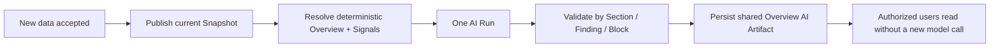
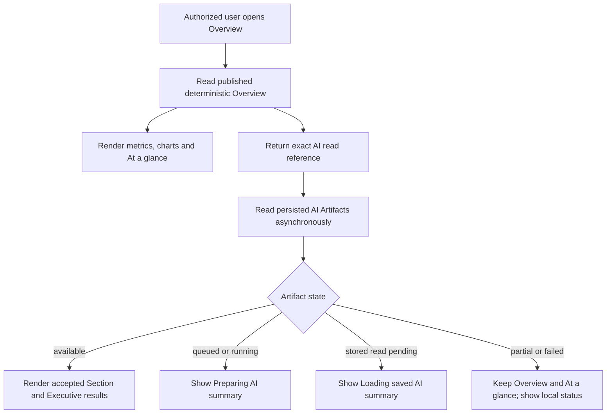

# Overview 用户价值与 AI Slot 最小交付决策

> **2026-08-06 客户价值补充：** [Charles 系统价值复核与两批数据连续演示决策](2026-08-06-Charles系统价值复核与连续数据演示决策.md)进一步要求用两批真实增量数据证明系统相对“一次性 Claude HTML”的连续价值，并收紧最终页面的信息密度：#9 默认显示 0–3 条有价值 Finding，不为版式机械填满三条；原 #17 exactly-three 只保留为当时 Provider/tool-chain 验收证据。

## 1. 结论

本次独立复核对补充风险审查的判断是：**修改后接受**。

Ngee Ann 当前北极星不是单独交付一个结构化模板，也不是先建设完整 AI 平台，而是跑通同一条客户价值链：

> Boss/FM 在 60 秒内判断截至当前 data cutoff 的近期、重复和结构性用能机会；若存在，能理解主要问题、影响、证据、下一步核查对象和验证方式；若不存在，系统诚实显示没有足够的重要发现，不强行凑满三条。

Charles 首版验收边界同时包含：

1. **确定性 Overview**：快速首屏、真实数字、决策主题、Actual vs Baseline、Level/Circuit/time Evidence 和可操作下钻；
2. **真实 AI Slot**：在同一权威 Context、Snapshot 和只读 datasource 上执行一次真实 DataFoundry Run；AI 使用 SQL 工具主动调查、验证和组织 0–3 个有价值 Finding，模型不可用时不影响确定性页面。

这项决定只调整 Ngee Ann 首版的**执行顺序与验收边界**。既有架构仍然成立：Energy Data Foundation/Kernel 是数字权威，项目专属 Snapshot/ViewModel/Renderer 负责页面表达，DataFoundry 是可替换的 AI Runtime。

### 1.1 Current Overview 时间表面补充边界

Ngee Ann 客户 Overview 不再提供控制整页的 Yesterday、Last 7 days、Previous week、Previous month、Custom 与可编辑日期。服务端先在 Project 级选择最新完整日作为统一 data cutoff，再把 Overview 主观察窗口固定为截至该 cutoff 的滚动 28 天；不得为了得到“完整 28 天”向前搜索旧窗口。窗口内存在缺口时保留真实日期并显示 `Partial`/Data Status，不回退、不补零。随后以同一 Data Snapshot、Published Release、cutoff 与 `from/to` 解析所选 Scope；Scope 切换不得重新选择另一个 cutoff。

页面必须只读显示实际分析窗口和 data-through 日期。保留的旧 Period/Custom 深链接按其原始日期解析，但同样只读显示窗口，并提供返回 Current Overview 的入口；切换 Project 时不得继承旧 Project 的隐藏日期。Save 必须将 Snapshot 已解析的实际 `from/to` 冻结为 Custom 查询，Explorer、Saved/rerun、完整 AI Analyst handoff 与通用 Renderer 继续使用既有 Period/Custom 合同。

首版多时间尺度结构固定为：最新状态使用最新完整 1 天，短期变化使用滚动 7 天，Overview 的 Total、Daily Average、Peak、Trend/Anomaly、Level/Category/Circuit 贡献与 previous-period comparison 以滚动 28 天为主观察范围；AI 综合 1d/7d/28d。日内曲线继续复用最新完整日与现有典型工作日/周末/节假日投影。只有具体探索模块日后证明需要时才增加局部时间切换；局部切换不得重算整页或触发全部 AI。

本补充只收窄 Ngee Ann 客户表面并增加一个窄的 `current-overview-28d` 解析意图，不删除底层时间合同，不改变既有 1d/7d/28d Kernel，也不引入 Cadence、Scheduler 或通用 Horizon 平台。

## 2. 为什么需要调整旧顺序

[《Overview 改造与 AI Analysis 打通最终方案》](决策-Overview改造与AI-Analysis打通最终方案.md)原先将完整 AI 上下文跳转排在 AI Slot 前，并把 AI Slot 放到较后批次。该顺序适合降低早期风险，但已不符合当前确认的 Charles 首版目标：**AI Slot 本身也是要交付和验证的产品价值，不应在 #9 验收完成后才首次出现。**

因此，本决策替代的仅是以下旧执行顺序：

- 不再要求完整对话式 AI Analyst #16 全部完成后，才能实现首版嵌入式 AI Slot；
- 不再让 #17 被最终 Charles 验收 #9 反向阻塞；
- #9 应在确定性页面、首屏性能和最小真实 AI Slot 都具备后，承担最终组装与人工验收。

本决策不改变以下边界：

- AI 不改写或覆盖官方 KPI；AI 可以调用服务端授权的只读 SQL 工具验证数字和寻找额外角度；
- AI 不成为 Overview Renderer；
- 模型停机时确定性 Overview 仍完整可用；
- 完整 AI Analyst 的自由追问、Task Console 和上下文跳转仍由 #14/#16 负责。

## 3. 当前证据与问题

### 3.1 当前页面已经可信，但还没有形成完整决策闭环

固定 Ngee Ann Golden Period 的当前页面可以正确显示 Project/Scope/Period、Data Status、KPI、异常、Level/Circuit/time Evidence，并保持 Snapshot/Release/Rule 等版本边界。

但首屏三个 Decision Priority 实际来自同一个 `daily_usage_above_baseline` 规则，使用同一个 `INSPECT_DAILY_USAGE_DRIVERS` 行动模板，只是日期和影响不同。它们能回答“哪几天异常”，却没有合并成“最值得先处理的决策主题”。

当前 Golden 中可支持更有价值叙事的确定性证据包括：

- Period 总能耗为 `1531.1683 kWh`；
- 非营业时段能耗为 `684.5044 kWh`，占 `44.7%`；
- Level 7 的 Fan ISOL1/2 对非营业时段贡献 `260.742 kWh`；
- 11、13、14 Jun 的主要 Circuit driver 一致，而当前页面把三个日期拆成三张近似卡片。

这些事实说明：页面已达到“可信异常发现”，但仍需把重复日期异常组织成少量决策主题，并明确下一步核查和复核指标，才达到“决策就绪”。

### 3.2 DataFoundry 基础可复用，但 AI Slot 尚未存在

当前代码已经提供：

- Workspace 默认模型与 fallback-off 解析；
- 服务端权威 Energy Query Context；
- Scope 限制的只读 datasource；
- 可显式选择的 Skill、工具策略、Run、事件、Trace 与持久化能力；
- Run request fingerprint 和已有 Run replay。

当前仍缺的是一个直接面向 Charles 首版价值的垂直切片：服务端把权威 Ngee Ann Context、当前 Snapshot pin 和最小项目调查先验交给一次真实 Run；Run 使用现有 schema inspection 与只读 SQL 工具形成 Finding、Evidence、Impact、Action，并把运行状态和结果显示在 Overview。首版不以前置建设专用 Bundle、持久 Insight Artifact、Claim Validator 或通用复用平台为条件。

因此，DataFoundry 足以承载首版真实自主分析，但“Runtime 已存在”仍不等于“AI Slot 已完成”；必须用真实 Provider、真实工具调用、真实页面状态和 Chrome 结果共同证明。

## 4. 评估过的方案

| 方案 | 优点 | 主要问题 | 结论 |
| --- | --- | --- | --- |
| A. 先完成确定性 Overview，AI Slot 留到 #9 之后 | 风险最低、页面先可用 | 无法在当前验收中验证 AI 是否创造真实用户价值 | 不采用 |
| B. 先完成 #14/#16 的完整 AI Analyst，再做 AI Slot | 共用能力最完整 | 重新形成平台优先的瀑布，延迟第一张真实 AI 页面 | 不采用 |
| C. 在确定性页面之上交付一次真实、异步、受 Snapshot 与 Evidence 约束的自主 DataFoundry Run | 能直接验证 AI 是否会主动查数并形成客户价值，同时保留故障隔离 | 需要严格固定授权 Context、只读工具和项目调查边界 | **采用** |

## 5. 最小架构

~~~mermaid
flowchart LR
  A["Published Release + current Data Snapshot"] --> B["Deterministic Overview renders first"]
  A --> C["Server-authoritative Energy Query Context"]
  D["ngee-ann-analysis-pack@v1"] --> C
  C --> E["One real DataFoundry Run"]
  E --> F["Schema inspection + scoped read-only SQL"]
  F --> G["0-3 Evidence-backed Findings"]
  G --> H["Async AI Slot"]
  E -. "timeout or failure" .-> I["AI unavailable; deterministic Overview remains"]
~~~

首版只有一个页面级 AI Run，不为三个视觉位置分别调用模型。Renderer 只消费 Run 状态和 Finding ViewModel，不了解 Mastra、Prompt、Skill 内部或 Provider API。Run 必须 pin 当前 `dataSnapshotId`；Snapshot 漂移或 datasource 不可用时 fail closed。

### 5.1 最小 Project Analysis Prior

首版不新增一套通用 Skill taxonomy。继续复用现有 `data-analysis` guidance，只增加一个由服务端拥有、可追溯的项目调查先验：

> `ngee-ann-analysis-pack@v1`

它只包含：

1. 值得调查的问题，例如整体偏差、1d 近期信号、7d 重复模式、28d 结构性迹象，以及 Level、Category、Circuit、time 和 peak driver；
2. 推荐调查顺序，例如先确认整体与可比基线，再下钻空间、回路和时间证据；
3. 分析边界，例如官方总量只由 Aggregate 口径决定，Sub-meter 只用于解释；
4. 缺失 Evidence，例如没有排班、设备状态、天气或维修记录时只能提出 Hypothesis 和下一步核查。

Pack **不包含** SQL、公式、阈值、当前数字、官方 Finding 或答案模板，也不成为第二套 Recipe。服务端按已授权 Project 与当前 Published Renderer/Release 显式选择 Pack，并把 `packId` 与 `revision` 记录在同一次 Context Package/Trace；浏览器不能自行选择或覆盖。

AI 可以用 Pack 作为调查先验，得出 `supports`、`challenges` 或 `independent` 的 Evidence-backed Finding。首版不强迫模型必须“创新”；没有可靠新角度时允许只支持或反证已有主题，但不得把三张确定性卡片简单改写成长摘要。

### 5.2 首版 AI 使用现有只读工具主动查数

首版 AI Slot 执行真实 DataFoundry Run，并允许模型按需使用现有 schema inspection 与服务端 Scope 限制的只读 SQL datasource。SQL 结果必须来自当前授权 Workspace、Project、Scope 与同一 Snapshot，禁止写入、跨租户、跨 Project 或绕开服务端 Context。

为先验证分析价值，Ngee Ann 首版同时向模型提供一个由当前 Renderer Snapshot 生成的、有上限的跨维度 Discovery Evidence projection。它只选择同一 cutoff 下已经确定性算出的 1d/7d/28d、Level、Category、Circuit、daily/time、peak、operating-hours、quality 与 limitation Evidence，不携带原始 Excel，也不新增计算口径。模型可在这些 Evidence 中自主选择调查角度，并只执行一次最有价值的只读 SQL 交叉核查；不得恢复为固定 Level 查询或为每张卡重复查数。

确定性 Overview 仍是官方 KPI、Rule 和 Decision Theme 的唯一权威层。AI Finding 的数字必须逐项引用同一 Snapshot 的确定性 Evidence 或该次只读 SQL result；SQL Evidence 与 Deterministic Snapshot Evidence 在页面中分开显示，模型不能把自己的计算覆盖到官方卡片。需要的数据不存在时应明确 `Missing Evidence`，而不是心算、猜测或扩大权限。

上述 projection 是 Charles MVP 的非权威适配层：当前由浏览器根据服务端返回的 Snapshot 构造，Run 仍由服务端重新校验 Workspace/Project/Scope/Snapshot pin 与 datasource 权限，但服务端尚未重新构造或逐项签名该 projection。因此它可以支持可追溯的候选 Finding，不能提升为官方 KPI，也不能作为多租户生产防篡改完成的证据。只有真实客户部署需要跨会话共享或服务端信任 AI Artifact 时，才按实际风险把 projection 改为服务端重建/校验；本轮不建设通用 Artifact 或第二套版本系统。

### 5.3 Preschool Pack 只确认内容，不接 Runtime

`preschool-analysis-pack@v1` 的首版调查范围先固定为 Portfolio 总览、Centre ranking、EUI/per-pax、P75 benchmark、quadrant、standby/off-hours、operating pattern 和 Centre → Circuit 下钻。它同样只保存问题、顺序、边界和缺失 Evidence，不保存 SQL、公式、阈值或当前数字。

在 Preschool 独立 Renderer、确定性 Recipe 与 Published Mapping 尚未形成可验收闭环前，不注册、不选择也不执行该 Pack；Ngee Ann #17/#9 不等待 Preschool。只有真实 Preschool 页面证明这些维度具备权威口径后，才把 Pack 接入 Runtime，并据两项目实际重复点判断是否抽取通用 Policy。

截至 2026-08-06，以上接入前置已经由 #10–#13 的自动化垂直切片满足：真实 May Snapshot/Mapping、独立 `preschool-overview` Renderer、Portfolio/Centre Benchmark、EUI/Per-Pax、Standby/Operating、Spike/SOP、确定性决策组装及 1440/1920 Chrome 证据均已形成。Charles 对 #13 的最终人工签字仍单独保留，但用户已确认初步验收不阻塞 #18 的技术执行。因此 #18 可以接入 `preschool-analysis-pack@v1`；它必须使用 Preschool 专属的有界 Evidence projection 与 0–3 Finding 合同，不复制 Ngee Ann 强耦合的 1d/7d/28d 或 exactly-three 输出，也不借机抽象通用 Pack Runtime。

## 6. 输入、输出与可信边界

### 6.1 服务端权威 Context Package

Run 使用服务端从登录身份、Membership、Project Release 和当前请求解析出的权威 Context，至少固定：

- `workspaceId`、`projectId`、`scopeId`、`resource` 与 Project timezone；
- 统一的 data cutoff，以及 Finding 可使用的 1d、7d、28d 分析窗口；
- `dataSnapshotId`、`projectReleaseId` 与 Published Renderer key；
- 当前授权 datasource 和只读工具集合；
- `ngee-ann-analysis-pack@v1` 的 `packId` 与 `revision`。

Hover、弹窗、选中 heatmap cell、滚动位置和局部图表切换不触发整页 AI Run。浏览器传入的 Workspace、Pack、Snapshot 或 Renderer 只能作为请求线索，服务端必须重新解析并校验；首版 Discovery Evidence projection 的例外和非权威限制见 5.2，不得用它覆盖服务端 Context 或官方确定性层。

### 6.2 Finding 输出

首版返回 0–3 个互不重复的 Finding；三条合计应覆盖近期信号、重复模式和较长周期结构，但不要求机械地“一条对应一个 Horizon”。每条至少回答：

- `what`：发生了什么；
- `why`：为什么重要，以及原因是 Fact、Attribution 还是 Hypothesis；
- `action`：下一步调查或行动方向；
- `verification`：如何在下一可比周期验证；
- `evidence`：所用 SQL/tool result、Scope、窗口与关键数字；
- `relationship`：`supports`、`challenges` 或 `independent`。

`relationship` 用于解释 AI 与确定性主题的关系，不是创新配额。若数据不足以支持额外角度，模型不得为了填满 `independent` 而编造结论。无 Evidence 的数字、已确认根因、节省金额、ROI、负责人或承诺不展示。

### 6.3 自主探索与最终输出验真边界

Agent 的调查能力与客户可见输出采用不同边界：**调查阶段不规定固定主题、维度、SQL 数量或“创新”配额；发布阶段
逐条验证事实、数字、图表与 Evidence 身份。** 输出校验限制的是未经证明的断言，不限制 Agent 可以观察和调查什么。

评估过的选择：

| 方案 | 优点 | 风险 | 决定 |
| --- | --- | --- | --- |
| 直接相信模型最终文本 | 最快、最自由 | 无法区分可靠计算、心算、错引和编造 | 不采用 |
| 用固定主题、固定 SQL 或固定路线避免错误 | 容易得到稳定格式 | 压制自主发现，退化成摘要生成器 | 不采用 |
| 自主调查，完成后只做拒绝 | 安全 | 当前 Preschool 已出现工具成功但 0/3 Finding 可展示 | 仅作为最终兜底 |
| 自主调查 + 提交前自检 + 确定性发布校验 | 保留分析能力，同时提高可交付率 | 增加一次校验和可能的定向修正成本 | **采用** |

采用方案的最小合同：

1. `Fact`、数字和图表值必须来自同一 Project/Scope/Resource/Snapshot/window 的 typed Evidence；只出现相同数值不等于
   语义一致，还必须匹配指标、单位和维度；
2. 排名、比例、差值等派生事实应由 SQL/受控计算工具输出为明确命名字段，不允许模型在最终文案中自行心算；
3. 原因尚未被数据证明时可以提出 `Hypothesis`，但必须说明支持迹象、缺失 Evidence 和验证方式，不能写成已确认因果；
4. 行动建议可以自主提出；“做了会节省多少”等量化结果只有在存在对应模型/Evidence 时才能发布，否则使用可验证的
   定性预期；
5. 每条 Finding 和每个 Presentation Block 独立校验：无效 Block 局部移除，无效 Finding 不连坐已验证 sibling；全部
   无效时 AI Slot honest unavailable，确定性 Overview 保持可用；
6. Agent 提交前先使用本 Run 已有工具结果自检；服务端校验失败时最多进行一次定向修正，只允许补正确引用、删除/降级
   未证明断言或改为 Missing Evidence，不重新启动整页分析，也不形成无限自动重试；
7. 自动补绑定只在 typed Evidence 唯一匹配时执行；同值、多来源或语义不明确时不得静默选择某条 Evidence；
8. 校验合同 revision 进入 Artifact/恢复指纹；旧结果不因新校验器而被改写，新 Snapshot 也不得恢复旧合同结果。

这套校验是必要但不充分的：数字可追溯不代表洞察有价值，也不能完全自动证明因果语义。因此 #30 继续同时检查
Insight 的 What/Evidence/Why/Action/Verify 与人工决策价值，不能用“通过守卫”代替客户验收，也不能通过让模型少写数字
来提高通过率。

### 6.4 2026-08-08 MVP 执行校准：停止扩大输出治理

Preschool 输出合同 v10 已经覆盖当前已复现的同值错实体、错单位、错误 Centre、EUI/per-pax/currency 混淆和唯一
Evidence 补绑定。它作为 Charles MVP 的安全底线继续保留，但本轮**不再把同 Run 的 Output Submit、一次定向修正或
通用 Typed Evidence Adapter 作为客户可见交付的前置条件**。

当前处理规则足够简单：唯一且语义一致时允许补绑定；无法证明的 Presentation Block 或 Finding 局部移除；全部无效时
honest unavailable；确定性 Overview 始终不受影响。接下来工程优先级回到真实验收、信息价值、阅读路径、图文协同和
AI Slot 展示，而不是继续增加 Runtime 协议。

只有同时满足以下条件，才重新启动一次定向修正切片：

1. 固定 Snapshot/Profile 的重复真实 Run 中，至少两次产生了人工判断有价值、数字本身正确，但只因可机械修复的引用错误而被丢弃；
2. 该问题已经阻塞 Charles/用户看到有价值结果，不能靠当前唯一匹配或局部降级解决；
3. 修复可以复用现有 Runtime/Session/Artifact，在一个窄切片内完成，不新增第二套平台。

即使触发，也只做最小修正；不建设通用 Claim Graph、公式 DSL、Scheduler、跨项目缓存或新的 Artifact 仓库。

## 7. 页面生命周期

1. Ngee Ann Renderer 和确定性首屏立即出现；
2. 核心数据返回后，AI Slot 显示 `AI analysis queued` 或 `AI analysis in progress`；
3. 同一次稳定 Context 只启动一个 Run；首版不为复用结果建设页面业务缓存、持久 Insight Artifact 或跨用户共享机制；
4. Run 完成后显示 0–3 个 Finding，并标注生成时间、Snapshot、Pack revision、关系和限制；
5. 模型超时、失败或 Provider 未批准时显示明确的 unavailable 状态，不覆盖指标、图表和规则 Finding；
6. Project、Scope、data cutoff 或 Snapshot 改变后，旧结果立即隐藏或标记 `Outdated context`，不得冒充当前结论；
7. 首版只在稳定主上下文加载后自动运行，或由用户点击 Refresh AI；Hover 和局部浏览交互不触发 Run。

首版直接复用现有 DataFoundry Run、事件和 Trace；不新增独立 Runtime、Scheduler、Cadence DSL、Insight 仓库、跨用户缓存、分布式 lease 或页面级 Artifact 平台。后续追问进入完整 AI Analyst，并把选中的 Finding、Context pins 与必要工具证据带入已有 Session；首版不为此重做会话系统。

## 8. Provider 与数据治理

本地开发和 Charles 首版验证复用当前 Workspace 模型配置、密钥隔离和授权 datasource，不把治理建设扩成当前 Ticket。客户正式环境仍须记录 Provider/endpoint、发送字段范围及适用的留存/地域约束；未配置或不允许外发时 AI Slot 诚实显示 unavailable，确定性 Overview 正常工作。

当前本地 Workspace default 为 StepFun，DeepSeek 只作为候选 Profile；这是可变的运行配置，不进入代码、Pack 或产品合同。一次连接成功或一次 accepted Run 都不能证明 Provider 可复现性。新的真实 AI 垂直切片只做同一 Snapshot/cutoff/Pack/Profile revision 下 3 次有界 smoke，记录 accepted/unavailable、wall time、failure reason、tool Evidence 数量与人工决策价值，目标至少 2/3 accepted。未达到时保持 honest unavailable，并停止通过放松 Snapshot、numeric 或 Evidence 守卫制造假成功；不得为此建设 Scheduler、缓存、静默 fallback 或通用 Provider eval 平台。

Run 只向模型提供 Context、Pack 和模型完成调查所需的工具结果，不发送原始 Excel、密钥或无关 Workspace 数据。“模型已连接”仍不等于客户生产授权已经完成，证据必须区分本地真实 Provider 与客户生产验收。

## 9. Ticket 与依赖调整建议

以下边界已于 2026-08-05 同步到 GitHub #17/#9/#10/#18；若后续 Issue 正文与本文再次出现冲突，应先按本文北极星复核，再保留更小、可见交付优先的执行切片。

### 9.1 建议的执行链

1. **#26 / T08A**：保留已完成的性能优化和剩余 `<3s` 证据，不让小幅性能余量重新阻塞客户可见价值；
2. **#27 / T08B**：保留已完成的 1d/7d/28d 确定性多时间尺度主题、Actual vs Baseline、driver 与直接 Evidence 路径；
3. **#17 / T16**：交付一个真实 DataFoundry 自主 Run、服务端 `ngee-ann-analysis-pack@v1`、当前 Snapshot pin、只读 SQL 工具证据、异步 AI Slot 和 honest unavailable；不依赖完整 #16；
4. **#9 / T08**：在 #17 后完成 1440/1920 Chrome、全页价值/视觉/交互、真实 Provider 结果和 Charles 人工验收；
5. **#14/#16**：继续完成 Overview Finding → 完整 AI Analyst 的带上下文追问，不作为最小嵌入式 Slot 的前置；
6. **Preschool**：先完成确定性 Renderer 与数据合同，再由后续 Ticket 接入 `preschool-analysis-pack@v1`；不得阻塞 Ngee Ann #17/#9。

本轮直接优化现有 #17，不再为 Pack、Artifact、Scheduler 或自主分析另建新 Ticket。

### 9.2 第一项客户可见交付物

第一项交付物不是后端 Schema 或 Prompt，而是一张可在 Chrome 直接检查的 Ngee Ann 页面：

- 确定性 Overview 已先显示；
- 重复日期异常已经合并成少量主题；
- AI Slot 真实经历 queued/running/available 或 honest unavailable；
- 至少一个 AI Finding 引用同一 Snapshot 的真实 SQL/tool Evidence；
- 1440px 与 1920px 截图同时记录 Context、生成状态和限制。

该截图应由调整后的最小 #17 交付，#9 再做整页最终验收；截图中的 AI Finding 必须来自一次真实 Provider + 只读 SQL 工具 Run，并可查看 Snapshot、Pack revision 与 Evidence。Fixture/Mock 截图不能冒充真实 Provider E2E。

## 10. 验收标准

### 10.1 用户价值

- Boss 在 60 秒内能说出发生了什么、影响多大、谁应先核查什么、如何在下一可比周期复核；
- FM 从主题一次操作即可看到预筛选的 Level/Circuit/time Evidence；
- 0–3 个主题互不重复；没有重要发现时不凑数；
- AI 不是更长的摘要，而是会主动查数、验证或挑战已有主题，并补充受 Evidence 支持的调查角度、缺失 Evidence 和可验证行动。

### 10.2 可信性与故障隔离

- 官方 KPI、Rule 与 Decision Theme 只来自确定性 Snapshot/Evidence；AI Finding 中的数字逐项引用同一 Snapshot 的 Deterministic Snapshot Evidence 或只读 SQL/tool result，不覆盖官方层；
- Fact、Attribution、Hypothesis 和 Missing Evidence 可区分；
- Context、Snapshot、Published Renderer、Pack revision、模型与工具调用可追溯；
- Context 变化后旧结果不再显示成当前结论；
- AI 超时、失败、Snapshot 漂移、工具拒绝或 Provider 未配置时，确定性页面仍完整可用。

### 10.3 工程证据

- 服务端 Project/Published Renderer → Pack 选择、跨项目拒绝与 Pack revision Trace 自动测试；
- `expectedDataSnapshotId` 漂移 fail closed、只读 SQL Scope/授权隔离和 stale 降级测试；
- 固定 Golden 的 Renderer/Chrome 视觉回归；
- 同一 Snapshot、模型与任务做一次有 Pack/无 Pack 的真实 Provider 对照，比较 Charles Matrix 覆盖、重复度、证据质量和行动价值；不做逐字文案 Golden；
- Charles 对信息价值、分析深度和行动可用性的独立人工验收；
- 清楚区分代码、Fixture、Chrome、本地真实 Provider 和客户验收证据。

## 11. 最大剩余风险与反证条件

最大风险不是 Prompt 写得不够漂亮，而是能耗 Evidence 只能支持异常定位和调查优先级，却让模型把排班、设备故障或人员行为写成已确认根因。没有门禁、门禁记录、设备状态、控制策略、天气或维修记录时，AI 必须停在“有依据的假设 + 下一步验证”。

以下任一情况出现，应暂停扩张并重新审查：

1. 最小 Slot 必须重建 DataFoundry Runtime 或先完成完整 #14/#16 才能运行；
2. Run 无法把模型关键数字追溯到同一 Snapshot 的只读 SQL/tool result；
3. 真实 Provider 多次运行仍频繁编造数字、合并错误主题或把假设写成事实；
4. 必须把模型放入确定性首屏同步链才能展示页面；
5. Ngee Ann Pack 开始复制指标算法或形成第二套 Recipe；
6. 第一张真实结果仍只是三条日期异常的同义复述；
7. #26 后继续出现新的跨 Metadata、DuckDB、API、Web 的通用底座 Ticket，且不能直接说明其阻塞哪个 Ngee Ann 页面/AI 验收项。
8. 为接入 Pack 必须先建设持久 Insight 仓库、通用 Scheduler/DSL 或第二套 Runtime。
9. 同一 Snapshot/Profile 的有界 Provider smoke 多次不能通过 Evidence 验证时，仍试图用自动重试、静默 fallback、放松 numeric guard 或扩建 Provider 平台掩盖不稳定性。

## 12. 明确停止项

首版不做：

- 不新建第二套 Agent Runtime；
- 不建设通用 Query Receipt、历史 Snapshot 回放、持久 Insight Artifact、Scheduler/Cadence DSL 或跨项目缓存平台；
- 不先设计所有项目的 Skill taxonomy；
- 不创建 5–8 个 Ngee Ann 专属 Skill；
- 不在首版建设 section 级 Claim 状态机、流式 Token UI 或自动取消旧 Run 的复杂状态机；
- 不做跨用户、跨项目或跨 Workspace 的 AI 结果缓存；
- 不把完整 Overview Snapshot 或原始 Excel 发给模型；
- 不开放写入 SQL、跨 Scope datasource、任意外部工具、图表代码或 React/HTML 生成；
- 不让模型修改官方 KPI、Recipe、Rule priority 或 Renderer 布局；
- 不把 Pack 写成答案模板，也不强迫模型必须提出 `independent` 新角度或永远生成三条洞察；
- 不在 Ngee Ann #17/#9 前接入 Preschool Pack Runtime；
- 不在 Provider 数据治理未批准时自动发送客户数据；
- 不让 AI Run 阻塞确定性首屏；
- 不用静态 Mock、合法 JSON 或更长文案冒充真实价值与真实 Provider E2E；
- 不用 AI 文字掩盖确定性图表、Actual vs Baseline、driver 和 Evidence 路径不足。

## 13. 当前未决输入

当前本地开发继续使用已配置 Workspace/用户模型完成真实 Provider 验证。客户正式环境发布前仍需确认发送字段范围及对应 Provider 的留存和处理地域；这项确认不触发通用治理平台建设，也不阻塞 Ngee Ann 本地 Charles 验收。

## 14. 2026-08-08 AI-native 决策界面校准

### 14.1 独立结论与替代范围

本次独立复核后，接受以下产品目标：EnergyIQ 不是“Dashboard + 页面底部 AI Chat”，而是一个由同一可信上下文驱动的
AI-native 决策界面。确定性计算、Structured Signals、AI Interpretation 和 UI Composition 分工如下：

| 层 | 权威职责 | 不负责 |
| --- | --- | --- |
| Facts / Evidence | Metric、Comparison、Ranking、Threshold、Snapshot、Scope、Period、单位和 Evidence | 客户长文与开放式原因判断 |
| Structured Signals | 项目专属、可测试的值得关注信号，包含事实引用、严重程度、Section 和限制 | 拼接完整 What/Why/Action 文章 |
| AI Interpretation | 自主选择调查角度，解释重要性、提出假设、下一步和验证方式，并选择 0～N 个 Presentation Blocks | 改写官方 KPI、Snapshot、Signal 强度或 Evidence |
| UI Composition | 把已接受的 Interpretation 放入对应 Section，并提供确定性 fallback、加载和局部失败状态 | 执行模型生成的 HTML、JavaScript 或 React |

这一决定不新建第二套 Unified Model。现有 Published Snapshot 与 `AnalysisContextEvidenceCatalog` 是唯一可信上下文；
Preschool 与 Ngee Ann 只新增项目专属 Structured Signal Adapter。原 5.2、7、9.1、11、12 中“AI 只作为独立页面级
Slot”“不做持久/跨用户结果”的表述，被本节的窄范围共享 Artifact 决定替代；禁止通用 Scheduler、跨项目缓存和任意
页面代码的停止项继续有效。

### 14.2 单次 Run，多 Section 输出

同一 `Project + Scope + Resource + Published Snapshot + Project Release + model Profile revision + output contract`
只运行一次 AI。模型可以为不同模块返回不同表达，但不为每个模块重复调用：

```ts
type OverviewAiArtifact = {
  sectionInterpretations: Array<{
    sectionId: string;
    signalRefs: string[];
    takeaway: string;
    importance: string;
    action: string;
    verify: string;
    presentation: PresentationBlock[];
  }>;
  pageSynthesis: {
    priorities: Array<{ sectionId?: string; signalRefs: string[]; takeaway: string }>;
  };
};
```

Agent 可以支持、挑战、合并或省略现有 Signal，也可以提出新的 Evidence-backed 发现。新发现属于已知模块时绑定稳定
`sectionId`；跨模块发现进入 `page-synthesis`。Runtime 逐 Finding、逐 Section、逐 Presentation Block 验收；一个模块
失败时只回退该模块的确定性 Signal，不连坐已经接受的 sibling。Page Synthesis 只能引用已接受的事实、Signal 或
Interpretation。

Preschool 首版稳定锚点为：

- `overall-summary`；
- `centre-benchmark`；
- `operating-behaviour`；
- `appliance-contribution`；
- `planning-outlook`；
- `page-synthesis`。

锚点只规定内容可以放在哪里，不规定 Agent 必须调查哪些主题或必须输出多少内容。AI 可以组合任意数量的安全声明式
Presentation Blocks，并标记 `primary` / `supporting`；系统不执行模型生成的 HTML、JavaScript、React、SQL 或任意
前端代码。将来若复杂可视化确有价值，只在完整 AI Analyst 中另行评审隔离 iframe 实验区，不进入当前 MVP。

### 14.3 页面生命周期与 fallback

1. 确定性 Overview、Facts、图表和精简 Structured Signals 立即显示；
2. Artifact 尚未完成时，顶部或对应模块显示轻量 `AI analysis is being prepared`，不阻塞整页；
3. Artifact Available 后，Section Interpretation 原地进入对应模块，页面顶部只保留 0～3 条简洁全页 Synthesis；
4. 不再同时展示一套长篇 deterministic DecisionSummary 和一套重复 AI Brief；
5. 单个 Section 无效时局部回退，全部无效或 Provider 不可用时确定性页面保持完整；
6. Saved Analysis 冻结并恢复当时已接受的 Interpretation、Presentation 和 Synthesis，不启动新 Run；旧版历史 Artifact
   按原合同和布局读取，不追写、不迁移、不重新生成。

### 14.4 新 Snapshot 后预生成共享 Artifact

Overview AI 不再以“用户打开页面”作为主要启动条件。新 Data Snapshot 成为 Project 当前 Published Snapshot 后，系统为
Project-level Current Overview 触发一次 AI materialization：



这不是固定夜间 Cron：虽然当前数据通常夜间更新，但触发条件是新 Published Snapshot，保证未来 API 在任意时间到数时仍
正确。MVP 只预生成 Project-level Current Overview，不提前遍历 Centre、Level、Circuit、自定义 Period 或完整 AI Analyst
问题。

Artifact 在同一 Workspace/Project/Scope/Snapshot/Release/Profile/contract 下共享，但读取时仍重新检查 Membership 与
Project 授权；不跨 Workspace、Project 或 Snapshot 复用。相同身份的普通页面 Refresh 直接恢复 Artifact；新 Snapshot
创建新身份。旧 Snapshot Artifact 只在 History 中读取，不得和当前数字混用。

后台对同一 Snapshot 只允许一个共享任务和有限重试。预生成仍失败时，用户打开页面不为每个用户创建新 Run；页面显示
确定性 Overview 与明确状态，并提供受控 Retry。实现复用现有 Run、Session、validator 和 Metadata 持久化，不建设通用
Scheduler、Cadence DSL、跨项目 Insight 平台或第二套 Agent Runtime。

### 14.5 配置 fail-fast

`SECRET_MASTER_KEY` 缺失或无法解密当前模型 Profile 属于启动配置错误，不应等到客户发起 AI Run 才暴露。受支持的启动
入口必须在停旧进程前检查授权 Env；API readiness 在存在加密默认 Profile 时执行不泄露明文的 decryptability probe。
配置错误使 AI capability not-ready，并向 UI 返回客户安全的配置状态；readiness 不调用外部 Provider，避免把网络波动变成
整个 API 的健康失败。Provider 超时、网络失败和 Evidence rejection 仍是正常可降级的 AI unavailable，不承诺彻底消失。

### 14.6 最小迁移顺序与停止项

1. Preschool 服务端 Snapshot 产出项目专属 Structured Signals，删除浏览器 ViewModel 中的长篇决策模板 owner；
2. Preschool 一次 Run 返回 Section Interpretations + Page Synthesis，并逐 Section 验收；
3. Renderer 将 Interpretation 嵌入稳定 Section，保留 deterministic fallback、Saved/Resume 和旧 Artifact 兼容；
4. 完成真实 Provider、1440/1920/tablet 和人工信息价值验收后，再把同一输出 Interface 适配 Ngee Ann；
5. 新 Snapshot 预生成共享 Artifact 作为独立窄切片接入，不阻塞前三步首次客户可见结果。

明确停止：不建立通用 Signal DSL、通用 Scheduler、所有 Scope 预跑、按用户重复分析、跨项目缓存、第二套 Evidence Catalog、
第二套 Runtime、模型生成可执行页面代码，或为了预生成而放松 Snapshot/授权/Evidence 校验。

## 15. 2026-08-11 Preschool Section Interpreter 窄范围校准

GitHub `#43` 对第 14 节作以下 Preschool 专属收窄；本节不改变 Autonomous Investigator、Interactive AI Analyst 或未来
Overview Studio 的方向：

1. **Section Interpreter** 只读取当前 Published Snapshot 已验证的 Section Pack，为 Preschool Sections 2–5 输出一句普通
   英文结论和 2～4 个 Key Points。它不加载完整 Schema、SQL 工具、Knowledge/Skill，也不启动自主调查循环或独立 Editor。
2. **Executive Synthesis** 只综合同一 Workspace、Project、Scope、Snapshot、Release、Period 和 Model identity 下已经通过的
   Section Interpretation，输出 0～4 条顶部 Key Findings；不得重读原始 Facts、引入新数字或新事实。
3. **Autonomous Investigator** 保留现有 Investigator → Editor、typed Evidence Validator 和声明式 Presentation Blocks，后续只
   服务 `Additional EnergyIQ Insights`；其失败不得影响 Section Interpreter 或确定性 Overview。
4. 三类结果复用同一 Overview AI Artifact Store，并以 `artifactKind` 和可选 `targetId` 区分价值单元。旧 Autonomous identity
   保持可读，不追写、不迁移；`empty` 是成功 payload，不扩张数据库状态机。
5. Provider 可用一次短批调用生成多个 Section，但 Parser、Evidence Validator、持久化、失败状态和重试必须逐 Section；一个
   malformed 或 unsupported Section 不得抹掉合格 sibling。Provider 整体传输失败可以诚实地共同失败。
6. 客户/Web 继续使用 read / ensure / retry 小接口。Refresh 和 Saved Analysis 只恢复精确 identity 的 Artifact，不启动新模型。

本校准不授权通用 Artifact 平台、通用多 Agent 编排、Scheduler/DSL、Ngee Ann AI 或 Overview Studio。

## 16. 2026-08-12 Preschool Section Run 隔离与价值合同

GitHub `#44` 进一步校准第 15 节的 Provider 批处理边界。四个 Section 已经拥有独立 Artifact，但一次共享 Provider envelope
仍会让顶层 JSON、传输、上下文和 Run identity 故障连坐全部 claimed Sections。因此 Preschool Sections 2–5 改为四个独立
Provider Run / Session；它们仍通过同一 Workspace、Project、Scope、Snapshot、Release、Period 和 Model identity 关联，
不新增父级数据库状态机、第二套 Store 或通用 Orchestrator。

1. 每个 Section Run 获得完整、自包含的单 Section Pack 投影，包括 audience、decision question、page coverage、data quality、
   limitations、missing evidence、allowed next checks、Evidence 和精确 identity pin；不得依赖其他 Session 的隐式消息或 memory。
2. 每个 Section 在获得进程内固定并发槽后才 claim Artifact 并启动 Provider，避免等待并发槽时 lease 先过期。并发 ensure 继续
   依赖精确 Artifact claim 去重；一个 transport、Parser、Schema、Evidence 或 identity drift 失败只影响该 Section。
3. 第一版并发上限固定为 `2`，用于控制 Provider 限流和突发请求；这会增加 Provider 请求次数和共享指令 Token，必须在真实
   验收中分别记录每 Section latency / input / output / cache tokens，不把隔离收益描述成免费。
4. `available` 改为一句结论加 1～4 个真正有用的 Key Points；模型自行选择 `priority`、`finding`、`meaning`、`next-check` 的数量和顺序，
   不再强迫每类各一条。没有超出页面复述的增量价值时返回 `empty` 和 0 条；不得机械凑数。
5. Runtime 硬门继续只处理 identity、结构、Evidence、数字、日期、单位、Centre 和关系；“是否有管理价值”由 Prompt 目标、
   Harness 和人工产品验收判断，自动测试不得冒充该判断。
6. Executive Synthesis 只在所有 Section 到达 `available/empty/failed` 终态后启动，避免并发 ensure 基于仍在运行的部分来源
   生成临时 Executive。其 identity 继续绑定 accepted source Artifact IDs；失败 Section 后续成功时形成新的来源集合和 Artifact。
7. `priority` 是明确的管理价值类型，不是未经验证的严重性标签；它仍必须绑定当前 Section Pack 的 Evidence。真实 Provider
   验收曾因模型合理返回 `priority`、而旧 Schema 未收录该类型导致单 Section 失败，因此合同、Schema、Parser、Store 与 Web
   DTO 必须一致接受该类型，并通过新 identity 重新物化，不能用 Prompt 强迫模型把优先事项改写成别的类型。
8. 同一 Section 的受控 Retry 保持新 Run / Session 和完整 Pack 自包含，但额外携带上一次客户安全的失败类别，帮助模型减少
   事实范围、数字和关系越界；不得携带隐藏聊天历史、原始错误堆栈或其他 Section 内容。重试上限仍由 Artifact Store 控制，
   不能无限调用 Provider 直到偶然通过。
9. 日期事实校验将 Evidence 的 ISO `YYYY-MM-DD` 与等价的客户可读 `D Month YYYY` 规范化到同一天；自然语言日期中的年份
   不再被数字校验器误判为新数值，但不在 Evidence 中的日期、无效日历日期和非整点时刻仍然拒绝。

本校准不改变 Section Interpreter 无 SQL/工具的 Summary 职责。需要自主发现新事实时，仍由 `Additional EnergyIQ Insights`
Investigator 使用只读工具；模板编排和 Coding Agent 分别属于后续受控阶段。

## 17. 2026-08-13 Overview 渐进加载、AI 信息分层与安全 Markdown

### 17.1 背景与本次决定

当前本地 Preschool Overview 的一次真实加载中，页面外壳约 0.6 秒出现，确定性 Overview 约 11.5 秒出现，AI 状态约
14.2 秒全部恢复。普通页面打开没有必要重新调用模型；当前额外等待主要来自确定性 Project Analysis 首次解析，以及 AI
Artifact 读取前为重建 identity 再次解析同一 Snapshot。与此同时，顶部确定性 highlights 与 AI synthesis 都以“总结”形式
出现，职责重叠；AI 文案又以整段统一字重渲染，无法让管理者快速区分重点、解释、行动和限制。

本次选择以下产品与技术方向：

1. **确定性 Overview 与 AI 恢复必须解耦。** 页面先显示当前 Published Snapshot 的确定性结果；AI 作为异步、局部、可降级的
   已存 Artifact 恢复，不得阻塞 Overview，也不得把普通页面打开变成模型启动条件。
2. **AI Executive Summary 是主总结。** 它负责跨 Sections 2–5 去重、排序和表达管理优先级、业务意义与下一步，但不引入新的
   Facts。只有独立 Investigator 产生的增量发现才属于 `Additional AI Insights`。
3. **At a glance 是确定性备用和导航索引。** 它不是第二份长篇 Summary；AI 未完成、部分失败或返回 `empty` 时承担可靠 fallback，
   AI 完整可用时保持紧凑、次级和可点击。
4. **Additional AI Insights 固定在 Section 5 之后。** 后续可承载 Autonomous Investigator、EnergyIQ 内置 Skill，以及能源专家编写
   并版本化的行业 SOP；它与 Section Interpreter、Executive Synthesis 保持独立 Artifact 和失败状态。
5. **AI 客户文案允许安全 Markdown 子集。** 模型返回 Markdown 文本，Runtime 在剥离格式后的纯文本上继续执行事实校验，Web
   将已接受的 Markdown 解析为 React elements；不接受模型 HTML，也不执行 `dangerouslySetInnerHTML`。

### 17.2 真实选项与取舍

| 选项 | 做法 | 优点 | 否决原因或代价 |
| --- | --- | --- | --- |
| A. 只保留确定性 Highlights | 删除顶部 AI Summary | 最稳定、最快 | 失去跨 Section 优先级与管理解释，不能作为主路线 |
| B. 只保留 AI Summary | 删除确定性 fallback | 页面更简洁 | AI partial/empty/failed 时首屏失去可靠摘要，也削弱导航 |
| C. AI 主总结 + 紧凑 At a glance | AI 负责综合，确定性层负责 fallback 与定位 | 同时保留价值与韧性，职责可解释 | 必须严格控制重复、覆盖状态和视觉主次 |
| D. 模型返回任意 HTML | 让模型直接控制正文和布局 | 表达自由 | XSS、样式漂移、无法稳定验收，明确拒绝 |
| E. 安全 Markdown 子集 | 模型只控制正文内轻量强调 | 表达自然、实现成熟、仍可校验 | 需要 parser/renderer 合同和格式降级策略 |

**决定选择 C + E。** At a glance 不是与 AI Executive Summary 平级竞争的第二套 Key Findings；Markdown 也不拥有页面
信息架构，只负责已结构化字段内部的有限表达。

### 17.3 页面信息架构与职责

| 区域 | 回答的问题 | Owner | 允许增加什么 | 不允许做什么 |
| --- | --- | --- | --- | --- |
| At a glance | 每一节最关键的数据结果是什么？ | Renderer/ViewModel + 当前 Snapshot | 主要值、对象、短补充、Section 跳转 | 推测原因、拼长文、替代 AI 解读 |
| Section Interpretation | 这一节意味着什么、先看什么？ | 单 Section Interpreter | Evidence-backed priority、meaning、next check、limitation | 查 SQL、跨 Section 综合、新事实 |
| AI Executive Summary | 跨 Sections 2–5，管理者先处理什么？ | Executive Synthesis | 去重、排序、跨节管理含义和行动 | 重读 Facts、创造数字、冒充完整来源 |
| Additional AI Insights | 页面原有分析之外还发现了什么？ | Autonomous Investigator / approved Skill / SOP | 新角度、调查结果、声明式 Presentation | 修改官方 KPI、混入 Executive 后不标来源 |

展示顺序采用 AI 主总结、At a glance fallback 的逻辑，而不是让两个 Summary 同时争夺注意力：

退役 `AI Management Brief` 和 `Verified Section Highlights` 两个旧展示名，分别统一为 `AI Executive Summary` 和
`At a glance`；`Verified` 是内部验收属性，不作为面向客户的标题。

1. Overall metrics 后预留 `AI Executive Summary` 稳定区域；
2. AI 已保存且完整时，显示 0～4 条跨 Section priorities，At a glance 收为紧凑次级导航；
3. AI 仍在后台生成、部分失败或 `empty` 时，At a glance 自动承担主要 fallback；
4. Partial Executive 必须显示 `Based on 2 of 4 sections` 等覆盖信息，不得伪装成完整页面总结；
5. 若 Executive 没有比 At a glance 增加跨节优先级、意义或行动，应返回 `empty`，不机械复述；
6. `Additional AI Insights` 位于 Section 5 后，默认只展示少量高价值结果并保留来源、Evidence、Skill/SOP revision。

At a glance 的可读性由受控 Presentation Grammar 保证，而不是由代码拼完整自然语言：每个 Section 只保留一个主要结果、
一个对象或范围和至多一行补充。所有值必须直接投影自同一 Renderer/ViewModel；不得在前端重新计算。Section 5 必须明确
区分 `Original plan`、`Actual to date` 和 `Current outlook`，避免 fallback 与本节当前结果使用不同口径。

### 17.4 渐进加载和只读 Artifact 恢复



定义一个深的 `Overview AI Read Module`，让调用方只学习一个读取 Interface；Membership、Project 授权、Snapshot/Release/Period/
Profile/contract 匹配、Section/Executive/Autonomous 组合和历史兼容都隐藏在其 Implementation 中：

```ts
type OverviewAiReadRef = {
  projectId: string;
  scopeId: string;
  dataSnapshotId: string;
  projectReleaseId: string;
  analysisPeriod: { from: string; to: string };
};

type OverviewAiReadResult = {
  state: "loading" | "preparing" | "available" | "partial" | "empty" | "failed";
  acceptedSectionCount: number;
  expectedSectionCount: number;
  sections: Record<string, SectionArtifactState>;
  executive: ExecutiveArtifactState;
  additional: AutonomousArtifactState;
};

readOverviewAi(input: { user: AuthorizedUser; ref: OverviewAiReadRef }): Promise<OverviewAiReadResult>;
```

`OverviewAiReadRef` 是定位信息，不是授权凭证。服务端仍重新检查 Membership、Project 和 Artifact ownership，但不得为了读取
已存 Artifact 再运行完整 `resolveProjectAnalysis`。伪造、过期或混合 Snapshot 的 ref 必须 fail closed；普通 read 也不得隐式
调用 `ensure`。只有新 Published Snapshot 的后台 materialization 或明确的受控 Retry 可以调用 Provider。

仅把 AI 与 Overview 解耦只能消除 AI 侧重复解析，不能把确定性 Overview 的约 11.5 秒自动降到目标范围。因此还需要独立修复
`Published Overview Read Model`：让 Project Analysis cache 覆盖 Planning Lifecycle，或在 Snapshot 发布时物化可直接读取的
Overview result。不能把 AI skeleton 当成性能优化完成的证据。

状态文案必须反映真实行为：

- `Loading saved AI summary…`：Artifact 已存在，客户端正在读取；
- `Preparing AI summary…`：新 Snapshot 的后台 materialization 尚未到终态；
- `AI summary based on 2 of 4 sections`：部分 Section 已接受；
- `AI summary unavailable`：终态失败且没有可展示结果。

正常页面打开不得显示 `Thinking`，除非确实有一个 Provider Run 正在进行。

### 17.5 安全 Markdown Renderer

首选将 [`react-markdown`](https://github.com/remarkjs/react-markdown) 作为 Web 的**显式直接依赖**，而不是依赖 CopilotKit 当前偶然带入的传递版本。它输出 React elements，
最终由 React 生成浏览器 DOM；模型不返回 HTML。第一版不需要 GFM 表格、任务列表或 strikethrough，因此不默认引入
`remark-gfm`。

Section 与 Executive 的 JSON 结构继续控制 `kind`、`label`、列表顺序和页面标题；Markdown 只进入正文型字段，例如：

```ts
type AiMarkdownCopy = string;

type SectionKeyPoint = {
  kind: "priority" | "finding" | "meaning" | "next-check";
  label?: string;
  textMarkdown: AiMarkdownCopy;
  evidenceRefs: string[];
};
```

第一版 allowlist 只接受：

- 普通 paragraph 与换行；
- `**strong**`；
- `*emphasis*`。

列表和标题继续由结构化合同渲染。链接、图片、原始 HTML、iframe、代码块、表格和任意 CSS 均禁用；不启用 `rehype-raw`，
不调用 `dangerouslySetInnerHTML`。若未来 Additional AI Insights 确实需要引用或 blockquote，必须新增独立 renderer profile 和
contract revision，不静默扩大当前 allowlist。

Runtime 流程为：

```text
Markdown source
  -> parse and enforce allowlist
  -> extract normalized plain text
  -> validate Evidence / number / date / unit / entity / relation
  -> persist accepted Markdown with parser/contract revision
  -> render through the matching safe profile
```

格式不是事实来源。Markdown 语法损坏或使用了不支持节点时，应安全退回纯文本或局部移除格式；不得仅因加粗符号错误让一个
原本事实正确的 Section unavailable。必须限制每个字段长度和 AST 节点数，避免异常输入造成解析开销；对整段全部加粗、连续
多级强调等低可读格式做软降级而不是事实拒绝。

### 17.6 Additional AI Insights、Skills 与行业 SOP

`Additional AI Insights` 是未来体现能源专业方法的扩展位置，但不能把所有 Skill 和 SOP 塞回 Section Interpreter。首版 Interface
只要求每条结果公开以下 provenance：

```ts
type AdditionalInsightSource = {
  sourceType: "autonomous" | "energyiq-skill" | "industry-sop";
  sourceId: string;
  sourceRevision: string;
  authorRole?: "energy-expert" | "system";
  snapshotId: string;
  evidenceRefs: string[];
};
```

专家 SOP 应作为版本化、可审阅、可停用的 Project/Workspace Knowledge 或 Skill 输入；页面明确标识 `SOP-based review`，避免
用户把专业检查方法误解为传感器已证明的事实。SOP 可以决定“检查哪些问题、何时停止、还缺什么 Evidence”，但不能覆盖
Snapshot 数字或绕过 Runtime validator。第一版 Executive 不消费 Additional Insights，避免 Autonomous 结果较慢或失败时让顶部
Summary 反复变化；未来若需要纳入，必须让 Executive identity 显式绑定被选中的 Additional Artifact IDs。

### 17.7 潜在问题与缓解

| 潜在问题 | 影响 | 方案中的缓解 |
| --- | --- | --- |
| 只解耦 AI，确定性 Overview 仍慢 | 用户仍等待约 10 秒 | 单独优化/物化 Published Overview Read Model；设置首屏性能门 |
| read ref 被伪造或跨 Snapshot 复用 | 数据泄露或旧 AI 配新数字 | ref 不承载授权；服务端重验 Membership、Project、Artifact identity |
| 页面打开仍调用 `ensure` | 每个用户重复调用 Provider | normal read 与 materialize/retry 分离；浏览器网络验收证明零模型调用 |
| 新 Snapshot 发布与旧请求竞态 | 页面闪回旧 Summary | Overview 和 AI ref 同响应绑定；旧响应不得覆盖新 snapshot state |
| AI Summary 与 At a glance 重复 | 首屏冗余、用户不知道看什么 | AI 必须增加跨节 priority/meaning/action，否则 `empty`；At a glance 保持紧凑 |
| Partial Summary 冒充完整 | 管理者遗漏 Section 4/5 | 显式 coverage；Executive identity 绑定 accepted source Artifact IDs |
| Markdown 引入 XSS/样式失控 | 安全与视觉风险 | `react-markdown`、allowlist、`skipHtml`、无 raw HTML/links/images/unsafe plugins |
| Runtime 与 Web 解析 Markdown 不一致 | 校验文本和显示文本漂移 | pin parser/renderer contract revision；共享 Golden fixtures；先提取纯文本再做事实校验 |
| 模型过度加粗 | 仍然没有视觉重点 | 默认正文正常字重；整段 strong 软降级；限制格式密度，不限制内容价值 |
| Markdown 错误导致 Artifact failed | 可用率倒退 | 格式错误退回纯文本，事实错误才 fail closed |
| At a glance 与 Section 5 使用不同计划口径 | fallback 提供过期结论 | 只投影同一 ViewModel；显式区分 Original/Actual/Current Outlook |
| Additional Insights 扩张成第二个平台 | T17A 失焦、治理重复 | 复用现有 Artifact/Runtime/Evidence；独立 artifactKind；本切片只固定 placement 与 source contract |
| 专家 SOP 被当成已确认结论 | 专业方法与事实混淆 | 显示 SOP revision/source；假设、检查项和事实分层；Runtime 仍验证客户可见 Claim |
| SOP/知识文本产生提示注入 | 模型把外部文本当成工具或越权指令 | 来源信任分级；SOP 只进入声明式检查合同；不得从 Markdown 执行工具、URL 或代码 |
| Saved Analysis 被新格式重写 | 历史不可复现 | 旧 Artifact 按原 renderer revision 只读；不追写、不迁移、不自动重跑 |

### 17.8 交付切片和验收

1. **读取解耦红测：** normal Overview open 先返回确定性 Read Model；AI read 不调用 `resolveProjectAnalysis`、`ensure` 或 Provider；
   stale/forged ref fail closed，Membership 每次重验。
2. **首屏性能：** 补齐 Planning Lifecycle/cache 或发布时物化，分别记录 cold/warm Overview 与 stored AI restore；不把 AI 延迟混入
   Overview 指标。
3. **信息架构：** `At a glance` 作为 compact fallback；`AI Executive Summary` 显示 accepted/expected coverage；Section 4/5
   failure 不隐藏 Sections 2/3 或确定性页面。
4. **Markdown 合同：** 先做 XSS、raw HTML、link/image、格式降级、plain-text fact validation 和 Saved restore 红测，再添加显式
   Markdown 依赖、Renderer 与 contract/identity revision。
5. **T17A 正确性：** 修复 Section 4/5 的真实事实校验问题，完成真实 Provider 4/4、完整 Executive、Refresh 零新 Run 与人工阅读
   验收；不能用格式改造掩盖当前 2/4。
6. **Additional placement：** 只固定 Section 5 后的独立区域、empty/partial/failed 状态和 provenance Interface；新的行业 Skill/SOP
   另开可独立验收 Ticket。
7. **最终门：** focused/full tests、API/Web build、1440/1920/tablet、无横向溢出、无 console error；Provider、浏览器、性能和人工
   产品价值分别报告。

建议性能验收目标为：已发布 Overview 的 warm local first meaningful content 不高于 2 秒；stored AI Artifact 在 Overview 后 1 秒内
恢复；普通 Refresh 的 Provider Run 数不增加。若实际部署环境不同，使用同一测量方法重新设定 P95，不用本地单次数字冒充服务器
SLA。

本节不授权 Template Agent、Coding Agent、通用 Scheduler、任意 Markdown/HTML 页面生成或全量 Skill 平台。完成 T17A 4/4 和
本节渐进读取/表达验收后，才进入后续 Template Change Proposal 阶段。

## 18. 2026-08-13 Stage 3 Additional AI Insights 实施与验收计划

### 18.1 当前事实与不能误报的状态

截至 `9baa4dc`，页面已把 `Additional AI Insights` 放在 Section 5 之后，但当前 Live Read Model 仍从旧
`preschool-analysis-pack@v1` 基础 identity 读取 `autonomous` JSON。旧 `preschool-overview-ai-workflow` 有两阶段
Investigator/Editor、Evidence 和 SQL 事实校验测试，但当前 Server 只装配 Layer 1/2 Page Workflow，旧 Workflow 没有生产调用入口。

以下能力已经存在为纯合同或纯评估函数，但尚不等于生产 Stage 3：

- `ai-discovery / expert-sop / hybrid` 来源和精确 Skill revision/SHA 校验；
- feedback → review → approval → publication 的状态转换；
- 声明式 Insight Canvas 的 Evidence 绑定和局部 Block 拒绝；
- 固定 Snapshot/Profile 的 pass@3 与 Snapshot A→B 分类函数。

因此当前状态是：**Stage 3 治理原语已建立，运行、持久化、只读恢复、反馈和产品验收尚未闭环。** 不能用旧 Autonomous
Artifact 的页面可见性，或上述纯函数的单元测试，声称 Additional AI Insights 已达到本阶段目标。

### 18.2 目标运行链路

```text
Published Snapshot / Release
  + approved exact Method set (core discovery + optional expert directions)
  + scoped read-only capability policy
  + deterministic Evidence catalog
    -> open discovery
    -> Evidence / origin / permission / safety / Canvas acceptance
    -> compact publication
    -> immutable Additional Insight Artifact
    -> Overview read-only restore after Section 5
    -> useful / not-useful feedback
    -> explicit human review and versioned Method publication
    -> same Method set reruns on the next Snapshot
```

普通 Overview 打开只读取已经持久化的精确 Artifact，不启动 Provider、不加载新 Skill、不调用工具。生成只发生在明确的
Publisher/Admin materialization 路径；失败、`empty`、`No material change` 和局部 Presentation 拒绝都必须是可恢复的独立状态。

### 18.3 Artifact 与来源合同

当前 Additional Artifact 必须使用独立 `artifactKind=autonomous-insights` 和显式 identity revision，至少固定：

- Workspace、Project、Scope、Resource；
- Snapshot、Release、Period；
- Model Profile id/revision；
- output/validator/workflow/prompt/capability/publication revisions；
- 被批准且实际加载的完整 Method 集合，包含资源 revision 与 content SHA；
- 共享 Overview 的 workspace/builtin 可见性边界，不允许 user-private Method 泄露到共享页面。

每条已发布 Insight 至少保存 `origin`、确定性等级、Evidence refs、可选 Alert 语义、deep-dive question 和受控 Canvas
结果。`sourceType/sourceRevision` 可作为客户层简化表达，但不能替代内部的精确 Method execution trace。Artifact 的 Method
集合、Finding origin 和 Store identity 必须可互相验证；只改 semantic version、不改 identity 的复用是禁止的。

### 18.4 执行切片

1. **3A — identity / Store / Read Model：** 先写红测，建立当前 Additional Artifact identity、Method-set fingerprint、Store
   canonical validator 和 Live 只读恢复；旧 v13 只保留 Saved compatibility，不再冒充当前 Stage 3。
2. **3B — discovery / acceptance / publication：** 将当前未接线的 Investigator 能力拆到显式 Stage 3 Workflow；加载已批准
   Method，支持受控只读能力，并接入 origin、Evidence、权限、Alert safety 和 compact publication。页面打开不得成为 worker。
3. **3C — Production Insight Canvas：** Runtime 调用 `acceptInsightCanvasPlan`；Finding 可以无图，坏 Block 局部拒绝；Web 只渲染
   注册模块和已接受声明，不执行 HTML、CSS、JS、URL 或任意图表配置。
4. **3D — feedback / promotion persistence：** 持久化 Useful/Not useful、Proposal、Review、Approval、Publication audit；反馈本身
   永不自动发布。Workspace 与 private Analysis 选择规则分别验证。
5. **3E — evaluation / A→B：** 在固定 Snapshot/Profile 上执行三次独立 Run，至少两次经盲审达到人工价值门；随后使用新
   Snapshot 验证 New、Changed、Still supported、Resolved 或 No material change，且 B Artifact 不得引用 A 数字。

每个切片保持 TDD：先取得能够命中真实生产缺口的 RED，再做最小 GREEN；focused tests、build、真实 Provider、浏览器和人工
价值验收分别报告，互不替代。

### 18.5 Stage 3 产品价值门

一个 Additional Insight 只有在现有 Layer 1/2 没有主动提供该角度，并且满足以下条件时才算增量价值：

- 给出值得继续思考的新现象、联系、反例、假设、低风险试验或专业 SOP 视角；
- 与当前管理问题相关，文字紧凑，并诚实区分事实、推断和猜想；
- Evidence 与来源可追溯，Alert 等级不超过 Evidence；
- 值得进入 AI Analysis 深挖，而不是把“请检查、请比较”原样交还用户；
- Presentation 帮助理解，不为展示 AI 而增加页面长度；没有新价值时允许 `No material change`。

固定 Snapshot 的三次运行必须由人工在不知道运行序号的情况下独立评分。工程测试只证明合同执行，不能证明内容有价值；真实
Provider 只证明可运行，不能证明值得发布。

### 18.6 首轮审计已发现的实现缺口

- 当前 Server 未装配旧 Autonomous Workflow，也没有新的 Stage 3 Publisher/Admin 生成入口；
- 当前 Read Model 原样附带旧基础 Artifact，缺少当前 Method-set exact identity 和本地结果校验；
- Metadata Store 对 legacy accepted artifact 有校验，但没有 Stage 3 origin、Method trace、Canvas、Alert 和 publication 合同；
- Web 只识别 `preschool-analysis-pack@v1` Finding，未呈现 SOP/Skill revision、运行来源或 A→B 状态；
- promotion 与 pass@3/A→B 目前没有持久化记录和生产编排；
- 当前 `/ensure`/`/retry` 路由仍需在最终安全 Gate 中证明只有授权 Publisher/Admin 可产生 Provider 工作。

这些缺口按 3A→3E 顺序关闭。Layer 4 Coding Agent、模板自动发布和未经管理员审核的生产变更继续排除在本计划之外。

### 18.7 Stage 3A 工程 checkpoint

Stage 3A 只关闭 Additional Artifact 的核心持久化边界：服务端从固定 Registry 解析当前 Method set，Method-set fingerprint 与
`methodSkillRevision` 独立进入 identity；Metadata Store 重新解析同一 Registry 并校验完整 Artifact、Method execution、
Evidence refs、tool audit 引用、可选 Alert/Canvas provenance 和 Snapshot A→B 结构。当前 Read Model 只恢复精确 current
Additional identity；旧 base Artifact 仅由 Saved v3 composer 只读恢复，不能冒充 current。

这一 checkpoint 只证明 Contracts、Identity、Store、Read Model 和 Saved compatibility 的自动化门。`energyiq-autonomous-insights`、
Method promotion、Insight Canvas 与 A→B evaluation 的导出仍是已有的受控合同/评估原语，不表示生产 Workflow、Canvas UI、反馈
持久化或 Snapshot transition 已接线。3B 的生成入口、真实 Provider、浏览器恢复和人工增量价值验收仍保持未完成。

### 18.8 Stage 3B / 3C 工程 checkpoint

Stage 3B 已把 Additional discovery 接入显式 Publisher/Admin Workflow：服务端从固定 Registry 加载 current Method set，按精确
Snapshot、Release、Period 与 Model identity 建立 scoped read-only runtime，逐候选校验 Evidence、origin、tool audit 与 Alert，按模型
source order 发布最多三条，并把 `available` 或诚实 `empty` 保存为不可变 current Additional Artifact。普通 Overview 只读已保存
Artifact；历史 v1/v2 只允许 Frozen Saved Analysis 恢复，不能作为 current live 结果。

Stage 3C 已把 `acceptInsightCanvasPlan` 接入同一 Workflow，并旋转 Additional output、validator、workflow、prompt、publication 与 Canvas
current identity。Artifact 只持久化服务端接受的有序 quantitative `metric`、`comparison`、`trend` blocks，以及受约束的局部拒绝和
presentation gaps；第四个及之后的有效 Block 以 `PRESENTATION_BUDGET_EXCEEDED` 留下审计后省略。Web 通过封闭 Renderer Registry
只查找上述三个模块；未知声明或坏 Block 仅使该 Canvas 局部 unavailable，Finding 与兄弟 Insight 保留。HTML、CSS、JS、URL 和任意
图表配置不进入执行路径。

这一 checkpoint 只证明 Stage 3A–3C 的自动化合同、持久化、只读恢复和安全渲染边界，不证明真实 Provider 输出质量、浏览器视觉恢复
或人工增量价值。Stage 3D feedback/promotion persistence、Stage 3E pass@3 与 Snapshot A→B evaluation 仍未实现；在这些门完成前
不得宣称 Stage 3 已完成或 Additional Insight 已通过产品验收。

### 18.9 Stage 3D 工程 checkpoint

Stage 3D 已建立 Additional Finding 反馈与 Insight Method 晋升的持久化治理边界。Useful / Not useful 由服务端重新解析 current
Additional Artifact 与 Finding，绑定精确 Workspace、Project、Scope、Artifact identity hash/revision、Snapshot、Release、Period、
Finding 与 actor；同一 actor 的同一精确 Finding 只有一条当前反馈，重复同票幂等，改票使用 optimistic revision 并保留完整历史。
反馈不会创建、批准或发布 Method，也不会改变 current Method Registry。

Additional current identity 已旋转为 `additional-insights-v3`，validator/workflow/discovery prompt 同步为 v3；持久化输出合同仍为兼容的
`energyiq-additional-ai-insights-v2`。每个 discovery candidate 必须提交结构化 origin 和实际使用的稳定 Method resource IDs，服务端只映射
本次已加载的精确 Method refs；core-only Finding 保持 `ai-discovery` 且 direction 为空，未知、未加载或重复 refs 只拒绝该候选。治理记录使用
`artifactIdentityRevision` 绑定 `identityContractRevision`，不再用 output contract revision 冒充 Artifact identity。

Method Proposal 使用 `provisional → in-review → approved → published` 的显式状态机、revision conflict、actor/time/from/to audit 与租户边界。
项目成员可从可见 Finding 创建 provisional 并提交 review；只有管理员可 approve/publish。共享 Overview 的 current Method set 只组合 builtin
core Method 与该 Workspace 已 published、内容 SHA 可重新验证的 expert direction；未发布、私人或其他 Workspace 的 Method 不进入共享生成。
发布后 Method-set fingerprint 变化会形成新的 current Additional Artifact identity，普通 Overview 打开仍只读已保存 Artifact，不触发
Provider、工具、ensure 或 queue。

Web current Finding 提供自己的反馈 loading / existing / saving / success / error 状态；Frozen Saved Analysis 不提交反馈。管理员生命周期通过
受保护 API 与独立可测试管理组件暴露，仍需在真实管理页面中完成浏览器放置与交互验收。此 checkpoint 只证明 Contracts、Metadata、API、
Method selection 与 Web 状态的自动化门；数据库迁移部署、真实浏览器与权限会话、真实 Provider、人工增量价值评审均未完成。Stage 3E pass@3
与 Snapshot A→B evaluation 仍未开始，因此不得宣称 Stage 3 或 Additional AI Insights 已完成产品验收。

### 18.10 Stage 3E 工程 checkpoint

Stage 3E 已建立独立于 current Overview Artifact 的 Additional 模型价值评估闭环。授权管理员可以针对服务端解析的 exact Snapshot、
Release、Period、Model Profile 与 Method set 创建 pass@3；三个 attempt 在开始 Provider 工作前分别保留独立 Run、Session、Artifact
identity，并绕开 current Artifact、single-flight 与页面缓存。中断恢复复用同一个已保留 attempt identity，Provider 或 structured-output
失败作为该 attempt 的局部终态保存，不把 retry 计成第四次或新的盲评样本。相同 idempotency key 的并发请求通过 Metadata 中可过期的
DB claim/CAS 协调；只有 claim owner 可执行 Provider 和写入终态，过期恢复仍复用原 Run、Session 与 Artifact identity。

盲评包使用稳定打乱的 `Review A/B/C` 标签，客户响应不包含 attempt、Run、Session 或私有映射；服务端 audit 保留 token 到 exact attempt
的映射。机器门只检查合同、事实边界、来源、重复、表达长度和恢复完整性，不强加 What/Why/Action 或固定分析镜头。人工门分别保存
Summary usefulness 与每条 Insight usefulness，并至少评分新角度、相关性、清晰直白、是否值得进入 AI Analysis、事实与猜想是否诚实、
用户价值；三次中至少两次同时通过机器与人工阈值才算 pass。管理员批准只产生 `publication-candidate-only` 记录，不自动改变 current
Overview Artifact。

Snapshot transition 使用已通过评估的 A attempt 与服务端重新生成的 B attempt，再由独立 comparison Run 形成 Evidence-bound 的
`New / Changed / Still supported / Resolved / No material change`。Store 固定 A/B Artifact 与 Finding/Evidence lineage，拒绝 B 复用 A
Snapshot identity、旧数字或不属于 B Artifact 的 Evidence；同一个逻辑 fact ID 可以在 A/B 各自 exact Snapshot lineage 下合法复用。
生成、校验或比较失败保存为可恢复的局部 transition failure。普通 Overview GET 仍只读 saved current Artifact，不触发
evaluation、Provider、工具、ensure 或 queue。

这一 checkpoint 只证明 Contracts、Metadata、API、生产 Runner 装配、权限、幂等恢复与关键回归的自动化工程门。此 worktree 未调用
真实 Provider，未执行真实 pass@3 人工盲评，未在真实 Snapshot A/B 上完成价值判断，也未做浏览器管理流程验收或数据库迁移部署。
部署时由 startup migration registry 执行 `0034_energyiq_additional_insight_evaluation_hardening`，把 0033 表升级为 tenant/FK、Artifact hash
恢复校验与 DB claim 版本；本地自动化通过不代表该迁移已经在真实环境执行。
这些真实 Provider、浏览器和人工产品价值门完成前，不得宣称 Stage 3 已通过产品验收；Stage 4 Coding Agent 仍不在范围内。
