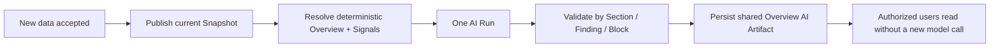

# Overview 用户价值与 AI Slot 最小交付决策

> **2026-08-06 客户价值补充：** [Charles 系统价值复核与两批数据连续演示决策](2026-08-06-Charles系统价值复核与连续数据演示决策.md)进一步要求用两批真实增量数据证明系统相对“一次性 Claude HTML”的连续价值，并收紧最终页面的信息密度：#9 默认显示 0–3 条有价值 Finding，不为版式机械填满三条；原 #17 exactly-three 只保留为当时 Provider/tool-chain 验收证据。

## 1. 结论

本次独立复核对补充风险审查的判断是：**修改后接受**。

Ngee Ann 当前北极星不是单独交付一个结构化模板，也不是先建设完整 AI 平台，而是跑通同一条客户价值链：

> Boss/FM 在 60 秒内判断截至当前 data cutoff 的近期、重复和结构性用能机会；若存在，能理解主要问题、影响、证据、下一步核查对象和验证方式；若不存在，系统诚实显示没有足够的重要发现，不强行凑满三条。

Charles 首版验收边界同时包含：

1. **确定性 Overview**：快速首屏、真实数字、决策主题、Actual vs Baseline、Level/Circuit/time Evidence 和可操作下钻；
2. **真实 AI Slot**：在同一权威 Context、Snapshot 和只读 datasource 上执行一次真实 DataFoundry Run；AI 使用 SQL 工具主动调查、验证和组织 0–3 个有价值 Finding，模型不可用时不影响确定性页面。

这项决定只调整 Ngee Ann 首版的**执行顺序与验收边界**。既有架构仍然成立：Energy Data Foundation/Kernel 是数字权威，项目专属 Snapshot/ViewModel/Renderer 负责页面表达，DataFoundry 是可替换的 AI Runtime。

### 1.1 Current Overview 时间表面补充边界

Ngee Ann 客户 Overview 不再提供控制整页的 Yesterday、Last 7 days、Previous week、Previous month、Custom 与可编辑日期。服务端先在 Project 级选择最新完整日作为统一 data cutoff，再把 Overview 主观察窗口固定为截至该 cutoff 的滚动 28 天；不得为了得到“完整 28 天”向前搜索旧窗口。窗口内存在缺口时保留真实日期并显示 `Partial`/Data Status，不回退、不补零。随后以同一 Data Snapshot、Published Release、cutoff 与 `from/to` 解析所选 Scope；Scope 切换不得重新选择另一个 cutoff。

页面必须只读显示实际分析窗口和 data-through 日期。保留的旧 Period/Custom 深链接按其原始日期解析，但同样只读显示窗口，并提供返回 Current Overview 的入口；切换 Project 时不得继承旧 Project 的隐藏日期。Save 必须将 Snapshot 已解析的实际 `from/to` 冻结为 Custom 查询，Explorer、Saved/rerun、完整 AI Analyst handoff 与通用 Renderer 继续使用既有 Period/Custom 合同。

首版多时间尺度结构固定为：最新状态使用最新完整 1 天，短期变化使用滚动 7 天，Overview 的 Total、Daily Average、Peak、Trend/Anomaly、Level/Category/Circuit 贡献与 previous-period comparison 以滚动 28 天为主观察范围；AI 综合 1d/7d/28d。日内曲线继续复用最新完整日与现有典型工作日/周末/节假日投影。只有具体探索模块日后证明需要时才增加局部时间切换；局部切换不得重算整页或触发全部 AI。

本补充只收窄 Ngee Ann 客户表面并增加一个窄的 `current-overview-28d` 解析意图，不删除底层时间合同，不改变既有 1d/7d/28d Kernel，也不引入 Cadence、Scheduler 或通用 Horizon 平台。

## 2. 为什么需要调整旧顺序

[《Overview 改造与 AI Analysis 打通最终方案》](决策-Overview改造与AI-Analysis打通最终方案.md)原先将完整 AI 上下文跳转排在 AI Slot 前，并把 AI Slot 放到较后批次。该顺序适合降低早期风险，但已不符合当前确认的 Charles 首版目标：**AI Slot 本身也是要交付和验证的产品价值，不应在 #9 验收完成后才首次出现。**

因此，本决策替代的仅是以下旧执行顺序：

- 不再要求完整对话式 AI Analyst #16 全部完成后，才能实现首版嵌入式 AI Slot；
- 不再让 #17 被最终 Charles 验收 #9 反向阻塞；
- #9 应在确定性页面、首屏性能和最小真实 AI Slot 都具备后，承担最终组装与人工验收。

本决策不改变以下边界：

- AI 不改写或覆盖官方 KPI；AI 可以调用服务端授权的只读 SQL 工具验证数字和寻找额外角度；
- AI 不成为 Overview Renderer；
- 模型停机时确定性 Overview 仍完整可用；
- 完整 AI Analyst 的自由追问、Task Console 和上下文跳转仍由 #14/#16 负责。

## 3. 当前证据与问题

### 3.1 当前页面已经可信，但还没有形成完整决策闭环

固定 Ngee Ann Golden Period 的当前页面可以正确显示 Project/Scope/Period、Data Status、KPI、异常、Level/Circuit/time Evidence，并保持 Snapshot/Release/Rule 等版本边界。

但首屏三个 Decision Priority 实际来自同一个 `daily_usage_above_baseline` 规则，使用同一个 `INSPECT_DAILY_USAGE_DRIVERS` 行动模板，只是日期和影响不同。它们能回答“哪几天异常”，却没有合并成“最值得先处理的决策主题”。

当前 Golden 中可支持更有价值叙事的确定性证据包括：

- Period 总能耗为 `1531.1683 kWh`；
- 非营业时段能耗为 `684.5044 kWh`，占 `44.7%`；
- Level 7 的 Fan ISOL1/2 对非营业时段贡献 `260.742 kWh`；
- 11、13、14 Jun 的主要 Circuit driver 一致，而当前页面把三个日期拆成三张近似卡片。

这些事实说明：页面已达到“可信异常发现”，但仍需把重复日期异常组织成少量决策主题，并明确下一步核查和复核指标，才达到“决策就绪”。

### 3.2 DataFoundry 基础可复用，但 AI Slot 尚未存在

当前代码已经提供：

- Workspace 默认模型与 fallback-off 解析；
- 服务端权威 Energy Query Context；
- Scope 限制的只读 datasource；
- 可显式选择的 Skill、工具策略、Run、事件、Trace 与持久化能力；
- Run request fingerprint 和已有 Run replay。

当前仍缺的是一个直接面向 Charles 首版价值的垂直切片：服务端把权威 Ngee Ann Context、当前 Snapshot pin 和最小项目调查先验交给一次真实 Run；Run 使用现有 schema inspection 与只读 SQL 工具形成 Finding、Evidence、Impact、Action，并把运行状态和结果显示在 Overview。首版不以前置建设专用 Bundle、持久 Insight Artifact、Claim Validator 或通用复用平台为条件。

因此，DataFoundry 足以承载首版真实自主分析，但“Runtime 已存在”仍不等于“AI Slot 已完成”；必须用真实 Provider、真实工具调用、真实页面状态和 Chrome 结果共同证明。

## 4. 评估过的方案

| 方案 | 优点 | 主要问题 | 结论 |
| --- | --- | --- | --- |
| A. 先完成确定性 Overview，AI Slot 留到 #9 之后 | 风险最低、页面先可用 | 无法在当前验收中验证 AI 是否创造真实用户价值 | 不采用 |
| B. 先完成 #14/#16 的完整 AI Analyst，再做 AI Slot | 共用能力最完整 | 重新形成平台优先的瀑布，延迟第一张真实 AI 页面 | 不采用 |
| C. 在确定性页面之上交付一次真实、异步、受 Snapshot 与 Evidence 约束的自主 DataFoundry Run | 能直接验证 AI 是否会主动查数并形成客户价值，同时保留故障隔离 | 需要严格固定授权 Context、只读工具和项目调查边界 | **采用** |

## 5. 最小架构

~~~mermaid
flowchart LR
  A["Published Release + current Data Snapshot"] --> B["Deterministic Overview renders first"]
  A --> C["Server-authoritative Energy Query Context"]
  D["ngee-ann-analysis-pack@v1"] --> C
  C --> E["One real DataFoundry Run"]
  E --> F["Schema inspection + scoped read-only SQL"]
  F --> G["0-3 Evidence-backed Findings"]
  G --> H["Async AI Slot"]
  E -. "timeout or failure" .-> I["AI unavailable; deterministic Overview remains"]
~~~

首版只有一个页面级 AI Run，不为三个视觉位置分别调用模型。Renderer 只消费 Run 状态和 Finding ViewModel，不了解 Mastra、Prompt、Skill 内部或 Provider API。Run 必须 pin 当前 `dataSnapshotId`；Snapshot 漂移或 datasource 不可用时 fail closed。

### 5.1 最小 Project Analysis Prior

首版不新增一套通用 Skill taxonomy。继续复用现有 `data-analysis` guidance，只增加一个由服务端拥有、可追溯的项目调查先验：

> `ngee-ann-analysis-pack@v1`

它只包含：

1. 值得调查的问题，例如整体偏差、1d 近期信号、7d 重复模式、28d 结构性迹象，以及 Level、Category、Circuit、time 和 peak driver；
2. 推荐调查顺序，例如先确认整体与可比基线，再下钻空间、回路和时间证据；
3. 分析边界，例如官方总量只由 Aggregate 口径决定，Sub-meter 只用于解释；
4. 缺失 Evidence，例如没有排班、设备状态、天气或维修记录时只能提出 Hypothesis 和下一步核查。

Pack **不包含** SQL、公式、阈值、当前数字、官方 Finding 或答案模板，也不成为第二套 Recipe。服务端按已授权 Project 与当前 Published Renderer/Release 显式选择 Pack，并把 `packId` 与 `revision` 记录在同一次 Context Package/Trace；浏览器不能自行选择或覆盖。

AI 可以用 Pack 作为调查先验，得出 `supports`、`challenges` 或 `independent` 的 Evidence-backed Finding。首版不强迫模型必须“创新”；没有可靠新角度时允许只支持或反证已有主题，但不得把三张确定性卡片简单改写成长摘要。

### 5.2 首版 AI 使用现有只读工具主动查数

首版 AI Slot 执行真实 DataFoundry Run，并允许模型按需使用现有 schema inspection 与服务端 Scope 限制的只读 SQL datasource。SQL 结果必须来自当前授权 Workspace、Project、Scope 与同一 Snapshot，禁止写入、跨租户、跨 Project 或绕开服务端 Context。

为先验证分析价值，Ngee Ann 首版同时向模型提供一个由当前 Renderer Snapshot 生成的、有上限的跨维度 Discovery Evidence projection。它只选择同一 cutoff 下已经确定性算出的 1d/7d/28d、Level、Category、Circuit、daily/time、peak、operating-hours、quality 与 limitation Evidence，不携带原始 Excel，也不新增计算口径。模型可在这些 Evidence 中自主选择调查角度，并只执行一次最有价值的只读 SQL 交叉核查；不得恢复为固定 Level 查询或为每张卡重复查数。

确定性 Overview 仍是官方 KPI、Rule 和 Decision Theme 的唯一权威层。AI Finding 的数字必须逐项引用同一 Snapshot 的确定性 Evidence 或该次只读 SQL result；SQL Evidence 与 Deterministic Snapshot Evidence 在页面中分开显示，模型不能把自己的计算覆盖到官方卡片。需要的数据不存在时应明确 `Missing Evidence`，而不是心算、猜测或扩大权限。

上述 projection 是 Charles MVP 的非权威适配层：当前由浏览器根据服务端返回的 Snapshot 构造，Run 仍由服务端重新校验 Workspace/Project/Scope/Snapshot pin 与 datasource 权限，但服务端尚未重新构造或逐项签名该 projection。因此它可以支持可追溯的候选 Finding，不能提升为官方 KPI，也不能作为多租户生产防篡改完成的证据。只有真实客户部署需要跨会话共享或服务端信任 AI Artifact 时，才按实际风险把 projection 改为服务端重建/校验；本轮不建设通用 Artifact 或第二套版本系统。

### 5.3 Preschool Pack 只确认内容，不接 Runtime

`preschool-analysis-pack@v1` 的首版调查范围先固定为 Portfolio 总览、Centre ranking、EUI/per-pax、P75 benchmark、quadrant、standby/off-hours、operating pattern 和 Centre → Circuit 下钻。它同样只保存问题、顺序、边界和缺失 Evidence，不保存 SQL、公式、阈值或当前数字。

在 Preschool 独立 Renderer、确定性 Recipe 与 Published Mapping 尚未形成可验收闭环前，不注册、不选择也不执行该 Pack；Ngee Ann #17/#9 不等待 Preschool。只有真实 Preschool 页面证明这些维度具备权威口径后，才把 Pack 接入 Runtime，并据两项目实际重复点判断是否抽取通用 Policy。

截至 2026-08-06，以上接入前置已经由 #10–#13 的自动化垂直切片满足：真实 May Snapshot/Mapping、独立 `preschool-overview` Renderer、Portfolio/Centre Benchmark、EUI/Per-Pax、Standby/Operating、Spike/SOP、确定性决策组装及 1440/1920 Chrome 证据均已形成。Charles 对 #13 的最终人工签字仍单独保留，但用户已确认初步验收不阻塞 #18 的技术执行。因此 #18 可以接入 `preschool-analysis-pack@v1`；它必须使用 Preschool 专属的有界 Evidence projection 与 0–3 Finding 合同，不复制 Ngee Ann 强耦合的 1d/7d/28d 或 exactly-three 输出，也不借机抽象通用 Pack Runtime。

## 6. 输入、输出与可信边界

### 6.1 服务端权威 Context Package

Run 使用服务端从登录身份、Membership、Project Release 和当前请求解析出的权威 Context，至少固定：

- `workspaceId`、`projectId`、`scopeId`、`resource` 与 Project timezone；
- 统一的 data cutoff，以及 Finding 可使用的 1d、7d、28d 分析窗口；
- `dataSnapshotId`、`projectReleaseId` 与 Published Renderer key；
- 当前授权 datasource 和只读工具集合；
- `ngee-ann-analysis-pack@v1` 的 `packId` 与 `revision`。

Hover、弹窗、选中 heatmap cell、滚动位置和局部图表切换不触发整页 AI Run。浏览器传入的 Workspace、Pack、Snapshot 或 Renderer 只能作为请求线索，服务端必须重新解析并校验；首版 Discovery Evidence projection 的例外和非权威限制见 5.2，不得用它覆盖服务端 Context 或官方确定性层。

### 6.2 Finding 输出

首版返回 0–3 个互不重复的 Finding；三条合计应覆盖近期信号、重复模式和较长周期结构，但不要求机械地“一条对应一个 Horizon”。每条至少回答：

- `what`：发生了什么；
- `why`：为什么重要，以及原因是 Fact、Attribution 还是 Hypothesis；
- `action`：下一步调查或行动方向；
- `verification`：如何在下一可比周期验证；
- `evidence`：所用 SQL/tool result、Scope、窗口与关键数字；
- `relationship`：`supports`、`challenges` 或 `independent`。

`relationship` 用于解释 AI 与确定性主题的关系，不是创新配额。若数据不足以支持额外角度，模型不得为了填满 `independent` 而编造结论。无 Evidence 的数字、已确认根因、节省金额、ROI、负责人或承诺不展示。

### 6.3 自主探索与最终输出验真边界

Agent 的调查能力与客户可见输出采用不同边界：**调查阶段不规定固定主题、维度、SQL 数量或“创新”配额；发布阶段
逐条验证事实、数字、图表与 Evidence 身份。** 输出校验限制的是未经证明的断言，不限制 Agent 可以观察和调查什么。

评估过的选择：

| 方案 | 优点 | 风险 | 决定 |
| --- | --- | --- | --- |
| 直接相信模型最终文本 | 最快、最自由 | 无法区分可靠计算、心算、错引和编造 | 不采用 |
| 用固定主题、固定 SQL 或固定路线避免错误 | 容易得到稳定格式 | 压制自主发现，退化成摘要生成器 | 不采用 |
| 自主调查，完成后只做拒绝 | 安全 | 当前 Preschool 已出现工具成功但 0/3 Finding 可展示 | 仅作为最终兜底 |
| 自主调查 + 提交前自检 + 确定性发布校验 | 保留分析能力，同时提高可交付率 | 增加一次校验和可能的定向修正成本 | **采用** |

采用方案的最小合同：

1. `Fact`、数字和图表值必须来自同一 Project/Scope/Resource/Snapshot/window 的 typed Evidence；只出现相同数值不等于
   语义一致，还必须匹配指标、单位和维度；
2. 排名、比例、差值等派生事实应由 SQL/受控计算工具输出为明确命名字段，不允许模型在最终文案中自行心算；
3. 原因尚未被数据证明时可以提出 `Hypothesis`，但必须说明支持迹象、缺失 Evidence 和验证方式，不能写成已确认因果；
4. 行动建议可以自主提出；“做了会节省多少”等量化结果只有在存在对应模型/Evidence 时才能发布，否则使用可验证的
   定性预期；
5. 每条 Finding 和每个 Presentation Block 独立校验：无效 Block 局部移除，无效 Finding 不连坐已验证 sibling；全部
   无效时 AI Slot honest unavailable，确定性 Overview 保持可用；
6. Agent 提交前先使用本 Run 已有工具结果自检；服务端校验失败时最多进行一次定向修正，只允许补正确引用、删除/降级
   未证明断言或改为 Missing Evidence，不重新启动整页分析，也不形成无限自动重试；
7. 自动补绑定只在 typed Evidence 唯一匹配时执行；同值、多来源或语义不明确时不得静默选择某条 Evidence；
8. 校验合同 revision 进入 Artifact/恢复指纹；旧结果不因新校验器而被改写，新 Snapshot 也不得恢复旧合同结果。

这套校验是必要但不充分的：数字可追溯不代表洞察有价值，也不能完全自动证明因果语义。因此 #30 继续同时检查
Insight 的 What/Evidence/Why/Action/Verify 与人工决策价值，不能用“通过守卫”代替客户验收，也不能通过让模型少写数字
来提高通过率。

### 6.4 2026-08-08 MVP 执行校准：停止扩大输出治理

Preschool 输出合同 v10 已经覆盖当前已复现的同值错实体、错单位、错误 Centre、EUI/per-pax/currency 混淆和唯一
Evidence 补绑定。它作为 Charles MVP 的安全底线继续保留，但本轮**不再把同 Run 的 Output Submit、一次定向修正或
通用 Typed Evidence Adapter 作为客户可见交付的前置条件**。

当前处理规则足够简单：唯一且语义一致时允许补绑定；无法证明的 Presentation Block 或 Finding 局部移除；全部无效时
honest unavailable；确定性 Overview 始终不受影响。接下来工程优先级回到真实验收、信息价值、阅读路径、图文协同和
AI Slot 展示，而不是继续增加 Runtime 协议。

只有同时满足以下条件，才重新启动一次定向修正切片：

1. 固定 Snapshot/Profile 的重复真实 Run 中，至少两次产生了人工判断有价值、数字本身正确，但只因可机械修复的引用错误而被丢弃；
2. 该问题已经阻塞 Charles/用户看到有价值结果，不能靠当前唯一匹配或局部降级解决；
3. 修复可以复用现有 Runtime/Session/Artifact，在一个窄切片内完成，不新增第二套平台。

即使触发，也只做最小修正；不建设通用 Claim Graph、公式 DSL、Scheduler、跨项目缓存或新的 Artifact 仓库。

## 7. 页面生命周期

1. Ngee Ann Renderer 和确定性首屏立即出现；
2. 核心数据返回后，AI Slot 显示 `AI analysis queued` 或 `AI analysis in progress`；
3. 同一次稳定 Context 只启动一个 Run；首版不为复用结果建设页面业务缓存、持久 Insight Artifact 或跨用户共享机制；
4. Run 完成后显示 0–3 个 Finding，并标注生成时间、Snapshot、Pack revision、关系和限制；
5. 模型超时、失败或 Provider 未批准时显示明确的 unavailable 状态，不覆盖指标、图表和规则 Finding；
6. Project、Scope、data cutoff 或 Snapshot 改变后，旧结果立即隐藏或标记 `Outdated context`，不得冒充当前结论；
7. 首版只在稳定主上下文加载后自动运行，或由用户点击 Refresh AI；Hover 和局部浏览交互不触发 Run。

首版直接复用现有 DataFoundry Run、事件和 Trace；不新增独立 Runtime、Scheduler、Cadence DSL、Insight 仓库、跨用户缓存、分布式 lease 或页面级 Artifact 平台。后续追问进入完整 AI Analyst，并把选中的 Finding、Context pins 与必要工具证据带入已有 Session；首版不为此重做会话系统。

## 8. Provider 与数据治理

本地开发和 Charles 首版验证复用当前 Workspace 模型配置、密钥隔离和授权 datasource，不把治理建设扩成当前 Ticket。客户正式环境仍须记录 Provider/endpoint、发送字段范围及适用的留存/地域约束；未配置或不允许外发时 AI Slot 诚实显示 unavailable，确定性 Overview 正常工作。

当前本地 Workspace default 为 StepFun，DeepSeek 只作为候选 Profile；这是可变的运行配置，不进入代码、Pack 或产品合同。一次连接成功或一次 accepted Run 都不能证明 Provider 可复现性。新的真实 AI 垂直切片只做同一 Snapshot/cutoff/Pack/Profile revision 下 3 次有界 smoke，记录 accepted/unavailable、wall time、failure reason、tool Evidence 数量与人工决策价值，目标至少 2/3 accepted。未达到时保持 honest unavailable，并停止通过放松 Snapshot、numeric 或 Evidence 守卫制造假成功；不得为此建设 Scheduler、缓存、静默 fallback 或通用 Provider eval 平台。

Run 只向模型提供 Context、Pack 和模型完成调查所需的工具结果，不发送原始 Excel、密钥或无关 Workspace 数据。“模型已连接”仍不等于客户生产授权已经完成，证据必须区分本地真实 Provider 与客户生产验收。

## 9. Ticket 与依赖调整建议

以下边界已于 2026-08-05 同步到 GitHub #17/#9/#10/#18；若后续 Issue 正文与本文再次出现冲突，应先按本文北极星复核，再保留更小、可见交付优先的执行切片。

### 9.1 建议的执行链

1. **#26 / T08A**：保留已完成的性能优化和剩余 `<3s` 证据，不让小幅性能余量重新阻塞客户可见价值；
2. **#27 / T08B**：保留已完成的 1d/7d/28d 确定性多时间尺度主题、Actual vs Baseline、driver 与直接 Evidence 路径；
3. **#17 / T16**：交付一个真实 DataFoundry 自主 Run、服务端 `ngee-ann-analysis-pack@v1`、当前 Snapshot pin、只读 SQL 工具证据、异步 AI Slot 和 honest unavailable；不依赖完整 #16；
4. **#9 / T08**：在 #17 后完成 1440/1920 Chrome、全页价值/视觉/交互、真实 Provider 结果和 Charles 人工验收；
5. **#14/#16**：继续完成 Overview Finding → 完整 AI Analyst 的带上下文追问，不作为最小嵌入式 Slot 的前置；
6. **Preschool**：先完成确定性 Renderer 与数据合同，再由后续 Ticket 接入 `preschool-analysis-pack@v1`；不得阻塞 Ngee Ann #17/#9。

本轮直接优化现有 #17，不再为 Pack、Artifact、Scheduler 或自主分析另建新 Ticket。

### 9.2 第一项客户可见交付物

第一项交付物不是后端 Schema 或 Prompt，而是一张可在 Chrome 直接检查的 Ngee Ann 页面：

- 确定性 Overview 已先显示；
- 重复日期异常已经合并成少量主题；
- AI Slot 真实经历 queued/running/available 或 honest unavailable；
- 至少一个 AI Finding 引用同一 Snapshot 的真实 SQL/tool Evidence；
- 1440px 与 1920px 截图同时记录 Context、生成状态和限制。

该截图应由调整后的最小 #17 交付，#9 再做整页最终验收；截图中的 AI Finding 必须来自一次真实 Provider + 只读 SQL 工具 Run，并可查看 Snapshot、Pack revision 与 Evidence。Fixture/Mock 截图不能冒充真实 Provider E2E。

## 10. 验收标准

### 10.1 用户价值

- Boss 在 60 秒内能说出发生了什么、影响多大、谁应先核查什么、如何在下一可比周期复核；
- FM 从主题一次操作即可看到预筛选的 Level/Circuit/time Evidence；
- 0–3 个主题互不重复；没有重要发现时不凑数；
- AI 不是更长的摘要，而是会主动查数、验证或挑战已有主题，并补充受 Evidence 支持的调查角度、缺失 Evidence 和可验证行动。

### 10.2 可信性与故障隔离

- 官方 KPI、Rule 与 Decision Theme 只来自确定性 Snapshot/Evidence；AI Finding 中的数字逐项引用同一 Snapshot 的 Deterministic Snapshot Evidence 或只读 SQL/tool result，不覆盖官方层；
- Fact、Attribution、Hypothesis 和 Missing Evidence 可区分；
- Context、Snapshot、Published Renderer、Pack revision、模型与工具调用可追溯；
- Context 变化后旧结果不再显示成当前结论；
- AI 超时、失败、Snapshot 漂移、工具拒绝或 Provider 未配置时，确定性页面仍完整可用。

### 10.3 工程证据

- 服务端 Project/Published Renderer → Pack 选择、跨项目拒绝与 Pack revision Trace 自动测试；
- `expectedDataSnapshotId` 漂移 fail closed、只读 SQL Scope/授权隔离和 stale 降级测试；
- 固定 Golden 的 Renderer/Chrome 视觉回归；
- 同一 Snapshot、模型与任务做一次有 Pack/无 Pack 的真实 Provider 对照，比较 Charles Matrix 覆盖、重复度、证据质量和行动价值；不做逐字文案 Golden；
- Charles 对信息价值、分析深度和行动可用性的独立人工验收；
- 清楚区分代码、Fixture、Chrome、本地真实 Provider 和客户验收证据。

## 11. 最大剩余风险与反证条件

最大风险不是 Prompt 写得不够漂亮，而是能耗 Evidence 只能支持异常定位和调查优先级，却让模型把排班、设备故障或人员行为写成已确认根因。没有门禁、门禁记录、设备状态、控制策略、天气或维修记录时，AI 必须停在“有依据的假设 + 下一步验证”。

以下任一情况出现，应暂停扩张并重新审查：

1. 最小 Slot 必须重建 DataFoundry Runtime 或先完成完整 #14/#16 才能运行；
2. Run 无法把模型关键数字追溯到同一 Snapshot 的只读 SQL/tool result；
3. 真实 Provider 多次运行仍频繁编造数字、合并错误主题或把假设写成事实；
4. 必须把模型放入确定性首屏同步链才能展示页面；
5. Ngee Ann Pack 开始复制指标算法或形成第二套 Recipe；
6. 第一张真实结果仍只是三条日期异常的同义复述；
7. #26 后继续出现新的跨 Metadata、DuckDB、API、Web 的通用底座 Ticket，且不能直接说明其阻塞哪个 Ngee Ann 页面/AI 验收项。
8. 为接入 Pack 必须先建设持久 Insight 仓库、通用 Scheduler/DSL 或第二套 Runtime。
9. 同一 Snapshot/Profile 的有界 Provider smoke 多次不能通过 Evidence 验证时，仍试图用自动重试、静默 fallback、放松 numeric guard 或扩建 Provider 平台掩盖不稳定性。

## 12. 明确停止项

首版不做：

- 不新建第二套 Agent Runtime；
- 不建设通用 Query Receipt、历史 Snapshot 回放、持久 Insight Artifact、Scheduler/Cadence DSL 或跨项目缓存平台；
- 不先设计所有项目的 Skill taxonomy；
- 不创建 5–8 个 Ngee Ann 专属 Skill；
- 不在首版建设 section 级 Claim 状态机、流式 Token UI 或自动取消旧 Run 的复杂状态机；
- 不做跨用户、跨项目或跨 Workspace 的 AI 结果缓存；
- 不把完整 Overview Snapshot 或原始 Excel 发给模型；
- 不开放写入 SQL、跨 Scope datasource、任意外部工具、图表代码或 React/HTML 生成；
- 不让模型修改官方 KPI、Recipe、Rule priority 或 Renderer 布局；
- 不把 Pack 写成答案模板，也不强迫模型必须提出 `independent` 新角度或永远生成三条洞察；
- 不在 Ngee Ann #17/#9 前接入 Preschool Pack Runtime；
- 不在 Provider 数据治理未批准时自动发送客户数据；
- 不让 AI Run 阻塞确定性首屏；
- 不用静态 Mock、合法 JSON 或更长文案冒充真实价值与真实 Provider E2E；
- 不用 AI 文字掩盖确定性图表、Actual vs Baseline、driver 和 Evidence 路径不足。

## 13. 当前未决输入

当前本地开发继续使用已配置 Workspace/用户模型完成真实 Provider 验证。客户正式环境发布前仍需确认发送字段范围及对应 Provider 的留存和处理地域；这项确认不触发通用治理平台建设，也不阻塞 Ngee Ann 本地 Charles 验收。

## 14. 2026-08-08 AI-native 决策界面校准

### 14.1 独立结论与替代范围

本次独立复核后，接受以下产品目标：EnergyIQ 不是“Dashboard + 页面底部 AI Chat”，而是一个由同一可信上下文驱动的
AI-native 决策界面。确定性计算、Structured Signals、AI Interpretation 和 UI Composition 分工如下：

| 层 | 权威职责 | 不负责 |
| --- | --- | --- |
| Facts / Evidence | Metric、Comparison、Ranking、Threshold、Snapshot、Scope、Period、单位和 Evidence | 客户长文与开放式原因判断 |
| Structured Signals | 项目专属、可测试的值得关注信号，包含事实引用、严重程度、Section 和限制 | 拼接完整 What/Why/Action 文章 |
| AI Interpretation | 自主选择调查角度，解释重要性、提出假设、下一步和验证方式，并选择 0～N 个 Presentation Blocks | 改写官方 KPI、Snapshot、Signal 强度或 Evidence |
| UI Composition | 把已接受的 Interpretation 放入对应 Section，并提供确定性 fallback、加载和局部失败状态 | 执行模型生成的 HTML、JavaScript 或 React |

这一决定不新建第二套 Unified Model。现有 Published Snapshot 与 `AnalysisContextEvidenceCatalog` 是唯一可信上下文；
Preschool 与 Ngee Ann 只新增项目专属 Structured Signal Adapter。原 5.2、7、9.1、11、12 中“AI 只作为独立页面级
Slot”“不做持久/跨用户结果”的表述，被本节的窄范围共享 Artifact 决定替代；禁止通用 Scheduler、跨项目缓存和任意
页面代码的停止项继续有效。

### 14.2 单次 Run，多 Section 输出

同一 `Project + Scope + Resource + Published Snapshot + Project Release + model Profile revision + output contract`
只运行一次 AI。模型可以为不同模块返回不同表达，但不为每个模块重复调用：

```ts
type OverviewAiArtifact = {
  sectionInterpretations: Array<{
    sectionId: string;
    signalRefs: string[];
    takeaway: string;
    importance: string;
    action: string;
    verify: string;
    presentation: PresentationBlock[];
  }>;
  pageSynthesis: {
    priorities: Array<{ sectionId?: string; signalRefs: string[]; takeaway: string }>;
  };
};
```

Agent 可以支持、挑战、合并或省略现有 Signal，也可以提出新的 Evidence-backed 发现。新发现属于已知模块时绑定稳定
`sectionId`；跨模块发现进入 `page-synthesis`。Runtime 逐 Finding、逐 Section、逐 Presentation Block 验收；一个模块
失败时只回退该模块的确定性 Signal，不连坐已经接受的 sibling。Page Synthesis 只能引用已接受的事实、Signal 或
Interpretation。

Preschool 首版稳定锚点为：

- `overall-summary`；
- `centre-benchmark`；
- `operating-behaviour`；
- `appliance-contribution`；
- `planning-outlook`；
- `page-synthesis`。

锚点只规定内容可以放在哪里，不规定 Agent 必须调查哪些主题或必须输出多少内容。AI 可以组合任意数量的安全声明式
Presentation Blocks，并标记 `primary` / `supporting`；系统不执行模型生成的 HTML、JavaScript、React、SQL 或任意
前端代码。将来若复杂可视化确有价值，只在完整 AI Analyst 中另行评审隔离 iframe 实验区，不进入当前 MVP。

### 14.3 页面生命周期与 fallback

1. 确定性 Overview、Facts、图表和精简 Structured Signals 立即显示；
2. Artifact 尚未完成时，顶部或对应模块显示轻量 `AI analysis is being prepared`，不阻塞整页；
3. Artifact Available 后，Section Interpretation 原地进入对应模块，页面顶部只保留 0～3 条简洁全页 Synthesis；
4. 不再同时展示一套长篇 deterministic DecisionSummary 和一套重复 AI Brief；
5. 单个 Section 无效时局部回退，全部无效或 Provider 不可用时确定性页面保持完整；
6. Saved Analysis 冻结并恢复当时已接受的 Interpretation、Presentation 和 Synthesis，不启动新 Run；旧版历史 Artifact
   按原合同和布局读取，不追写、不迁移、不重新生成。

### 14.4 新 Snapshot 后预生成共享 Artifact

Overview AI 不再以“用户打开页面”作为主要启动条件。新 Data Snapshot 成为 Project 当前 Published Snapshot 后，系统为
Project-level Current Overview 触发一次 AI materialization：



这不是固定夜间 Cron：虽然当前数据通常夜间更新，但触发条件是新 Published Snapshot，保证未来 API 在任意时间到数时仍
正确。MVP 只预生成 Project-level Current Overview，不提前遍历 Centre、Level、Circuit、自定义 Period 或完整 AI Analyst
问题。

Artifact 在同一 Workspace/Project/Scope/Snapshot/Release/Profile/contract 下共享，但读取时仍重新检查 Membership 与
Project 授权；不跨 Workspace、Project 或 Snapshot 复用。相同身份的普通页面 Refresh 直接恢复 Artifact；新 Snapshot
创建新身份。旧 Snapshot Artifact 只在 History 中读取，不得和当前数字混用。

后台对同一 Snapshot 只允许一个共享任务和有限重试。预生成仍失败时，用户打开页面不为每个用户创建新 Run；页面显示
确定性 Overview 与明确状态，并提供受控 Retry。实现复用现有 Run、Session、validator 和 Metadata 持久化，不建设通用
Scheduler、Cadence DSL、跨项目 Insight 平台或第二套 Agent Runtime。

### 14.5 配置 fail-fast

`SECRET_MASTER_KEY` 缺失或无法解密当前模型 Profile 属于启动配置错误，不应等到客户发起 AI Run 才暴露。受支持的启动
入口必须在停旧进程前检查授权 Env；API readiness 在存在加密默认 Profile 时执行不泄露明文的 decryptability probe。
配置错误使 AI capability not-ready，并向 UI 返回客户安全的配置状态；readiness 不调用外部 Provider，避免把网络波动变成
整个 API 的健康失败。Provider 超时、网络失败和 Evidence rejection 仍是正常可降级的 AI unavailable，不承诺彻底消失。

### 14.6 最小迁移顺序与停止项

1. Preschool 服务端 Snapshot 产出项目专属 Structured Signals，删除浏览器 ViewModel 中的长篇决策模板 owner；
2. Preschool 一次 Run 返回 Section Interpretations + Page Synthesis，并逐 Section 验收；
3. Renderer 将 Interpretation 嵌入稳定 Section，保留 deterministic fallback、Saved/Resume 和旧 Artifact 兼容；
4. 完成真实 Provider、1440/1920/tablet 和人工信息价值验收后，再把同一输出 Interface 适配 Ngee Ann；
5. 新 Snapshot 预生成共享 Artifact 作为独立窄切片接入，不阻塞前三步首次客户可见结果。

明确停止：不建立通用 Signal DSL、通用 Scheduler、所有 Scope 预跑、按用户重复分析、跨项目缓存、第二套 Evidence Catalog、
第二套 Runtime、模型生成可执行页面代码，或为了预生成而放松 Snapshot/授权/Evidence 校验。
