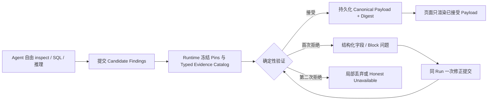

# AI Analyst Harness 与 AI Slot 执行路径

## 1. 目标、适用与不适用

### 目标

在不扩建通用 Agent 平台的前提下，让 EnergyIQ 的 AI：

1. 在同一授权 Project、Scope、Snapshot 与 cutoff 内正确查数和引用 Evidence；
2. 自主判断是否直接回答、继续调查、提出假设或停止；
3. 输出用户能直接理解和用于决策的 What → Why → How → Verify；
4. 在 Overview AI Slot 与 Full AI Analyst 中保持同一可信原则；
5. 用可重复 Eval 证明质量、稳定性和多轮连续性，而不是用一次演示判断完成。

固定优先级：

> 效果正确 > 调查稳定 > 多轮连续 > Cache 命中 > Token 成本

### 适用

- #30 AI Analyst Harness Eval 与客户问题集；
- #36 DeepSeek Context Budget、Cache 与轻量 Run Checkpoint；
- #9/#18/#35 中的 Ngee Ann、Preschool AI Slot；
- #15 Full Analyst 受控图表与异步 Run 的后续验收；
- #21 最终产品验收前的 AI 质量证据。

### 不适用

- 不修改确定性 Overview KPI、公式、Snapshot 或 Evidence；
- 不建设通用 Context、Memory、Prompt Optimizer、Scheduler 或 Provider Router；
- 不以固定 SQL、推理轮次、时间或 Token 上限代替 Agent 判断；
- 不在侧边分支直接修改主 Agent 尚未提交的 Overview/AI Slot 文件；
- 不用 Provider 连通性或单次成功冒充产品验收。

## 2. 三方职责

| 层 | 负责 | 不负责 |
| --- | --- | --- |
| Agent | 理解问题、选择工具、决定调查深度、形成 Finding、判断何时停止 | 授权自己、改写权威 KPI、伪造 Evidence |
| System | 授权、Project/Scope/Snapshot pin、只读 SQL、Evidence/Artifact 校验、结果持久化 | 替 Agent 规定固定调查路线或必须查几条 SQL |
| Harness | 验证正确性、安全、Evidence、连续性；记录效率和质量差异 | 用效率指标限制正确调查，或用关键词分数代替人工价值判断 |

Overview AI Slot 与 Full AI Analyst 均遵守以上职责。项目 Analysis Pack 可以不同，但不应形成两套可信原则。

## 3. 当前事实基线

### 已完成或基本完成

- #30 已有 10 个 Fast cases、真实 AG-UI Runner、确定性正确性/Evidence/Chart 校验和 Candidate-versus-Baseline 报告。
- #34 已完成 Agent/System/Harness 职责校准，并证明 10-case 实际结果可达到 10/10。
- #36 独立分支已完成 1M/32K DeepSeek budget、Context checkpoint、Cache telemetry 和固定三轮 same-session probe。
- #33 的晚绑定 SQL Claim Value 已作为 Integration commit `26d2fd1` 合入。
- Ngee Ann/Preschool AI Slot 已有异步状态、Finding Evidence、Ask AI deeper、Saved result 恢复和可选 Presentation Blocks 第一版。

### 真实剩余问题

1. #36/Harness 已合入 Integration；Ngee Ann 固定 Snapshot 的真实 DeepSeek pass@3 已完成，Preschool 连续追问仍需真实登录环境。
2. #30 当前 `insightQuality` 主要依赖关键词命中，不能充分判断逻辑、可读性和决策价值。
3. 两项目固定 SQL/强制 Finding 路线已移除；真实 Provider 仍可能产生单条错误 Evidence 引用，必须逐条拒绝并保留同批已验证 Finding。
4. #35 Presentation Blocks 已补服务端 materialization、Block 级 Evidence 绑定与无障碍语义；Ngee Ann 已完成一次真实 Provider、Evidence 和 1440/1920 验收，Preschool 与 tablet 仍待完成。
5. GitHub Issue 正文勾选状态滞后，必须用 commit、测试、Provider 和 Chrome 证据校准，不能仅看 checkbox。

## 4. 执行任务板

| 顺序 | 任务 | Owner | 状态 | 完成证据 |
| ---: | --- | --- | --- | --- |
| 1 | 将 #36/Harness 独立提交合入最新 Integration | 本侧边任务 | completed | Integration `7edd177`；7 files / 32 tests；build passed |
| 2 | 运行 #36 DeepSeek critical pass@3 + 固定三轮 same-session | 本侧边任务 | Ngee Ann pass@3 completed；Preschool real-auth blocked | Ngee Ann 3/3；Preschool CLI 被真实登录 401 阻止 |
| 3 | 将 #30 质量评分升级为结构化 Rubric，并保留确定性 hard gates | 本侧边任务 | implemented；real Candidate comparison pending | `7fb6977`；报告新增八维质量分解 |
| 4 | 增加重复调查与回答冗长的诊断遥测，不设效率硬门槛 | 本侧边任务 | completed | `7fb6977`；真实 pass@3 无重复 SQL，平均 701 词 |
| 5 | 校准 Ngee Ann/Preschool AI Slot 的固定 SQL/强制 Finding 路线 | 主 Agent | implemented；Provider pending | 0–3 Findings；Agent 自主调查；Evidence guard 不弱化 |
| 6 | 补齐 Ngee Ann 的 acted/ignored/verify 决策后果 | 主 Agent | planned | 两项目共享 Finding 语义；项目 Pack 保持独立 |
| 7 | 完成 #35 Provider 与 Presentation browser acceptance | 主 Agent + 本侧边复核 | Ngee Ann useful visual passed；Preschool running；no-visual/tablet pending | 两项目各有 useful visual 和正确 no-visual 案例 |
| 8 | 校准并关闭已完成 Ticket | 主 Agent | partial；#33 closed | #30/#36/#18/#35 继续按证据关闭 |
| 9 | #15 完整受控图表注册表 | 后续 | deferred | 仅在 Full Analyst 试点明确需要时推进 |
| 10 | #21 Charles/试点验收 | 用户/Charles | blocked by prior tasks | 人工确认信息价值、可读性、深度和行动价值 |

## 5. #30 最小质量 Eval 切片

### 5.1 保留的硬门槛

- 数字、单位、Period、Project、Scope、Snapshot 正确；
- Finding-specific Evidence 与 Chart data 能回到真实工具结果；
- 只读、无跨 Project/Workspace/Snapshot；
- 不泄露内部错误或协议字段；
- 不把假设写成已证明原因；
- Provider/Tool 失败时诚实失败，不伪造结果。

### 5.2 新增的软质量维度

每个 Insight case 独立记录，不用一个关键词总分掩盖弱项：

1. **Takeaway**：是否明确回答发生了什么；
2. **Evidence use**：是否用具体数字/范围支撑，而非只说“数据表明”；
3. **Decision relevance**：是否说明为什么值得关注；
4. **Action**：是否给出可执行的下一步，而非复述 Finding；
5. **Verification**：是否说明看什么结果来支持或推翻判断；
6. **Causal discipline**：是否区分事实、假设与 Missing Evidence；
7. **Readability**：是否先给结论、避免内部术语和不必要长文；
8. **Consequence**：当问题要求时，是否说明行动或不行动的可能后果。

确定性可判定项继续由代码判；主观价值作为 diagnostic rubric，后续可加入可选 LLM judge 和人工抽查，但不能覆盖 hard gate。

### 5.3 效率诊断

- SQL、Reasoning、latency、Token、Cache 和 Context 水位；
- 规范化 SQL 完全重复次数；
- Tool failure 是否恢复；
- 多轮是否复用同一 Evidence，还是无必要地重跑调查；
- 回答字数与首段长度，仅作为可读性诊断；
- 柔性停止原则：继续查询不会改变结论、行动或不确定性时，Agent 可以结束。

## 6. AI Slot 最小校准

### 6.1 Prompt/结果合同

- 返回 0–3 条最有价值 Finding；证据不足时允许 0 条；
- 不强制一条 Finding 对应一个 Horizon，也不强制覆盖全部 1d/7d/28d；
- 不规定固定成功 SQL 数或固定 observation/drill-down/validation 状态机；
- Agent 只引用实际使用的 Horizon、Discovery item 和 SQL Evidence；
- Ngee Ann 与 Preschool 共享 What/Why/Action/Expected/If ignored/Verify/Limitation 语义；
- Presentation 是可选表达，不要求每条 Finding 画图。

### 6.2 必须保留的安全边界

- 同 Workspace/Project/Scope/resource/Snapshot/cutoff；
- scoped read-only SQL；
- Finding-specific numeric Evidence；
- 权威 KPI 不被 AI 修改或冒充；
- unsupported cause、saving、ROI、owner、threshold 保持 Hypothesis/Missing Evidence 或拒绝；
- 刷新恢复已完成结果，相同 Context 不重复启动 Run；
- Ask AI deeper 复用 Session/Project/Finding/Evidence。

### 6.3 Provider 验收

Ngee Ann 与 Preschool 各运行至少三次固定 Profile/Snapshot：

- available/empty/fail-closed 状态正确；
- 非空 Finding 有实际决策价值且不重复 Overview；
- 所有数字与 Presentation 回到 Finding-specific Evidence；
- Agent 自主选择有用 visual，且至少一次正确选择 no visual；
- 记录 latency、SQL、recovery、Token/Cache，不把效率设为质量门槛；
- 人工检查 plain language、图文协同和行动后果。

## 7. 验收与关闭顺序

1. [x] #36/Harness commits 合入并通过自动回归；
2. [x] #36 Ngee Ann real pass@3；Preschool same-session 保留为真实登录环境验收；
3. [x] #30 结构化质量 Rubric 与报告回归；
4. [x] AI Slot 固定路线完成代码校准；Ngee Ann 已有真实运行证据，Preschool 继续验收；
5. [ ] #35 Ngee Ann useful visual、Evidence、1440/1920 已通过；Preschool、no-visual 与 tablet 待验；
6. [ ] #20 History keyboard/1440/1920 验收；
7. [x] 关闭已合入的 #33（`26d2fd1`；专项回归 4 files / 53 tests）；
8. [ ] 校准 #30/#36/#18/#35 正文或评论；
9. [ ] 最后进入 #21 Charles/试点验收。

自动测试、真实 Provider、Chrome 和 Charles 人工验收必须分层记录，不互相替代。

## 8. 失败模式

| 现象 | 可能原因 | 处理 |
| --- | --- | --- |
| 关键词分数高但答案没价值 | Rubric 只检查词语，没有检查逻辑与决策链 | 输出分维度结果；增加人工/可选 judge，不改 hard gate |
| Agent 重复查询或运行很慢 | Tool feedback 不清楚、上下文重复、模型不确定是否可结束 | 先用 #36/#30 遥测定位；改反馈与柔性停止提示，不设硬 SQL 上限 |
| AI Slot 经常 unavailable | 严格 JSON、固定 SQL 次数或强制三条 Finding 造成机械失败 | 放宽路线和数量，保留 Evidence/安全校验 |
| 图表数字校验失败 | 模型重复抄写数据或 Block 未绑定具体 Evidence | 服务端 materialize；Block 绑定 Evidence；Finding prose 仍可降级展示 |
| 多轮追问重新调查 | Session/Evidence 没恢复或模型不知道可复用 | 检查 checkpoint、thread、Snapshot；Harness 比较各轮 SQL/Evidence |
| 合并冲突 | 侧边分支修改主 Agent 的未提交 AI Slot 文件 | 等主 Agent 提交后再 rebase/cherry-pick；当前仅做 Harness 独立文件 |

## 9. 明确停止项

- 不创建新的 Context/Memory/Evidence/Artifact 平台；
- 不增加三路线意图分类器或固定分析状态机；
- 不用 SQL/轮次/延迟/Token 作为答案质量硬上限；
- 不为了 Cache 改变语义顺序或删除必要 Evidence；
- 不要求每个 Finding 有图，也不让浏览器执行模型生成代码；
- 不因 AI 失败阻塞确定性 Overview；
- 不在 Provider 真实证据前宣称 #30/#36/#18/#35 完成。

## 10. 维护规则

- 每完成一个切片，更新任务板状态和“完成证据”，不新增竞争文档；
- GitHub Issue 记录正式 AC/关闭状态，本文件记录跨 Ticket 顺序与依赖；
- 代码完成、自动测试、Provider、Chrome、Charles 验收分别标记；
- 发生新问题：范围内写入对应任务；超出范围写入失败模式或 deferred，不立即扩大实现；
- 文档更新必须引用实际 commit/report，不凭聊天记忆宣布完成。

## 11. 2026-08-08 当前执行记录

### #36 已完成代码提交与 Integration 合入

按顺序：

1. `0391b2e`：校准官方 DeepSeek V4 Flash 1M/32K Context budget；
2. `91ebb3d`：暴露 Context checkpoint telemetry；
3. `7febf78`：记录 Provider Cache telemetry；
4. `4866dd4`：在 Eval 报告每步 Context 构成；
5. `2dc959f`：加入固定三轮 same-session continuity；
6. `27df662`：修复预算一致性、Token 去重和 checkpoint 计数。

以上提交及后续 #30/稳定性/表达切片已按顺序进入 Integration `7edd177`。合入后聚焦回归
7 files / 32 tests 与根 build 通过；主 Agent 的未提交 Overview/Presentation 文件未被 stage、commit 或覆盖。

### #30 质量诊断切片

提交：`7fb6977 feat(eval): expose decision quality diagnostics`

新增：

- Takeaway、Evidence use、Decision relevance、Action、Verification、Causal discipline、Readability、Consequence 八维分解；
- 回答总字数、首两句字数；
- 规范化 SQL 的完全重复计数；
- Suite summary、Markdown 和 Candidate-versus-Baseline delta；
- 旧 Baseline 缺少新字段时返回 `null` delta，不产生伪造数值；
- 以上均为质量/效率诊断，没有增加 SQL、轮次、时间或 Token hard gate。

自动证据：

- Harness/Context 聚焦回归：5 files / 28 tests passed；
- 根 `npm run build` passed；
- Mastra stream normalizer contract passed；
- Eval script syntax 与 `git diff --check` passed。

限制：当前八维自动分解仍是透明的规则型 diagnostic，不等于人类价值判断。真实 Candidate/Baseline、可选 LLM judge 与 Charles 抽查仍待后续证据。

### Ticket 维护

- #30 进度证据：<https://github.com/Zion74/energyiq-datafoundry/issues/30#issuecomment-5219684498>
- #36 最新合入交接：<https://github.com/Zion74/energyiq-datafoundry/issues/36#issuecomment-5219684718>
- #33 已验证并关闭：<https://github.com/Zion74/energyiq-datafoundry/issues/33#issuecomment-5219684918>

### Ngee Ann 真实 DeepSeek 验收与修复

验收使用隔离 Metadata/File storage、受保护的 Ngee Ann 事实库和固定 Snapshot
`energy-snapshot-03499dcda183ae28c47f7d66`。没有停止当前 Integration 服务，也没有修改共享事实或登录状态。

第一次有效 pass@3 为 2/3。第三次并非模型结论错误，而是 Context Processor 在 SQL 工具返回
`undefined` observation 时对非字符串调用 `.slice()`，导致 Harness 自身崩溃。已用可复现红测锁定并修复：

- `9c14107 fix(agent): tolerate missing SQL observations`；
- 精确回归 3/3、相关 Context 回归 4/4、根 build 均通过；
- 修复后相同 Ngee Ann case 的真实 DeepSeek pass@3 为 3/3，hard failure 0。

修复后 pass@3 摘要：

| 指标 | 结果 |
| --- | ---: |
| Correctness / Insight | 1.00 / 10.00 |
| p50 / p95 | 139.5s / 206.2s |
| 平均 SQL / Reasoning rounds | 14.33 / 9.33 |
| 完全重复 SQL | 0 |
| Tool failure / recovered | 1 / 1 |
| Max prompt / budget utilization | 67,630 / 5.09% |
| Cache hit tokens / ratio | 653,568 / 1.00 |
| 平均 Decision Quality / Answer words | 0.75 / 701.3 |

结论：1M Context budget 不是当前性能瓶颈；DuckDB 也不是本次 139–206 秒的主要原因。
耗时主要来自模型自主选择了 9.33 个推理轮次和 14.33 条 SQL。因为没有重复 SQL且失败能恢复，
不应增加固定 SQL/轮次硬上限。当前应优化工具反馈、停止判断和最终表达，而不是限制调查能力。

### 决策简报最小优化

提交 `e8d5a16 feat(agent): default EnergyIQ answers to decision briefs` 只调整最终表达合同：默认把单一决策问题
组织为不超过五个短要点的简报，保留一个 takeaway、最多三个决定性 Evidence、一个行动和一个验证；
这不是分析或工具预算，不阻止 Agent 在需要时继续调查。

三次真实 Provider 单次试验均通过 correctness 1.00 / Insight 10：

- 96.4s、9 SQL、6 rounds、366 words；
- 119.8s、13 SQL、10 rounds、498 words；
- 最终文案：86.7s、9 SQL、6 rounds、359 words。

它已把 3-run 平均 701 词显著压短，但 DeepSeek 仍可能超过 300 词目标。今晚不增加第二个总结模型或
通用 Prompt 平台；AI Slot 的卡片级裁剪继续由 Presentation/renderer 负责。

提交 `5b094ff feat(agent): clarify autonomous stopping judgment` 补齐柔性停止原则：当新增查询不会改变
结论、下一步行动或实质不确定性时，Agent 可以结束调查。这一原则明确不是固定 query/step limit，
不会替 Agent 选择路线。聚焦回归 5 files / 9 tests 与根 build 通过。相同隔离 Snapshot 的真实
DeepSeek 单次复核也通过：correctness 1.00、Insight 10、decision quality 0.8125、323 words、
107.3s、13 SQL、9 reasoning rounds、重复 SQL 0、max budget utilization 3.38%。因此没有观察到
柔性停止导致的过早回答或质量下降。

### Preschool same-session 的诚实边界

对当前 `127.0.0.1:8787` 运行 fixed three-turn continuity 时，CLI 在进入模型前收到 `401 Authentication required`。
当前 API 使用真实浏览器 Session，并同时持有项目 DuckDB；不应停服务、复制登录凭据或切换 dev-auth 来制造通过。
因此当前证据边界是：same-session 自动契约测试已通过，但 Preschool 真实 Provider 连续会话仍需在已登录 UI 或
经正式测试账号/Token 的隔离实例完成。该 401 不是 DeepSeek、SQL 或结果质量失败。

### AI Slot 固定路线复核

最新 Integration 的未提交 AI Slot 仍存在两类限制：

- Ngee Ann：最多两次 SQL、第一次成功立即停止、必须恰好三条 Finding、强制覆盖 1d/7d/28d；
- Preschool：固定 observation → drill-down → validation，并要求每条 Finding 至少引用两条 SQL。

这些规则超出了安全/Evidence 边界，确实会限制 Agent 自主调查。但相关文件正包含主 Agent 的 Presentation WIP，
侧边分支不直接改动，避免覆盖或制造难解冲突。安全切片应在该 WIP 提交后单独完成：保留 inspect-first、只读、
Snapshot pin、数字 Evidence 与 fail-closed；删除固定调查状态机、成功 SQL 数和“恰好三条”要求，允许 0–3 条有价值 Finding。

### #35 Presentation Blocks 可信闭环

当前实现采用一个小型、版本化的共享 Presentation contract，不引入可执行模型代码或通用页面 DSL。模型只能在
metric、comparison、ranking、share、distribution、trend、heatmap、table 与 callout 这组安全 Block 中自主选用；
图表是可选表达，系统不设置图表配额。

本切片补齐：

- 定量 Block 必须携带属于当前 Finding 的 `evidenceRefs` 或 `evidenceSqlIndexes`；
- API 在保存和恢复前重新 parse、过滤和 materialize，不能持久化任意 HTML、脚本或未引用数字；
- 每个 Block 只用它自己绑定的 Evidence 校验数字，单个无效 Block 局部降级，不隐藏整个 Finding；
- Saved Analysis/Resume 读取同一份净化后的 Presentation Artifact，不触发新模型运行；
- trend、heatmap 与 table 提供非颜色依赖的辅助技术语义；
- Ngee Ann 与 Preschool 复用同一 contract 和 prompt 片段，项目分析逻辑仍保持独立。

自动证据：共享 contracts build、根 typecheck、Presentation/两项目 AI Slot/Saved Analysis 聚焦回归
7 files / 107 tests passed，`git diff --check` passed。该证据只证明代码合同和回归；真实 Provider 是否自主选择
有用 visual 或正确 no-visual、以及 1440/1920/tablet 的人工阅读效果，仍作为 #35 未完成的运行时验收。

远程检查点为 `27b0b0a`，服务端 materialization、Block 级 Evidence 与无障碍闭环为 `1da1690`，均位于
`codex/t35-presentation-checkpoint`。未包含本地生成物、凭据、私有 Excel 或并行工作树漂移。

### #18 自主调查路线校准

Ngee Ann 与 Preschool 的页面级 AI Slot 已从固定调查脚本改为受控自主调查：

- inspect-first、授权 Project/Scope/Release/Snapshot、只读 SQL 和 Finding-specific 数字 Evidence 继续硬性执行；
- 简单问题允许一条成功 SQL，复杂问题允许多条不同查询；SQL 被拒后可根据 Tool feedback 重规划；
- 当新增查询不会改变结论、下一步行动或实质不确定性时，由 Agent 判断停止；
- 两项目均返回 0–3 条非重复 Finding，证据不足时允许 0，不再填满三条；
- Ngee Ann 不再机械覆盖 1d/7d/28d，也不强制使用 Category/Circuit/time 维度；声明某个 Horizon 时仍必须引用对应 Evidence；
- Preschool 不再硬编码 observation → drill-down → validation，不再要求每条 Finding 至少两条 SQL 或总共 2–4 条；
- 单条 SQL Evidence 仍最多返回 10 行，避免把大结果集当页面 Evidence；安全与可复现边界未放宽；
- Saved Analysis 对 Ngee Ann 的结果数量同步允许 0–3，恢复时仍使用同一净化后的 Artifact。

自动证据：两项目 Run/Slot、Saved Analysis 共 5 files / 105 tests passed，根 typecheck 与 build passed。
该证据不等于真实模型价值验收；下一步仍需用相同授权 Profile/Snapshot 连续运行，并分别记录 0–3 Finding、
查询深度、数字 Evidence、延迟和人工决策价值。

### #18/#35 真实 Ngee Ann Run 收口

真实 DeepSeek V4 Flash Run `ngee-ann-overview-56d0add1-673c-4672-87ce-cfa9e534854b` 在同一授权
Ngee Ann Snapshot 上完成，耗时约 224 秒，执行 1 次 Schema 与 8 次只读 SQL。模型返回 3 条候选：前两条使用了
不存在的 path-like Discovery Evidence id；第 3 条为 SQL-only 的 Circuit reconciliation Finding，引用 SQL 2/6/7，
指出 14 个 component Circuits 合计 9,619.4663 kWh，相对 official 9,736.4214 kWh 有 116.9551 kWh 差额。

运行时复核暴露并修复三个窄问题：

1. Ngee Ann 原先任一候选校验失败会隐藏整批结果；现改为逐条拒绝 Horizon、deterministic ref、SQL ref 或数字
   Evidence 无效的 Finding，保留同批已验证 sibling；如果全部失败，AI 层仍 fail closed，确定性 Overview 不受影响；
2. SQL array rows 的紧凑 JSON 逗号曾被数字 tokenizer 误当千位分隔符，导致工具已返回的精确数字被误拒；现用有
   whitespace 边界的序列化并增加多列数组行回归；
3. 持久化 Trace 曾过滤模型流中的 whitespace-only chunk，恢复后会出现 `covers98.8%`；Trace 现完整保留原始文本
   chunk。该项自动回归通过，但当前 8787 实例未能在安全策略下重启，因此浏览器运行态复验要等正常 API 重启。

自动证据：Ngee Ann Run 与 Trace 2 files / 49 tests passed，根 typecheck passed。Chrome 已确认旧 Run 无需重新调用
模型即可恢复第 3 条有效 Finding；1440/1920 与 768px 基本 tablet 布局无横向裁切，当前代码刷新后的控制台无新增错误；
AI-selected comparison visual、Snapshot、3 条 SQL、
Audit ids 与 Finding-specific Evidence 对话框一致。当前旧 API 实例仍显示修复前的空格缺失，不能把自动修复冒充为
运行态已发布。

### #35 真实 Preschool Run 边界

登录态 Chrome 使用同一 Preschool Snapshot 完成两次真实 DeepSeek V4 Flash 运行，没有修改确定性 Overview：

1. Run `preschool-overview-cd5eec65-de9e-45f0-ba69-7e559d282bb0` 约 214 秒完成，执行 1 次 Schema 与 9 次只读
   SQL。三个候选中，前两个引用了不存在的 path-like Discovery Evidence id；第三个虽只引用 SQL，却把 Top-N
   返回行数“10”写成业务结论，而该数量并不是 SQL 返回的命名字段。Finding-specific 守卫按合同拒绝整批，未把
   未验证数字或伪 Evidence 显示给用户；
2. 页面重新加载后启动的 Run `preschool-overview-706701e9-476a-4759-8774-5197f52ae92a` 在 300 秒边界超时，
   已完成 7 次工具结果但未形成可验证最终 Artifact。页面保持 fail-soft，确定性 Overview 继续可用；不通过增加
   固定 SQL/轮次限制、提高超时或放宽 Evidence 守卫制造通过；
3. 超时链曾把 `BodyStreamBuffer was aborted` 暴露给用户。现将内部 timeout、错误码、网络与 abort 类错误统一
   映射为客户安全的暂时不可用提示，并增加 `RUN_TIMEOUT:300000` 与 stream abort 回归。业务校验失败原因仍保留，
   便于区分“模型结果不可验证”和“运行时暂时失败”。

当时未继续触发第三次 Provider Run。该轮结论是：Ngee Ann 已有一条真实 visual Finding 的 Chrome 证据；Preschool
仍缺少一次同时通过可信合同与客户表达的真实 Run，因此 #35 不能关闭。完成但全部候选被拒的 Run 在重新加载时会
再次尝试，是后续 Resume/Retry policy 的独立窄问题，不在本切片扩成调度或通用缓存平台。

### #18/#35 Preschool 后续真实验收与最小修复

登录态 Chrome 在同一 Published Snapshot 上继续运行，确定性 Overview 始终先显示且未被 AI 失败修改。本轮确认的
首要根因不是 DuckDB：Run `preschool-overview-ecb5f783-27d6-40aa-9628-5bdee83fa277` 约 233 秒内完成 7 条 SQL，
但页面提示词中的 `no chart quota` 被 Harness 关键词识别为“用户明确要求图表”，强制首个查询返回 2–500 行；这与
Preschool 单条页面 Evidence 最多 10 行的合同冲突。现将提示改为 `presentation-block quota`，保留 Agent 自主选择
Presentation 的能力，不再误触发 Artifact chart fast path。

结果校验从“任意探索 SQL 超行则整批失败”收窄为 Finding-specific：超 10 行的查询只淘汰实际引用它的 Finding；
未引用的探索查询不再连坐有效 sibling。显式引用或自动修复后新增引用的超行查询仍 fail closed。Ngee Ann 与
Preschool 输出合同分别提升至 v5/v9，避免同 Snapshot 恢复旧提示生成的结果；Saved Analysis 中已冻结的历史结果
不被改写。

v9 三次真实 Run 证据：

| Run | 耗时 | SQL | 结果 |
| --- | ---: | ---: | --- |
| `preschool-overview-f158f061-2f2f-45e7-a7dc-8a5696165cbf` | 184s | 5 | Evidence id 已限制为合法集合；Provider 使用 `next` 与顶层 `blocks` 等价字段，旧解析器拒绝 |
| `preschool-overview-e21b30cc-1262-41b2-b214-50813e6f8427` | 251s | 11 | 一条被 Finding 实际需要的查询返回 24 行，且叙述未绑定对应 SQL，数字守卫正确拒绝 |
| `preschool-overview-7ca9322f-8bdd-4693-80fb-936f88384876` | 164s | 6 | 生成 3 条候选；至少一条把实际返回行数写在 limitation，旧守卫将审计行数误当业务数字 |

解析器现兼容 `next → how`、顶层 `blocks → presentation.blocks`；缺少纯展示关系时使用中性的 `independent`，避免
根据 Evidence 引用臆断 supports/challenges。数值、Snapshot、SQL 行数与 Evidence 守卫不变。只有 `evidenceNote`
限制说明中的“实际返回 N 行”，且 N 精确等于该 Finding 所引用工具的 `returnedRowCount` 时，才作为结构上下文移除；
What/Why/Action/Presentation 中的相同数字仍须正常取证。不匹配行数、Top-N 业务结论、能耗、
比例、成本和派生数字仍拒绝。自动证据为 Presentation/两项目 Run 4 files / 98 tests、根 typecheck/build 通过；最新窄测
继续覆盖等价字段、未引用超行隔离、引用超行拒绝与真实返回行数/错误行数分支。

完整重载恢复后，三份 v9 Artifact 仍均无可显示 Finding，真实结果为 0/3 useful。恢复动作意外触发的第 4 次 Run
`preschool-overview-28c1ede5-2852-4827-92b3-3688cd913d4b` 也在约 266 秒、7 条成功 SQL（单条最多 9 行）后被
Finding-specific 数字守卫拒绝；它进一步证明剩余问题不是 10 行限制本身，而是模型继续输出未被同 Finding 精确引用的
派生/排名/上下文数字。确定性 Overview 仍完整可用。

因此不能关闭 #18/#35，也不继续自动重跑。以上真实失败样本进入 #30 Harness/Prompt 质量任务；下一步应让 Agent 在
最终提交前使用现有工具结果自检引用，或减少没有必要的派生数字，而不是放宽能耗、比例、成本守卫或建设通用调度平台。
Preschool 的 1440/1920/tablet useful visual 验收等待至少一条可信 Artifact 后再执行。

## 12. 自主探索与输出验真校准

### 12.1 独立结论

采用“开放调查、严格发布”的双阶段边界，但不能把它简化成数字白名单。当前 0/3 的真实证据证明 post-hoc 拒绝能守住
正确性，却不能稳定交付价值；下一切片要把校验反馈前移到提交阶段，同时保留最终 fail closed。

### 12.2 已识别的潜在问题

| 风险 | 可能后果 | 最小控制 |
| --- | --- | --- |
| 相同数字出现在不同查询或维度 | 错误 Evidence 也可能“数值匹配” | 同时校验 metric、unit、Scope、window、dimension；自动补绑定只接受唯一 typed match |
| 合法派生值不直接存在于行中 | 误杀正确排名、比例或差值 | 要求 SQL/受控工具输出最终命名字段；不在浏览器或模型文本中补算 |
| 模型为通过校验而回避数字 | 文案安全但空泛，没有决策价值 | #30 的 Insight rubric 与人工价值验收独立于 correctness gate |
| 修正循环重新查询或不断重跑 | 延迟、费用和结果漂移扩大 | post-validation 最多一次定向修正，复用同一 Run/Snapshot；失败后局部丢弃或 honest unavailable |
| 校验器自身误判 | 有效 Finding 被拒，或无效 Finding 放行 | 固定四次真实失败 transcript、篡改变体和 Golden 回归；记录字段级 reason code |
| 数字正确但因果/行动过度 | 形成错误决策建议 | 原因分 Fact/Hypothesis/Missing Evidence；量化后果必须另有 Evidence，无法自动证明的价值留给人工 rubric |
| 新合同恢复旧 Artifact | 修复后页面仍显示旧错误 | bump output contract revision，并把 revision 纳入恢复 fingerprint |
| 无效图表拖垮整条洞察 | 有价值文字也被隐藏 | Presentation Block 与 Finding 分层校验，Block 可局部降级 |

### 12.3 #30 下一实施切片

1. 把四次 Preschool 真实失败输出加入固定回归样本，保留原工具结果和失败字段；
2. 生成最终 JSON 前，让 Agent 检查每个客户可见数字是否具备当前 Finding 的 typed Evidence；派生事实没有最终 SQL 字段时，
   删除数字、降级为 Hypothesis/Missing Evidence，或在结束调查前自行补一次定向 SQL；
3. 服务端继续执行确定性校验；返回字段级失败原因，并只允许一次复用同一 Context 的定向文案修正，不重新跑 Overview、
   不静默换模型、不放宽 Snapshot/授权/只读/Evidence 守卫；
4. 自动 Evidence 补绑定改为仅唯一 typed match；多条候选时拒绝静默绑定；
5. 单个 Presentation Block、单个 Finding、同批 sibling 分别验证和局部降级；
6. 校验合同升版，补 Cache/Resume 回归，确保旧 Artifact 不被当成新合同结果；
7. 自动回归通过后，对相同 Preschool Profile/Snapshot 固定运行 3 次：目标至少 2/3 产生非空、可理解、
   Finding-specific Evidence 的 useful 结果，hard safety failure 必须为 0；再进行 1440/1920/tablet 与 Evidence 弹窗验收。

### 12.4 停止项与复审条件

- 不增加固定分析主题、SQL 次数、工具顺序或新颖性配额；
- 不用第二个 LLM Judge 决定事实正确性；
- 不构建通用 Claim Graph、公式 DSL、Provider Router 或自动 Prompt Optimizer；
- 不因 0/3 而放松数值、Snapshot、授权或只读 SQL 守卫；
- 若一次定向修正仍频繁触发、明显增加时延但 useful 率没有改善，停止叠加 Prompt/重试，重新检查 Evidence 提交接口；
- 若通过率提高但人工判断仍是复读图表、空泛建议或不说人话，不关闭 #18/#35，转为表达与分析价值问题处理。

### 12.5 2026-08-08 首个实现切片

已完成 Preschool 本地输出合同 v10 的第一层可信闭环：

- 最终 JSON 前增加逐字段自检提示，同时保留既有的 cause、tariff、cost、savings、ROI、forecast 等禁止臆造约束；
- SQL Evidence 从“某个查询里出现过相同数字”收紧为 typed cell，保留 column、row 和同行字符串维度；
- Bundle Evidence 同样按字段类型和 Centre 维度匹配，`30 centres` 不再能授权 `30 kWh`；
- 实体既支持数字前也支持数字后、多字符 Centre 和跨字段代词；同一数值语句出现多个 Centre 时 fail closed；
- EUI、per-pax、currency 与能量单位分型校验，远距离 `cost` 和 `MWh` 不能由同值 `kWh` 字段授权；
- 自动补 Evidence 只接受全局唯一的 typed cell；同一 SQL 多行同值、SQL 与 Bundle 同值、错误 Centre 同值均拒绝静默绑定；
- 已有引用指向错误 Centre 时不自动追加另一个引用掩盖错误；
- 字段级校验结果保留原始 Provider candidate index，前序 sibling 被淘汰后不会错报 Finding；
- output contract 从 v9 升至 v10，避免同一 Snapshot 恢复旧合同 Artifact；Saved Analysis 中已冻结的历史结果不改写。

自动证据：Preschool Run 65 tests passed；Presentation、两项目 Run/Slot 共 6 files / 139 tests passed；Harness Eval
18 tests passed；根 typecheck、build 与 `git diff --check` passed。四次真实失败 Run 只用于确认失败形态；回归采用匿名 synthetic events，
不把原始推理、SQL、客户上下文或真实 Artifact 复制进 Git。

尚未宣称完成“一次定向修正”。当前 `validatePreschoolAiEventStream` 已能输出字段级问题，但安全修正仍需同一 Run 内的
governed submit seam，复用冻结的 Snapshot、SQL 与 Bundle，修正阶段禁用 inspect/query，最多提交两次。不能把修正实现
为第二个独立 AG-UI Run，否则会产生新 Run 身份、恢复关联和 TOCTOU 问题。该 seam 未完成前，系统继续局部丢弃无效
Finding 或 honest unavailable；不以 Prompt 自检冒充提交后修正。

## 13. #30 Output Submit 架构独立复核

### 13.1 结论：部分同意

采用以下产品原则：

> Agent 决定调查什么、解释什么；Runtime 决定哪些结构化事实、数字和图表数据有资格作为可信结果展示。

但 Runtime 不能声称“证明整个 Finding”。它可以确定性验证实体、指标、值、单位、维度、授权窗口和来源是否一致；
不能仅靠规则证明自然语言因果、行动价值或未来结果。后者仍必须显式标为 Evidence、Hypothesis 或 Missing Evidence，
并由 Harness rubric 与人工验收判断价值。

### 13.2 可复用与不可硬套的现有机制

| 现有能力 | 决定 | 原因 |
| --- | --- | --- |
| `ActionRouter` / `ProtocolRuntime` | 复用机制 | 已有 server policy、授权、requested/succeeded/failed journal、Context revision CAS、持久化 Protocol State 和同 Run 工具反馈 |
| `GovernedToolFactory` / Tool error observation | 复用机制 | 能在现有模型工具循环内返回结构化 rejection 与 recovery，不需要第二个 Agent Runtime |
| `analysis-requirements-commit` 生命周期 | 参考 | 已证明 Proposal → server validate → feedback → retry 能在同一 Run 工作 |
| `analysis-requirements-commit` 具体 Tool/Reducer | 不直接复用 | 面向预定义 Requirement；manual claim prose 与 Presentation 不验真；显式 Evidence 不匹配时存在回退到 candidate bindings 的兼容逻辑，不符合唯一 typed binding |
| `proposeCompletion` | 不作为修正入口 | 它负责整个 Run 终态；当前 API 在模型自由文本完成后 force terminal，无法把 post-hoc Web rejection 送回已经结束的 Agent loop |
| 当前 Web `validatePreschoolAiEventStream` | 仅保留为防御与回归 | 能 fail closed，但发生在 `RUN_FINISHED` 后，不是 Runtime referee，也不能安全触发 same-Run repair |

另一个必须修复的 TOCTOU 风险是：即使 `analysis_requirements_commit` 已接受 Claim，模型后续自由文本仍可能写出不同数字。
可信页面必须渲染 Runtime 接受并持久化的 canonical payload；不能继续把最后一段自由文本当权威结果。

### 13.3 推荐的最小深 Module

只新增一个窄 Interface，不建设 Claim Graph、公式 DSL 或通用治理平台：

```ts
submitAnalysisOutput({
  contractId,
  contractRevision,
  baseRevision,
  findings,
}): AcceptedOutput | RejectedOutput
```

Agent-facing Tool 可命名为 `analysis_output_submit`，内部 Action 为 `analysis.output.submit`。生命周期复用现有
Action Router 与 Protocol State；Ngee Ann、Preschool 各自提供小型 Evidence Adapter，不共享项目分析路线。



第一次 rejection 后进入 output-repair phase：锁定同一 `runId/segmentId`、Project、Scope、Snapshot、Period 和
Evidence catalog，只允许一次 `analysis_output_submit` 修正，不再 inspect 或查询。缺少派生事实时应删除数字或降级为
Hypothesis/Missing Evidence；若 Agent 希望保留排名、比例或差值，必须在第一次提交前让 SQL 返回最终命名字段。

第二次提交携带 `baseRevision`。Runtime 必须验证已通过 sibling 未被改写，仅允许修改 rejection 指向的 Finding/字段/Block。
接受后把 canonical payload、digest、attempt count、contract revision 和 catalog digest 写入持久化 Protocol State/Session
journal。只依赖进程内 idempotency Map 不足以支持重启恢复。

### 13.4 Typed Evidence MVP

不要在每个 cell 重复 Project/Snapshot 等信息。最小结构分两层：

1. Catalog envelope：Workspace、Project、Scope、Resource、Snapshot、Release、Period、timezone、contract revision；
2. Evidence cell：`sourceRef + metricId + value + unit + row/dimensions`。

其中实体、日期、Horizon、Category、Circuit 等属于 `dimensions`；SQL Artifact/Audit/Tool call 或 Bundle item 属于
`sourceRef`。排名、比例、差值不建立通用 derivation graph：MVP 只接受 SQL/受控工具返回的最终命名字段。

自然语言不是主要数据接口。Candidate 应把客户文案与结构化 facts/Presentation 分开；数字和图表从已验证 fact/cell
materialize。自由文案中的额外数字继续由 parser 作为防御检查，但不能以列名关键词和数字相等作为主要证明方式。

### 13.5 反证、风险与验收

| 风险 | 最小处理 |
| --- | --- |
| Validator false positive | 使用证据坐标和 Pack metric registry；EUI、kWh/pax、currency、count、ratio 分类型回归，不靠通用字符串猜测 |
| Validator false negative | 同值不同实体、同行维度互换、远距离实体、多字符 Centre、未知单位全部 tamper 测试；未知类型 fail closed |
| Agent 为过门而输出空话 | correctness gate 与 decision-value rubric 分开；无数字不等于 useful |
| 修正增加时延和成本 | 无第二模型/第二 Run；只有首次 rejection 多一个模型回合；第二次失败停止 |
| 修正时偷偷重查或改变 sibling | repair phase 禁用数据工具；base digest + sibling digest 校验 |
| 接受后自由文本漂移 | 页面与 Saved Analysis 只使用 canonical accepted payload，不读取后续自由文本作为权威 |
| 进程重启重置修正预算 | attempts、issues、catalog digest、accepted payload/digest 持久化到现有 Metadata Protocol State |
| 旧 Artifact 恢复 | identity 同时包含 Pack、output contract 与 validator revision；Saved historical Artifact 不改写 |

第一切片只为 Preschool 接入以上闭环并跑匿名 transcript/tamper 回归；稳定后再用相同 lifecycle 接 Ngee Ann Adapter。
若实现要求新增第二套 Session、Artifact、Query Receipt 或历史版本平台，立即停止并缩小方案。
