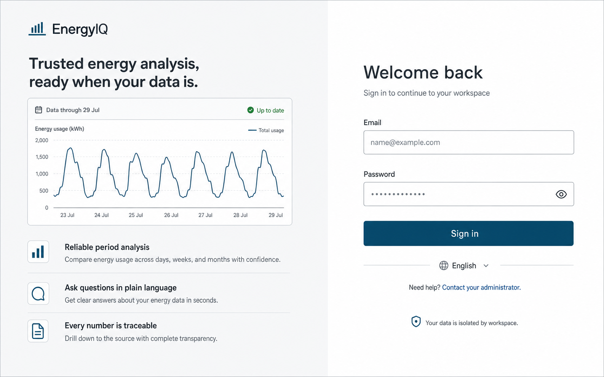
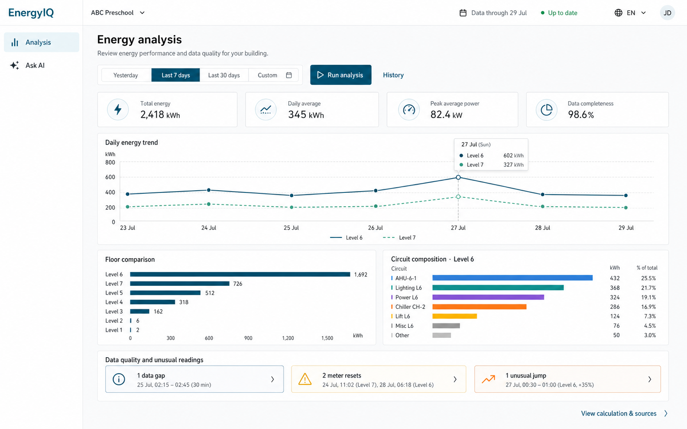
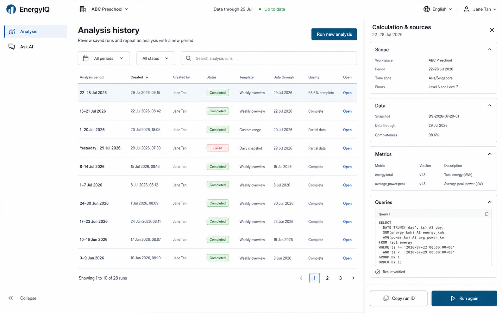
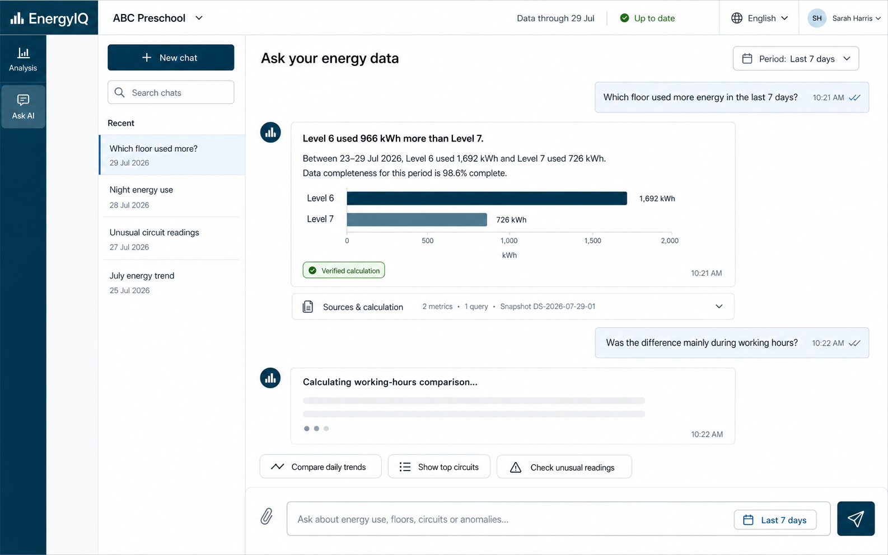
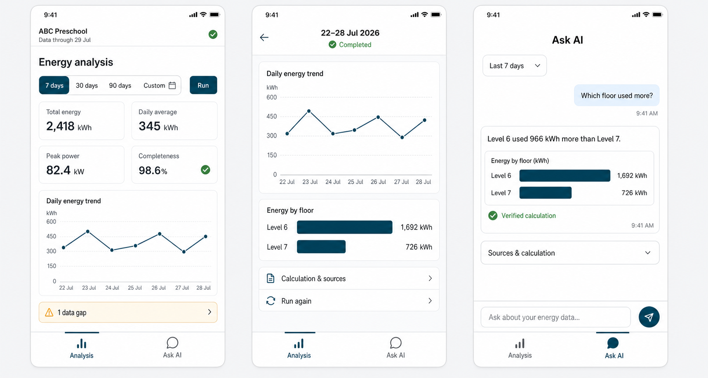

# EnergyIQ 前端界面示意图

> **历史视觉稿。** 这些图片记录早期只有 Analysis / Ask AI 的方案，不是当前信息架构，也不可直接切图实现。当前客户入口已确定为 Overview、Project Explorer、AI Analyst、Data Map，视觉与交互以[最新界面设计](../三类核心界面设计.md)为准。

这些图片仍可用于参考数据状态、渐进式 Evidence 和移动端信息密度。

## 1. 登录页

## 2. Analysis 首页

## 3. Analysis History 与 Calculation & Sources

## 4. Ask AI

## 5. 移动端核心流程

## 当时的设计假设（已被部分替代）

- 客户导航只有 Analysis 和 Ask AI；**已被四入口方案替代**；
- Analysis 是默认首页；
- 数据更新时间和质量始终可见；
- 固定报告自动保存并支持复跑；
- 来源与计算渐进展开，不占据主结果；
- Ask AI 展示直接答案、必要图表和可验证来源；
- 不向客户暴露模型或工具配置；客户可以看到受控 Task Console、Evidence 和 Trace；
- 移动端导航需按四入口重新设计，不缩放桌面侧栏。
