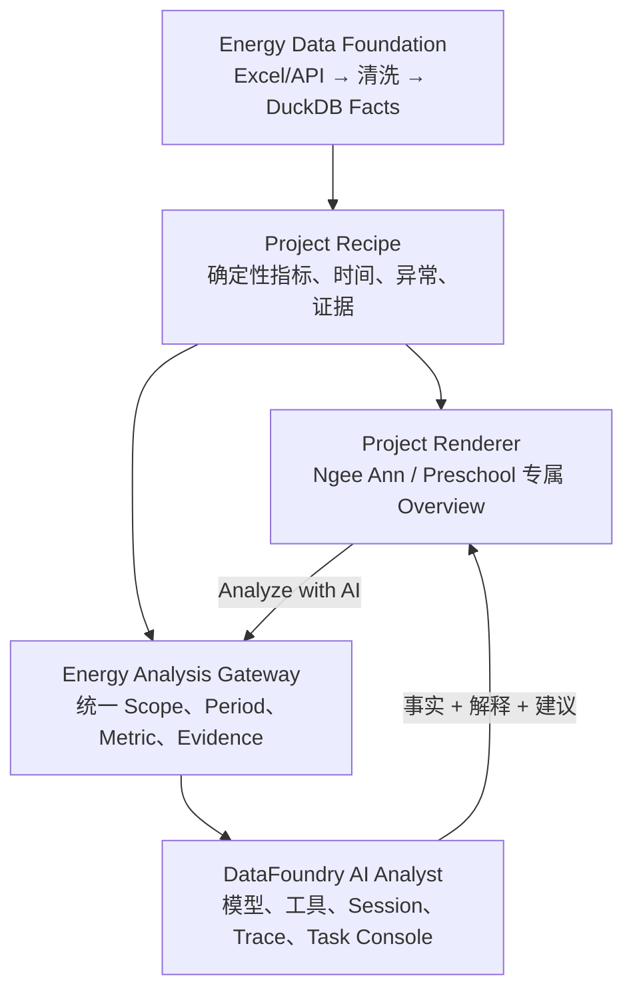

# Overview 改造与 AI Analysis 打通最终方案

> **2026-08-05 执行顺序更新：** Ngee Ann 首版 Charles 验收现已把一个最小、真实、异步且可降级的 AI Slot 纳入交付边界；它不再等待完整对话式 AI Analyst 全部完成。本文的架构职责仍然有效，新的执行依赖、输入/输出合同和停止项以[《Overview 用户价值与 AI Slot 最小交付决策》](2026-08-05-Overview用户价值与AI-Slot最小交付决策.md)为准。

## 1. 最终决定

采用一条混合但边界清晰的路线：

1. **Overview 不由 Agent 现场生成，也不直接嵌入 Charles 的静态 HTML。**
2. 每个案例先拥有自己的确定性 `Project Recipe + Project Renderer`。
3. Recipe 从统一 DuckDB 事实层计算指标；Renderer 用 React + Tailwind + Recharts/CSS 做视觉等价复刻。
4. 可以复制 Charles 已打磨好的信息结构、视觉和分析问题，但原型中的错误、Mock 和硬编码不复制。
5. DataFoundry 只作为 **AI Analyst 的 Runtime 和工作台**，不作为 Overview 的渲染器，也不替代 Energy Data Foundation。
6. Overview 与 AI 先通过显式上下文跳转打通；稳定后再加入组件内 AI Slot；AI 自动改模板不属于当前 MVP。

一句话概括：

> 固定看板负责稳定、正确地告诉 Boss 应该关注什么；AI Analyst 负责继续追问、解释和探索；两者读取同一份事实与时间上下文。

## 2. 四层架构



| 层 | 负责什么 | 不负责什么 |
| --- | --- | --- |
| Energy Data Foundation | Excel/API 接入、累计读数转 interval kWh、质量、层级映射、DuckDB Facts | 页面视觉、LLM 表达 |
| Project Recipe | KPI、时间桶、同比/环比、P75、异常、Evidence；同输入同输出 | CSS、组件排版、自由文本聊天 |
| Project Renderer | Charles 页面视觉、筛选、下钻、图表、时间交互 | 直接查 DuckDB、临时发明指标 |
| DataFoundry AI Analyst | 对话、工具调用、模型切换、Session、Trace、Task Console、Knowledge/MCP/Skills | Overview 的权威 KPI、项目页面渲染 |

这能保留 DataFoundry 的成熟能力，同时避免它的不稳定性影响 Boss 每天打开的核心页面。

## 3. Overview 怎么改

### 3.1 不做一个万能低代码看板

当前只有少量明确项目，而且 Charles 已针对场景打磨过内容。MVP 应先做项目专属 Renderer：

- `NgeeAnnRenderer`：吸收 Net Zero SaaS 中 Ngee Ann 的完整信息组织；
- `PreschoolRenderer`：吸收 Charles 的 Preschool Report 与 Benchmark；
- 第三个项目继续按真实项目定制；
- 到第三、第四个 Renderer 后，再按真实重复抽 KPI Card、时间选择器、异常表、热力图等共用组件。

共用的是 Shell、项目选择器、时间上下文、Evidence、Recipe 接口和基础图表组件；不强迫每个项目使用完全相同的页面章节。

### 3.2 页面复刻原则

可以做到 React 页面层面的视觉等价，包括卡片、双轴堆叠图、热力图、P75 四象限、表格、Tab 和交互动效。复刻时分三类处理：

| 原型内容 | 处理方式 |
| --- | --- |
| 有决策价值的模块、布局、配色和交互 | 复用/复刻 |
| Mock 数值、哈希随机数、固定 30 天除数、伪 national benchmark | 用 Recipe 真实计算替换；数据没有就显示 N/A/Provisional |
| 已确认错误 | 直接修正，不追求错误的视觉等价 |

已确认的两项修正：

1. Preschool 正确数量是 **30 个 Centre**，不能再写 31；Renderer 的数量由 Recipe 的 `sampleSize` 返回；
2. EUI × per-pax 四象限使用常规坐标：X、Y 数值分别向右、向上增大，**右上角是 Priority，左下角是 Efficient**。

### 3.3 第一版模块

Ngee Ann 第一版建议保留这条决策动线：

```text
┌────────────────────────────────────────────────────────┐
│ Project / Scope / Primary Period / Data as of          │
├────────────────────────────────────────────────────────┤
│ Action Summary：本期最重要的 3 个发现与优先行动        │
├────────────────────────────────────────────────────────┤
│ Data Status & Scope：在线、完整度、异常读数、范围        │
├────────────────────────────────────────────────────────┤
│ Energy Overview：总量、峰值、成本、强度、环比            │
├────────────────────────────────────────────────────────┤
│ Level / Circuit Comparison：同级横向比较与下钻           │
├────────────────────────────────────────────────────────┤
│ Consumption Breakdown / Day Profile / Heatmap          │
├────────────────────────────────────────────────────────┤
│ Exceptions & Evidence：异常、阈值、时间、SQL/指标证据     │
├────────────────────────────────────────────────────────┤
│ Recommended Actions：确定性建议 + 可选 AI 解释           │
└────────────────────────────────────────────────────────┘
```

Preschool 在同一原则下增加 Centre Benchmark、EUI/per-pax 和四象限，但使用 30 个实际 Centre 和正确轴方向。

### 3.4 时间规则

Overview 顶部有一个 `Primary Period`，首期支持 Yesterday、Last 7 complete days、Previous week、Previous month 和 Custom。所有模块默认继承。

- 用户切换时间后，同一个 Recipe 自动重算，不必每次手工创建完整 Analysis Run；
- 图表可以切粒度、Scope、Tag 和下钻节点，这不等于换主时间；
- Benchmark/Forecast 的长期历史属于显式 `Reference Window`；
- 极少数组件以后可有显式 Local Period，但默认不开；
- Saved Analysis 才冻结 Period、Data Snapshot、Recipe/Renderer Version 和组件 View State。

## 4. Overview 和 AI Analysis 怎么打通

### 4.1 MVP：上下文跳转，不把聊天塞进小弹窗

每个重要模块提供 `Analyze with AI`。点击后进入完整 AI Analyst 页面，并传递：

```ts
type EnergyAnalysisRequest = {
  projectId: string;
  scopeId: string;
  primaryPeriod: { start: string; endExclusive: string };
  timezone: string;
  metricIds: string[];
  componentId?: string;
  filters?: Record<string, string | string[]>;
  dataSnapshotId: string;
  recipe: { id: string; version: string };
  evidenceIds: string[];
  contextHash: string;
  question?: string;
};
```

前端不把整份原始数据塞给模型。DataFoundry 根据这些 ID 解析权威 Energy Query Context，只能访问这个 Project、Scope 和 Period 对应的只读事实。

用户到 AI 页面后会直接看到：

```text
Analyzing: Ngee Ann / Level 7 / Office Load 4
Period: 3–9 Jun 2026 · Asia/Singapore
Metric: hourly electricity consumption
Evidence: 3 verified metric results
```

然后继续追问“为什么 17:00 最高”“与 Level 6 比如何”“把工作时间和非工作时间分开”等问题。

### 4.2 第二阶段：AI Slot

AI Slot 不是让模型重算 KPI，而是在确定性模块下方提供增强解释：

```text
┌─ Deterministic finding ────────────────────────────────┐
│ Level 7 after-hours usage is 18.4% above its baseline │
│ Evidence: metric M-17 · period · scope · threshold     │
├────────────────────────────────────────────────────────┤
│ AI interpretation                                      │
│ Fact / possible causes / recommended checks / missing  │
│ evidence                                  [Ask deeper] │
└────────────────────────────────────────────────────────┘
```

AI 输出必须区分：

- `Facts`：只能引用 Evidence；
- `Interpretations`：原因假设及置信度；
- `Recommended Actions`：Boss/FM 可以执行的动作；
- `Missing Evidence`：排班、门禁、设备状态等仍缺什么。

模型不可用时，确定性 Finding 和规则版 Recommendation 仍正常显示。

### 4.3 第三阶段：结构化模板与 AI 协同

当前不做 AI 自由改页面。以后如果要让 AI 调整 Overview，只允许它生成受控 `Template Patch`，例如：

- 增加一个已登记的组件；
- 调整组件顺序或宽度；
- 修改允许的指标、筛选和标题；
- 基于 Component Catalog 选择图表类型。

AI 不能提交任意 React/HTML/SQL，也不能绕过 Admin Preview、Validation 和 Publish。这个阶段必须等固定 Renderer 和 AI Analyst 分别稳定后再做。

## 5. 是否真的需要 DataFoundry

### 结论

**需要复用，但只用于 AI Analyst，不把它当整个 EnergyIQ 的底座。**

如果删除 DataFoundry，我们必须重新建设：模型 Provider、密钥管理、模型切换/fallback、流式对话、工具执行、Session、Trace、Artifact、Task Console、Knowledge/MCP/Skills/Assets 管理。这些与 EnergyIQ 的核心差异化无关，重做浪费。

如果让 DataFoundry 接管 Overview，则会把确定性报表依赖到不稳定的 Agent SQL、图表生成和 Runtime 收口上，本次 Flash 实测已经证明这条路风险过高。

因此采用可替换适配器：

```ts
interface EnergyAnalyst {
  run(request: EnergyAnalysisRequest): AsyncIterable<EnergyAnalysisEvent>;
}

// MVP 实现
class DataFoundryEnergyAnalyst implements EnergyAnalyst {}
```

Overview 只依赖 `EnergyAnalyst` 接口，不依赖 Mastra、AG-UI 或 DataFoundry 内部表结构。将来 DataFoundry 不合适，可以替换 AI adapter，而不重写数据底座和 Overview。

## 6. DataFoundry 在打通前必须补的四个薄层

这些不是重写 Runtime：

1. **System Model Binding**：Admin 配置一个工作区默认模型，普通 FM/Boss 可用但看不到密钥；解决现有 Model Profile 用户级隔离问题。
2. **Energy Query Compiler/Validator**：`scope + period + metric + grain` 先由确定性代码生成或验证关键 SQL，特别禁止 `TIMESTAMP`/`TIMESTAMPTZ` 错配。
3. **Deterministic Chart Spec**：后端根据已验证查询结果生成 Chart Spec；不能依赖模型是否恰好把 `limit` 放在正确工具参数里。
4. **Protocol 收口修复**：统一 requirement/assertion registry 与 commit adapter；复杂 Run 改成异步状态或提高受控超时，但不能用延长超时掩盖死循环。

现有 Task Console、Provider、Session、Trace、Knowledge/MCP/Skills 不重做，只做 EnergyIQ 适配。

## 7. 开发顺序

### Batch 1：Overview 确定性基线

- 锁定 Ngee Ann Recipe 输入/输出和 Golden Values；
- 完成 Primary Period 与 Evidence；
- 复刻 Ngee Ann Renderer，修正原型错误；
- Overview 不调用 LLM 也能完整工作。

### Batch 2：第二个 Renderer

- 完成 Preschool Recipe；
- 30 Centre、EUI、per-pax、P75、正确四象限；
- 复刻 Charles 的建议模块；
- 记录 Ngee Ann 与 Preschool 的真实重复点，但暂不强行合并。

### Batch 3：AI Analyst 稳定化

- Flash 保持基准模型，修复上述四个薄层；
- 用 Boss/FM 问题集验收文本、对比、异常、小时曲线和 Chart Artifact；
- 每个答案必须包含 Scope、Period、Metric、数据截止和 Evidence；
- 图表链路连续通过后才算完成，不以 provider connected 代替产品验收。

### Batch 4：上下文跳转

- Overview 模块生成 `EnergyAnalysisRequest`；
- AI 页面展示并锁定上下文；
- 用户切换 Project/Period 后旧回答标 `Outdated context`；
- 回答可返回 Overview，但不静默修改 Overview。

### Batch 5：AI Slot 与受控协同

- 先在异常和 Recommendation 模块加入 AI Slot；
- 稳定后再评估 Template Patch；
- 不在 MVP 里做任意图表代码生成或复杂多 Agent。

## 8. 验收标准

### Overview

1. Charles 的关键信息结构和视觉达到可对照验收的等价程度；
2. 所有数字来自 Recipe，不含随机/硬编码业务结果；
3. 30 Centre 与四象限轴方向正确；
4. 全页模块默认共享 Primary Period；
5. 同一 Snapshot + Recipe Version 重跑得到相同确定性结果；
6. 模型停机时 Overview 不受影响。

### AI Analysis

1. 从 Overview 进入后 Project、Scope、Period、Metric 不丢失；
2. 关键时间过滤由确定性编译/验证，不由模型自由选择时区类型；
3. 文本问题和 168 点图表连续通过，而非偶发通过；
4. 用户能在现有 Task Console 查看查询、证据与失败原因；
5. 普通用户能使用 Admin 选择的模型，但不能读取 Key；
6. AI 将事实、推测、建议和缺失证据分开表达。

## 9. 最终判断

本方案不是放弃通用化，而是把通用化放在正确的位置：

- 统一数据事实、时间、Evidence 和 AI 请求协议；
- 项目页面先保持专属表达；
- 三四个真实 Renderer 后再抽公共组件；
- AI 通过稳定接口增强固定模板，而不是取代固定模板。

这最符合当前产品优先级：先让 Boss 看到经过打磨、可信且可复跑的 Overview，再让 AI 成为可追问、可解释、可探索的增强能力。

