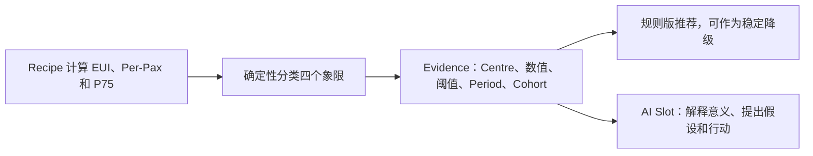

# 项目 Renderer、Recipe 与时间上下文决策

## 1. 结论先行

`Project Recipe + Project Renderer` 方向可以实现，也仍然是当前最合适的方向，但原方案还缺少一个承重结构：**统一、显式、可追溯的时间上下文**。

本次建议确定为：

1. Overview 顶部只有一个权威的 `Primary Period`，所有模块默认继承；
2. 组件可以改变筛选、下钻、图表粒度和对比方式，但不能悄悄使用另一个主时间；
3. Benchmark、Forecast 等确实需要不同历史窗口的模块，通过 Recipe 派生 `Reference Window`，并在界面明确标注；
4. 少数组件可以开启显式 `Local Period Override`，但必须显示本地时间徽标、可一键恢复全局时间，并且不得被全页 AI 静默混合；
5. AI 从哪个模块进入，就绑定哪个模块的最终有效上下文；全页 AI 只使用统一主时间的结果；
6. 图 1、图 2、图 4 都可以在 React + Recharts/CSS 中实现，图 3 的建议也可以生成；但计算结果必须来自 Recipe，不能复制原型里的模拟算法；
7. 第一版 Ngee Ann Renderer 先不开放任意组件时间。只有出现明确业务理由的模块，再逐个启用受控本地时间。

换句话说：

> 页面时间统一，组件视角灵活；计算窗口显式，AI 上下文唯一。

## 2. 为什么需要重新复核

附图看起来属于同一份分析报告，但源码中的时间语义并不一致：

| 模块 | 原型当前做法 | 能否直接用于正式系统 |
| --- | --- | --- |
| Consumption Breakdown | 组件内部独立选择 Today/Yesterday/Last 7/Last 30；点数按所选按钮生成，数值由 `hashCode + seeded` 合成，且没有归一回传入的总量 | 视觉可用，计算不可用 |
| Cost Analysis | 固定 `22 weekday + 6 weekend + 2 holiday`，日均固定除以 30；人数、房间负荷和 national benchmark 由哈希合成；Previous Cost 是由涨幅反推，不是独立查询上一期 | 视觉可用，计算不可用 |
| Preschool Benchmark | 固定 May 2026；EUI、per-pax 和 P75 来自该固定月份的数据；页面误写 31 个 Centre，实际正确数量是 30 个 | 规则可改造成 Recipe，时间、样本和 Cohort 必须参数化 |
| Key Recommendation | 由 P75 四象限确定性拼接，不是 LLM 推导 | 确定性规则值得保留，AI 可补充解释 |

因此，当前原型证明的是：

- 页面组织和交互有价值；
- 图表能够画出来；
- Charles 的分析问题值得吸收；

但它没有证明：

- 所有模块正在分析同一时间；
- 成本、人数和 benchmark 是真实数据；
- 切换时间后所有 KPI、图表和建议会一致重算；
- AI 能知道用户具体正在看哪段时间。

如果不先补时间契约，视觉复刻得越完整，错误结论反而越像真的。

## 3. 三种时间方案比较

### 3.1 整页完全固定时间

所有模块只看同一个固定月或固定报告期，不允许用户切换。

优点：最容易复跑和导出正式报告，所有文字天然一致。

问题：不适合 Interactive Analysis。Boss/FM 只是想把同一张图从昨天切到上周时，也必须重新生成整份报告，操作过重。

结论：适合 Saved Analysis/Report，不适合作为默认 Overview。

### 3.2 每个组件任意选择时间

每张图都有自己的时间选择器，用户可以自由组合。

优点：表面上最灵活。

问题：

- 同一页总能耗可能是上月，费用可能是过去 7 天，异常可能是昨天；
- 页面顶部的总建议无法说明自己引用了哪个时间；
- AI 容易把不同时间的证据拼成一个结论；
- 保存、复跑、分享链接、导出 PDF 都必须记录大量隐蔽状态；
- 用户很难发现某个组件仍停留在旧时间。

结论：不采用。

### 3.3 统一主时间 + 受控组件视图

页面顶部决定主分析区间；组件默认继承，只允许改变显示粒度、筛选、下钻和由 Recipe 定义的比较窗口。少数确有需要的组件可显式覆盖。

优点：

- 页面大部分结论保持一致；
- 用户仍可灵活查看小时、日、周和不同空间；
- AI、保存和复跑都有唯一上下文；
- Benchmark 等特殊分析不会被强行塞进不适用的一天数据。

结论：正式采用。

## 4. 时间不是一个字段，而是五个不同概念

### 4.1 Primary Period：主分析区间

用户在 Overview 顶部选择的时间，是页面的权威时间。

首期建议提供：

- `Yesterday`：上一个完整日；
- `Last 7 complete days`：最近 7 个完整日；
- `Previous week`：上一个完整日历周；
- `Previous month`：上一个完整日历月；
- `Last 30 complete days`：需要时保留；
- `Custom`：自定义完整区间。

由于目前每天拉一次数据，`Today` 很可能只是部分数据。MVP 应隐藏或禁用 Today；将来启用时必须标记 `Partial`，不能和完整日混为一谈。

时间由 Project timezone 解析。新加坡项目默认 `Asia/Singapore`。服务端统一使用左闭右开区间 `[start, end)`：

```text
Yesterday = [昨天 00:00, 今天 00:00)
```

### 4.2 Aggregation Grain：展示粒度

粒度不是另一段时间，只是同一主区间如何分桶：

| 主区间长度 | 默认粒度 | 可选粒度示例 |
| --- | --- | --- |
| 1 个完整日 | Hour | 15 min / Hour |
| 2–31 日 | Day | Hour / Day |
| 32–180 日 | Week | Day / Week |
| 更长 | Month | Week / Month |

图 1 在 Yesterday 下横轴是 24 小时；切到 Last 7 complete days 后横轴应变成 7 个日期，而不是仍然显示一套虚构的 24 小时。

### 4.3 Comparison Period：对比区间

“Previous Period”不是用户第二次随意选时间，而是 Recipe 根据主区间派生：

```text
主区间：2026-07-01 至 2026-07-08
对比区间：2026-06-24 至 2026-07-01
```

也可以按业务规则派生“同类型工作日历史平均”或“上一完整月”。页面必须写清楚比较对象，不能只写含糊的 `vs previous`。

### 4.4 Reference Window：基准/训练窗口

Benchmark、异常基线和 Forecast 往往需要比主时间更长的历史。这是算法输入窗口，不是用户当前正在看的主时间。

例如：

- 用户查看 `Previous month`；
- 四象限使用同一个月各 Centre 的能耗、面积和人数；
- P75 来自同一个、已版本化的 peer cohort；
- 异常基线可以使用过去 8 个同类日；
- Forecast 可以使用过去 3–12 个月训练数据。

这些窗口必须由 Recipe 定义并在 Evidence 中展示，不能藏在前端组件里。

### 4.5 Data Snapshot / As of：数据截止版本

同一个日期范围在今天和明天重跑，可能因为补数、纠错或新导入而不同。因此每次正式保存必须记录：

- 数据截止时间；
- Data Snapshot ID；
- Recipe Version；
- Project Release；
- Tariff/Calendar/Area/People 等配置版本。

这才是“可复跑”和“可追溯”的基础。

## 5. 组件时间契约

每个 Renderer 模块都声明自己的 `TimeContract`，而不是自己偷偷实现日期按钮：

```ts
type TimeContract = {
  mode:
    | "inherit"
    | "inherit_with_comparison"
    | "inherit_with_reference_window"
    | "local_override_allowed";
  allowedGrains: Array<"15m" | "hour" | "day" | "week" | "month">;
  minimumCompleteDays?: number;
  supportedPresets?: string[];
};
```

首期模块建议：

| 模块 | 时间模式 | 组件内允许改变什么 |
| --- | --- | --- |
| Energy Overview / KPI | inherit | 无或只切单位 |
| Consumption Breakdown | inherit | Tag、Scope、粒度 |
| Cost Analysis | inherit_with_comparison | Block 下钻、Total/Per-capita、上一周期开关 |
| Daily Trend / Anomaly | inherit_with_reference_window | Day type、阈值展示；基线由 Recipe 派生 |
| Day Profile | inherit | 15 min/Hour、工作日/周末切片 |
| Efficiency Quadrant | inherit_with_reference_window | Cohort、指标说明；短区间时受限 |
| Forecast | inherit_with_reference_window | 预测 horizon；训练窗口由 Recipe 派生 |

### 5.1 何时才允许组件本地时间

只有满足以下之一才允许：

1. 该分析在当前主区间没有统计意义，例如一天数据不能稳定做月度 EUI benchmark；
2. 用户明确要把某个模块作为临时探索，不希望改变全页；
3. Renderer 设计明确展示本地时间，并能一键恢复全局时间。

启用后必须显示：

```text
Local view · Previous month     Reset to page period
```

本地覆盖不应自动改写页面顶部时间，也不应被全页 Executive Summary 或全页 AI 静默引用。

## 6. 四张附图能不能实现

### 6.1 图 1：Consumption Breakdown

可以实现。现有 Recharts 已支持：

- `ComposedChart`；
- 多组 `Bar` 使用同一个 `stackId`；
- 右轴 `Line`；
- 双 Y 轴、Tooltip、Legend；
- `ReferenceLine` 平均线；
- Tag/Scope 筛选。

正式 Recipe 要返回按 `effectivePeriod + grain + scope + category` 聚合的真实数据，不再使用 `hashCode + seeded`。

需要注意一个分析问题：如果电价始终固定，`Cost = kWh × tariff`，费用折线与总能耗形状完全相同，只是换了一根轴，信息是重复的。只有存在分时电价或跨期费率变化时，费用线才真正增加信息。MVP 可以保留以还原设计，但不能把它解释成独立驱动因素。

### 6.2 图 2：Cost Analysis + Heatmap

可以实现。它不需要复杂图表引擎：

- 左侧是普通 React 表格和排序；
- 右侧热力图用 CSS Grid；
- 色阶根据当前 Block 内有效值计算；
- Total Cost / Per Capita Cost 是本地指标切换；
- 点击 Block 只改变下钻 Scope，不改变时间。

正式计算需要：

```text
interval_cost = interval_kwh × interval-effective tariff
scope_cost = Σ interval_cost
per_capita_cost = scope_cost / people-effective-for-period
```

没有人数的房间必须显示 `N/A`，不能用 0 或模拟人数填充。National Benchmark 在没有正式数据源时也必须隐藏或标为 `Provisional`；原型目前是按 Project ID 生成的模拟系数，不能进入客户结果。

### 6.3 图 4：EUI × Per-Pax 四象限

可以实现。对几十个 Centre，Recharts/SVG 已经足够：

- `ScatterChart + Scatter` 绘制点；
- `ReferenceArea` 绘制四色象限；
- `ReferenceLine` 绘制 P75 十字线；
- custom shape 区分 Centre 类型；
- custom label/tooltip 展示名称、EUI、per-pax 和证据链接。

如果以后达到数百、数千点并要求缩放、密集标签避让，再局部引入 ECharts；当前不需要为了这一张图增加第二套图表引擎。

原图把 X、Y 两根轴都反向，使“越差”位于左下角，这是原型错误，不应为了视觉等价继续复制。正式 Renderer 采用常规坐标：X 轴 EUI 从左向右增大，Y 轴 per-pax 从下向上增大，因此右上角是 `Priority (both > P75)`，左下角是 `Efficient (both < P75)`。同时保留清晰箭头、象限标题和 Tooltip。Recipe 的四象限分类按数值与 P75 的关系计算，不依赖屏幕方向。

### 6.4 图 3：Key Recommendation / AI Slot

可以实现，但不应该让大模型自己判断谁超过 P75。

正确链路是：



确定性层负责事实：

- 哪些 Centre 同时超过 P75；
- 哪些只在 EUI 偏高；
- 哪些只在人均能耗偏高；
- 阈值是多少；
- 数据质量是否足够。

AI 只负责：

- 把结果组织成 Boss 能读懂的结论；
- 提出带边界的原因假设；
- 给出优先行动和需要 FM 核查的证据；
- 明确区分事实、推测和缺失信息。

这样即使模型不可用，页面仍有正确的规则版建议；模型可用时，表达更自然，但不能改写基础事实。

## 7. Benchmark 的特殊时间问题

图 4 暴露了当前最容易犯错的地方：EUI 通常按年表示，per-pax 在原报告中按月表示，但用户可能只选择 Yesterday 或 Last 7 days。

如果直接把一天外推成年，很容易把节假日、异常日或部分数据放大成错误结论。因此采用以下规则：

1. 同级比较首先要求所有对象使用完全相同的主区间；
2. 任意时间范围都可以显示 `kWh/m²/period` 和 `kWh/person/period`；
3. 只有完整数据达到最低天数时，才允许显示年化 EUI 或月化 per-pax；建议首期最低 28 个完整日；
4. 年化/月化必须明确标 `Annualised` / `Monthly-normalised`，不能冒充实际年度/月度读数；
5. 正式 P75 必须绑定版本化 Cohort、同一时间口径、面积/人数口径和样本量；
6. 主区间过短时，Benchmark 模块显示“需要至少 28 个完整日”，可提供显式 `View previous month` 本地覆盖，而不是悄悄改时间。

还必须区分两种不同的 P75：

| P75 类型 | 比较对象 | 回答的问题 |
| --- | --- | --- |
| Portfolio P75 | 全部 Centre 放在同一个总体 | 整个 Portfolio 里谁最值得优先调查 |
| Peer-group P75 | Preschool、Senior Care、Active Aging 等类型分别计算 | 同类场所里谁明显偏高 |

现有 HTML 的 Benchmark 表按 Centre Type 分组计算 P75，但图 4 四象限把全部 Centre 混在一起计算 P75，二者并不是同一个 benchmark。正式 Renderer 必须在标题和 Evidence 中标明 `Portfolio benchmark` 或 `Peer-group benchmark`。如果不同场所类型的营业时间、面积和服务人数差异明显，Boss 的优先排查可先看 Portfolio 象限，公平的效率评价则应看 Peer-group 象限；不能用一个阈值同时冒充两者。

Preschool 案例的正确数量是 30 个 Centre；原报告标题中的 31 是错误文案。正式 Recipe 的 `sampleSize` 仍必须从实际结果生成，不能在 Renderer 文案中写死。

面积和人数按分析时间使用“当时有效”的值。例如房间 7 月扩建，7 月 15 日前后面积不同，Recipe 应使用对应生效期的面积，而不是永远拿今天的面积重算历史。

## 8. AI 如何知道用户正在看什么

### 8.1 页面级上下文

```ts
type AnalysisContext = {
  projectId: string;
  scopeId: string;
  resource: "electricity" | "water";
  primaryPeriod: { start: string; endExclusive: string };
  timezone: string;
  dataSnapshotId: string;
  projectReleaseId: string;
};
```

### 8.2 组件级上下文

每个组件在用户点击 `Ask AI about this` 时提供：

```ts
type ComponentAnalysisContext = {
  componentId: string;
  metricIds: string[];
  filters: Record<string, string | string[]>;
  grain: "15m" | "hour" | "day" | "week" | "month";
  localPeriod?: { start: string; endExclusive: string };
  effectivePeriod: { start: string; endExclusive: string };
  comparisonSpec?: Record<string, unknown>;
  benchmarkSpec?: {
    cohortId: string;
    cohortRevision: string;
    referenceWindow: { start: string; endExclusive: string };
  };
  recipeId: string;
  recipeVersion: string;
  evidenceIds: string[];
};
```

`effectivePeriod = localPeriod ?? primaryPeriod`。

### 8.3 两种 AI 入口

| 入口 | 使用的时间 | 行为 |
| --- | --- | --- |
| 页面级 Ask AI | Primary Period | 总结整页，只引用继承全局时间的模块 |
| 组件 `Ask AI about this` | 该组件 Effective Period | 带入选中的 Block/Tag/Metric/Benchmark 和本地覆盖 |

如果页面存在本地时间覆盖，全页 AI 不得把它与全局模块一起总结。页面显示：

```text
2 components use local periods and are excluded from page summary.
```

AI 开始运行时生成 `contextHash`。如果用户在回答完成前切换了 Project、Scope、Period 或筛选，旧回答标记为 `Outdated context`，不能继续显示成当前结论。

### 8.4 AI 输出结构

```ts
type EvidenceBackedInsight = {
  facts: Array<{ text: string; evidenceIds: string[] }>;
  interpretations: Array<{ text: string; confidence: "low" | "medium" | "high" }>;
  recommendedActions: Array<{ text: string; priority: "now" | "next" | "monitor" }>;
  missingEvidence: string[];
  contextHash: string;
};
```

页面要始终显示 Scope、Effective Period、数据截止时间和 Evidence。AI 不能在没有排班、门禁、设备状态时把“可能原因”写成“已确认原因”。

## 9. Recipe 与 Renderer 的最终接口

Recipe 是确定性计算器，Renderer 是项目专属页面。两者之间通过版本化 Snapshot 通信：

```ts
type ProjectAnalysisSnapshot<TPayload> = {
  context: AnalysisContext;
  recipe: { id: string; version: string };
  rendererContractVersion: string;
  quality: {
    coveragePct: number;
    status: "complete" | "partial" | "invalid";
    warnings: string[];
  };
  evidence: Array<{
    id: string;
    metricId: string;
    queryReceiptId?: string;
  }>;
  payload: TPayload;
};
```

调用边界：

```text
runRecipe(AnalysisContext) -> ProjectAnalysisSnapshot
renderProject(ProjectAnalysisSnapshot, ViewState) -> React 页面
```

Renderer：

- 不直接查询 DuckDB；
- 不自己计算 P75、费用或异常；
- 不自己猜测“上一个周期”；
- 只负责排版、绘图、交互和发出新的受控查询上下文。

Recipe：

- 不返回 HTML；
- 不决定颜色、间距和组件顺序；
- 返回稳定指标、序列、分类、质量和 Evidence。

这条边界保证 Charles 改视觉不会改坏计算，也保证换 Excel/API 不需要重写页面。

### 9.1 当前可执行接口（2026-08-04）

- 客户 Overview 通过 `POST /api/v1/energy/analysis/resolve` 一次取得服务端解析的 Project、Scope、Primary Period、Published Project Release 前置契约和版本化 `ProjectAnalysisSnapshot`，不再分别拼接 Template 与 Analysis 响应。
- `ProjectAnalysisSnapshot.context` 固定 `primaryPeriod` 与服务端解析的 `projectReleaseId`；浏览器不能提交或覆盖 Release/Renderer。Snapshot 同时固定 Recipe/Renderer 版本，并携带 Data Quality、Data Snapshot 与确定性 Scope Analysis。Workspace Membership、Project 可见性和 Scope 归属仍由服务端解析，浏览器传入的 Workspace 或客户专属 Scope 名称不构成授权依据。
- `evidence[]` 使用稳定 `id`、已发布 `metricId` 和实际 `queryIds` 定位事实来源；当前尚未持久化 Query Receipt，因此不得伪造 `queryReceiptId`。规则产生的业务结论保留在独立 `findings` 字段，不能冒充底层 Evidence。
- 当前以不可变 `EnergyIqTemplateRevisionRecord` 作为 Published Project Release 的前置接口。历史 Ngee Ann 与 Preschool 在正式重新发布前只允许使用显式 `legacy-profile`；其他客户 Project 没有已注册 Renderer 时返回 `configuration-required`，不得回退为通用成品看板。
- Renderer Registry 当前受控注册 `ngee-ann-overview@1`、`preschool-overview@1` 与仅限 Admin 的 `admin-generic-preview@1`。三者复用既有 `buildEnergyTemplateRenderPlan → EnergyTemplateRenderer`，没有建立虚构的 Recharts/ECharts Adapter seam；Renderer 不查询 DuckDB、不计算指标，也不生成建议。
- 客户 Overview 对 Coverage `<95%` 应用统一质量策略：保留可用的事实与 Data Quality 图表，显示 `Partial data`，隐藏业务异常/建议模块，并在函数和按钮两层禁用 `Save analysis`。

## 10. Interactive、Save 和 Rerun 的关系

### 普通交互

切换全局 Period、Scope 或图表粒度时自动刷新，不需要每次创建正式 Analysis Run。

- 改粒度、Tag、Block、Total/Per-capita：只改变 View State 或发轻量查询；
- 改全局 Period/Scope：重新执行同一 Recipe，可命中缓存；
- 改组件 Local Period：只产生该组件的新结果和上下文，不覆盖全局结果。

### 保存

用户点击 `Save analysis` 时，冻结：

- Primary Period；
- 所有组件 View State；
- 明确存在的 Local Period Override；
- Data Snapshot；
- Recipe/Renderer/Project Release 版本；
- 结果 Artifact、Evidence 和 AI Insight。

### 复跑

Rerun 复用原配置，但使用最新 Available 数据产生新 Run，绝不覆盖旧结果。若用户只是重新打开旧结果，应继续显示旧 Snapshot，而不是自动重算。

## 11. 主要风险与防护

| 风险 | 后果 | 防护 |
| --- | --- | --- |
| 全局和本地时间混用 | 一页多套事实 | 本地覆盖徽标；全页 AI 排除混合时间 |
| Today 数据不完整 | 把半天误当全天 | MVP 隐藏/禁用；启用时标 Partial |
| 7 天年化 EUI | 短期波动被夸大 | 最少 28 完整日；明确 Annualised |
| 固定费率下双轴误导 | 费用线看似独立趋势 | 标明费率；分时费率前不做独立因果解释 |
| Tariff 跨期变化 | 成本计算错误 | 每个 interval 使用当时生效费率 |
| 人数/面积变化 | 历史人均、每平米错误 | 使用有效期版本；缺失显示 N/A |
| Peer cohort 不可比 | P75 结论失真 | Cohort 版本、样本量、场景类型和窗口可见 |
| AI 回答期间用户切换 | 旧回答冒充新上下文 | contextHash 和 Outdated 标记 |
| 前端直接查原始库 | 口径分叉 | 只能经 Recipe/Analysis Resolver |
| Renderer 越做越多 | 项目代码碎片化 | Registry + 版本契约；第三/第四个后按真实重复抽组件 |
| 复制 Tailwind/CSS | 污染 DataFoundry 全局样式 | EnergyIQ 命名空间、Design Token、视觉回归测试 |
| 大量 15 分钟点传前端 | 页面卡顿、口径重复 | Recipe/后端按目标粒度聚合 |
| 图表标签重叠 | 四象限不可读 | 30 点用偏移/Tooltip；规模增大再评估 ECharts |

缓存键至少包含：

```text
project + scope + effective period + grain + filters
+ data snapshot + recipe version + config revision
```

## 12. 对现有路线的修正，不是推翻

仍然保留：

- 统一 Energy Data Foundation；
- 项目专属 Recipe；
- 项目专属 React Renderer；
- 前三个项目先保留各自表达；
- 第三、第四个 Renderer 后再提取真实重复组件；
- AI 只基于确定性结果和 Evidence 增强解释。

本次新增的约束是：

- `Time Context` 成为 Recipe、Renderer、AI 和 Saved Analysis 的共同协议；
- 不复制原型里彼此独立的日期按钮和固定月份假设；
- 特殊历史窗口属于 Recipe 的 Reference Window；
- 组件本地时间是例外能力，不是默认自由度。

因此方向没有被推翻，而是从“页面能复刻”补全为“页面复刻后仍然算得对、说得清、能复跑”。

## 13. MVP 实施顺序

### Phase 1：时间契约和 Ngee Ann Snapshot

1. 固定 `AnalysisContext`、`TimeContract` 和 `[start, end)`；
2. Ngee Ann Recipe 支持 Yesterday、Last 7 complete days、Previous month、Custom；
3. 返回 Summary、Breakdown、Cost、Level/Circuit、Day Profile、Anomaly 和 Evidence；
4. 所有模块共享 Primary Period，不开放 Local Period。

### Phase 2：视觉等价 Renderer

1. 复刻 Ngee Ann 页面顺序、卡片和图表；
2. 图 1 使用真实类别/时间聚合；
3. 图 2 在真实层级、费率、人数可用时启用；缺失项显示 N/A/Provisional；
4. 保留统一页面时间，组件只切粒度、筛选和下钻。

### Phase 3：Preschool Benchmark 与 AI Slot

1. 实现 EUI/per-pax/P75 确定性 Recipe；
2. 实现图 4 四象限；
3. 先提供规则版图 3 Recommendation；
4. 再让 AI 基于同一 Evidence 改写为决策建议；
5. 主区间不足 28 日时禁用年化/月化结论，提供显式 Previous month 入口。

### Phase 4：证明需要后再开放局部时间

只有真实用户证明“我想保持整页上周，同时单独看 Benchmark 上月”是常用动作，才为 Benchmark 开启 `local_override_allowed`。不要先把所有组件都做成独立时间选择器。

## 14. 验收标准

1. 页面切换 Project/Scope/Primary Period 后，所有继承模块使用同一上下文；
2. 单日、7 日、月度切换时，横轴粒度和指标单位正确变化；
3. Previous Period 的区间可见且长度/日历语义正确；
4. Today/Partial 数据不会混入完整周期结论；
5. 图 1、2、4 使用 Recipe 返回值，不包含哈希/随机模拟；
6. 四象限名单、P75 和规则建议可用测试数据手算复核；
7. AI 回答显示 Scope、Effective Period、Snapshot 和 Evidence；
8. 上下文切换后旧 AI 回答不会冒充当前结果；
9. Saved Analysis 能恢复所有时间、筛选、粒度和版本；
10. 同一 Snapshot + Recipe Version + Config Revision 得到同一确定性结果。

## 15. 最终判断

这条路线能实现，且不需要改成 iframe 或为每个项目部署独立 HTML 应用。

真正应该定死的是：

- 指标口径；
- 时间语义；
- Recipe/Renderer 接口；
- Evidence 和版本；
- AI 能做与不能做的边界。

不应该定死的是：

- 每个项目的模块顺序和视觉表达；
- 用户查看小时/日/周的粒度；
- Tag、Block、Room、Circuit 的下钻；
- 在明确标识下进行的局部探索。

推荐继续采用项目专属 React Renderer + Recipe，但把本文件的时间上下文作为前置契约。第一版先做统一主时间，不把“每个组件独立选时间”当成灵活性的目标。
